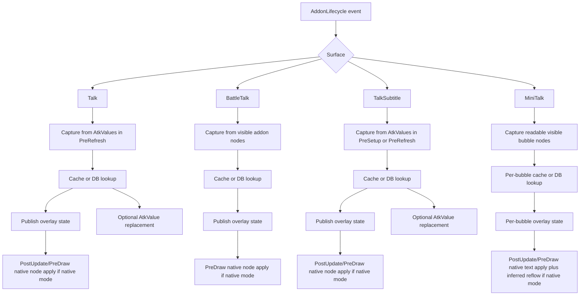
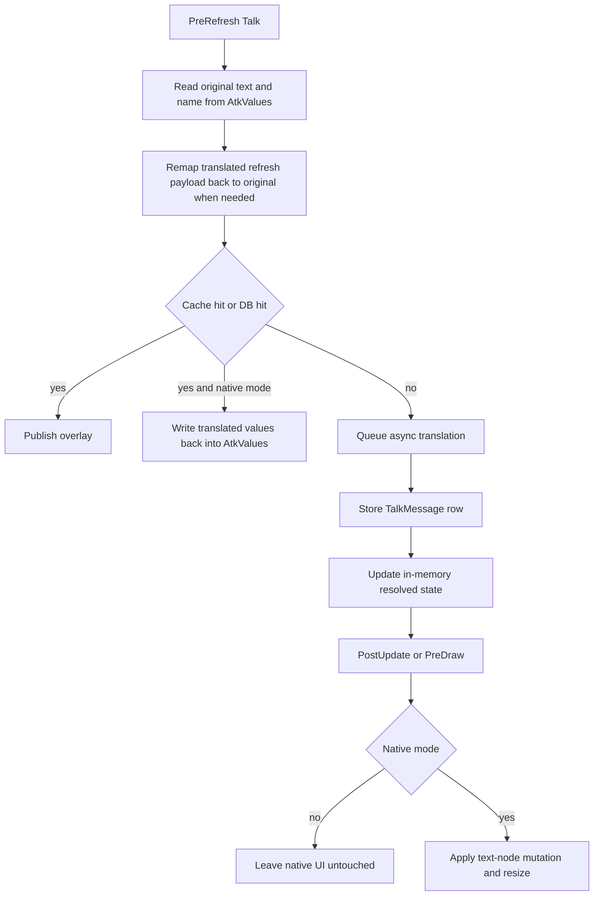
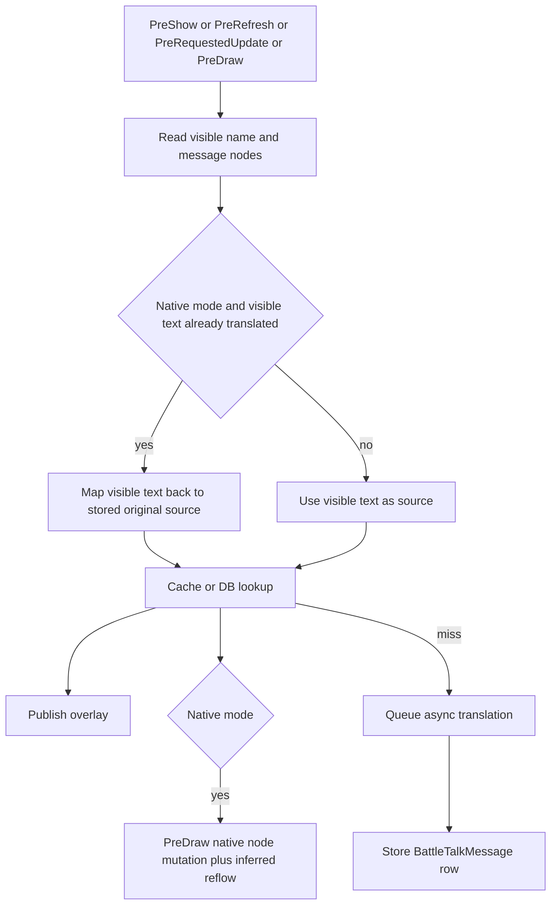
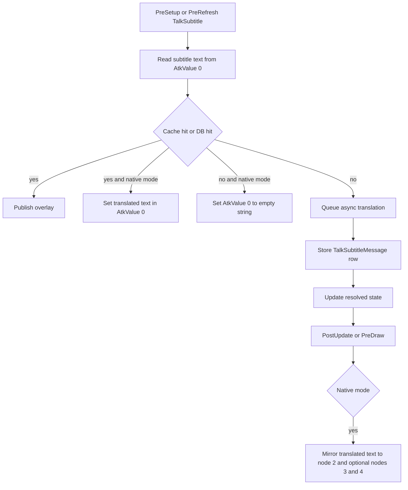
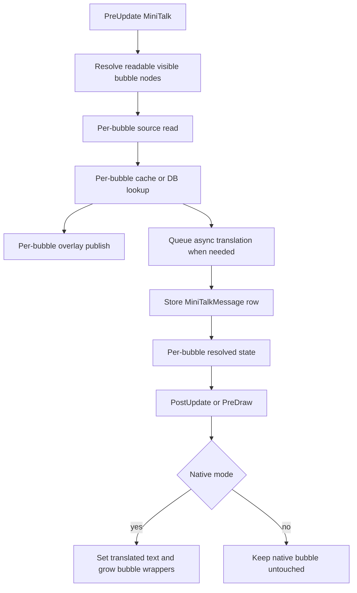
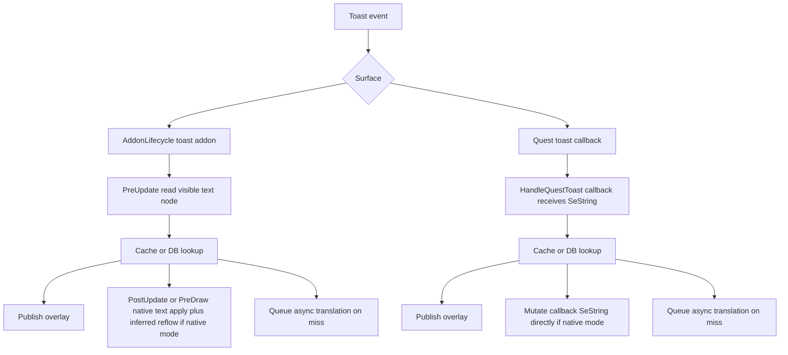
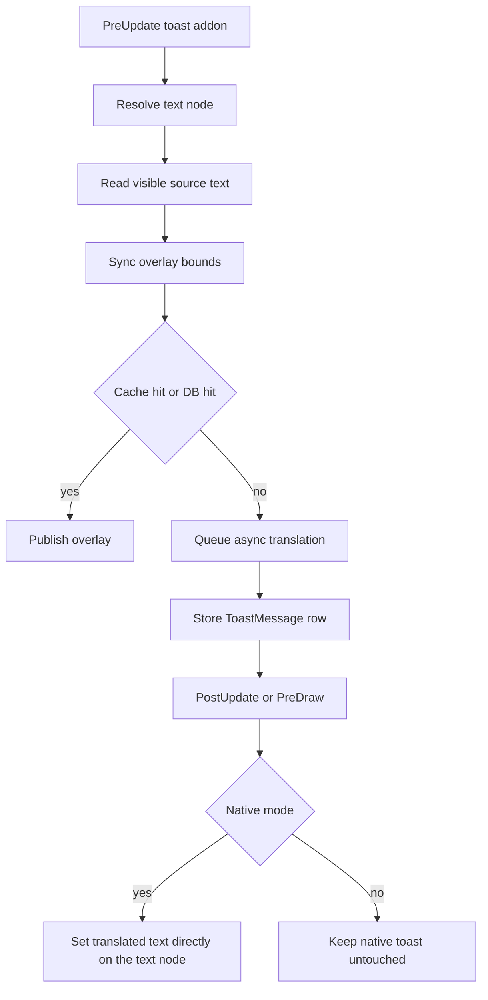
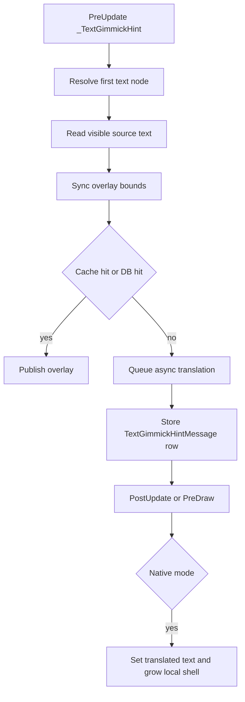
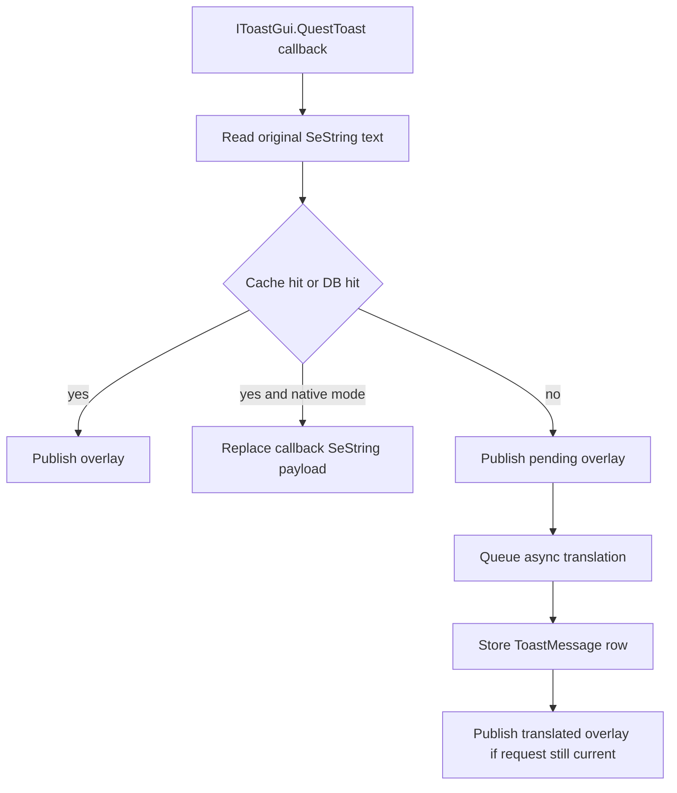

# Dialogue and toast runtime flows

This document records the current runtime shape for Echoglossian's
dialogue-family and toast-family surfaces on `v4-series`.

It focuses on:

- where the source text is captured
- which persistence table owns the translated history
- how overlay publication is driven
- when native mutation happens
- where the current layout or stability risks still live

## Shared native reflow helper

The current late native-mutation paths for `_BattleTalk`, `_MiniTalk`,
addon-text toasts, and `_TextGimmickHint` now share
[NativeTextNodeLayoutHelper.cs](../NativeUI/Helpers/NativeTextNodeLayoutHelper.cs).

That helper intentionally does not invent a new translation pipeline. It only
standardizes the layout side of late native replacement:

- preserve the current wrap width instead of hardcoding a new one
- enable multiline and wrap flags only for the native replacement path
- resize the text node after `SetText`
- propagate the resulting height through the wrapper chain above the text node
- grow the nearest nine-grid or background node using inferred padding instead
  of font shrinking

This improves visual consistency, but it is still a late-mutation strategy, not
an earlier source-level payload mutation.

Reference patterns that informed this helper:

- `SimpleTweaksPlugin` tooltip work, especially the pattern of resizing text
  first and then growing the owning shell or nine-grid from the measured text
  height
- `ChatBubbles`, which confirms that `_MiniTalk` bubbles are component-backed
  visual shells with their own nested nine-grid background

## Scope

Dialogue-family surfaces covered here:

- `Talk`
- `_BattleTalk`
- `TalkSubtitle`
- `_MiniTalk`

Toast-family surfaces covered here:

- `_WideText`
- `_TextError`
- `_AreaText`
- `_TextClassChange`
- `_TextGimmickHint`
- quest toast callback runtime

## Registration map

All of these surfaces are wired from
[AddonHandlerWiring.cs](../NativeUI/Helpers/AddonHandlerWiring.cs).

High-level ownership:

| Surface | Runtime owner | Persistence owner | Primary capture surface |
| --- | --- | --- | --- |
| `Talk` | `TalkHandler` | `TalkMessage` | `AtkValue*` during `PreRefresh` |
| `_BattleTalk` | `BattleTalkHandler` | `BattleTalkMessage` | visible text nodes in the live addon |
| `TalkSubtitle` | `TalkSubtitleHandler` | `TalkSubtitleMessage` | `AtkValue*` during `PreSetup` / `PreRefresh` |
| `_MiniTalk` | `MiniTalkHandler` | `MiniTalkMessage` | visible bubble text nodes |
| `_WideText` | `WideTextToastHandler` | `ToastMessage` | visible toast text node |
| `_TextError` | `ErrorToastHandler` | `ToastMessage` | visible toast text node |
| `_AreaText` | `AreaToastHandler` | `ToastMessage` | visible toast text node |
| `_TextClassChange` | `ClassChangeToastHandler` | `ToastMessage` | visible toast text node |
| `_TextGimmickHint` | `TextGimmickHintHandler` | `TextGimmickHintMessage` | visible text node |
| quest toast callback | `QuestToastRuntime` | `ToastMessage` | callback `SeString` payload |

## Runtime model

Across these surfaces, the runtime is intentionally split into four stages:

1. capture
2. translation lookup or queue
3. overlay publication
4. native mutation

Mode rules are the same across the family:

- overlay-only mode keeps native UI read-only
- native mode may write translated text into the addon
- swap mode keeps translated native text and publishes the original through the
  overlay

## Dialogue-family overview

## `Talk`

Current owner:

- [TalkHandler.cs](../NativeUI/AddonHandlers/Talk/TalkHandler.cs)

Key facts:

- capture is primarily value-driven, not UI-driven
- source text comes from `AddonRefreshArgs.AtkValues`
- the visible addon is still consulted for:
  - native apply
  - presentation snapshot and restore
  - mapping translated refresh payloads back to original source text

Current flow:

Native behavior today:

- when native mode is active, `TalkHandler` still mutates:
  - sender text node
  - text-node flags
  - font size
  - width
  - visible text
- the handler keeps a presentation snapshot so it can restore the text node
  only when that same path actually dirtied it

Important current rule:

- outside native mode, `Talk` now leaves native nodes untouched, including
  restore paths

## `_BattleTalk`

Current owner:

- [BattleTalkHandler.cs](../NativeUI/AddonHandlers/Talk/BattleTalkHandler.cs)

Key facts:

- capture is UI-first today
- source text comes from the visible name and message nodes inside the live
  addon
- in native mode, the handler maps already-translated visible text back to the
  stored original when possible
- persistence still belongs to `BattleTalkMessage`, not to any structured
  `StringArrayData` table

Current flow:

Native behavior today:

- in native mode, `BattleTalkHandler` still mutates:
  - sender name node text
  - message `TextFlags`
  - message text
  - timer-node X offset
  - wrapper heights above the text node
  - nine-grid height and related background sizing

- the current native path now reuses the live wrap width and inferred wrapper
  padding through `NativeTextNodeLayoutHelper`, so it no longer depends on the
  older fixed `FontSize = 14` / `width = 640` pattern

This is the most presentation-coupled runtime in the dialogue family today.

Current risk:

- because `BattleTalk` writes late into the live text node, it depends on
  late UI mutation instead of letting the game fully recalculate layout from an
  earlier source payload

## `TalkSubtitle`

Current owner:

- [TalkSubtitleHandler.cs](../NativeUI/AddonHandlers/Talk/TalkSubtitleHandler.cs)

Key facts:

- capture is value-driven
- source text comes from `AtkValue*` during `PreSetup` and `PreRefresh`
- native mode may write translated text into the same `AtkValue` before the
  addon finishes refresh
- a later apply step mirrors the translated text into multiple subtitle nodes

Current flow:

Important note:

- `TalkSubtitle` already gets closer to source-level native mutation than
  `BattleTalk`, because it can inject replacement text into `AtkValue` before
  later node mirroring happens

## `_MiniTalk`

Current owner:

- [MiniTalkHandler.cs](../NativeUI/AddonHandlers/SingleText/MiniTalkHandler.cs)

Key facts:

- MiniTalk is tracked per visible bubble
- overlay state is also per bubble
- capture comes from readable live text nodes discovered in the addon tree
- native apply now rewrites the visible bubble text through the shared reflow
  helper so the bubble wrappers and nearest background node can follow the new
  text height

Current flow:

Current risk:

- verbose translated text still depends on the native bubble layout being large
  enough
- the current helper improves wrapper and background growth, but the runtime is
  still driven by visible-node capture and late mutation

## Toast-family overview

There are two different runtime shapes in the toast family:

1. AddonLifecycle-driven text-node toasts
2. callback-driven quest toast

## AddonLifecycle toast family

Current shared owner:

- [AddonTextToastHandler.cs](../NativeUI/AddonHandlers/Toasts/AddonTextToastHandler.cs)

Concrete subclasses:

- [WideTextToastHandler.cs](../NativeUI/AddonHandlers/Toasts/WideTextToastHandler.cs)
- [ErrorToastHandler.cs](../NativeUI/AddonHandlers/Toasts/ErrorToastHandler.cs)
- [AreaToastHandler.cs](../NativeUI/AddonHandlers/Toasts/AreaToastHandler.cs)
- [ClassChangeToastHandler.cs](../NativeUI/AddonHandlers/Toasts/ClassChangeToastHandler.cs)

Text node resolvers:

- [AddonTextNodeResolvers.cs](../NativeUI/AddonHandlers/Toasts/AddonTextNodeResolvers.cs)

Current flow:

Important limitation today:

- these handlers now share the same late native reflow helper used by
  `_MiniTalk`, so wrapper heights and nearest backgrounds can follow longer
  text more reliably
- they are still late text-node mutation handlers, not earlier source-level
  payload mutation handlers

## `TextGimmickHint`

Current owner:

- [TextGimmickHintHandler.cs](../NativeUI/AddonHandlers/Toasts/TextGimmickHintHandler.cs)

Key facts:

- this is not stored in `ToastMessage`
- it uses a dedicated `TextGimmickHintMessage` entity family
- otherwise, the runtime shape closely matches the shared addon-text toast
  pattern

Current flow:

## Quest toast callback runtime

Current owner:

- [QuestToastRuntime.cs](../NativeUI/AddonHandlers/Toasts/QuestToastRuntime.cs)

Key facts:

- quest toast is not driven by `IAddonLifecycle`
- it intercepts the toast earlier through the Dalamud callback
- native mutation happens on the callback `SeString`, not on a late text-node
  rewrite

Current flow:

This is the most source-native toast flow in the family today.

## Overlay ownership

Overlay publication for these surfaces is still separate from capture and native
mutation.

The handlers publish through delegates wired in
[AddonHandlerWiring.cs](../NativeUI/Helpers/AddonHandlerWiring.cs),
which in turn update overlay state owned by:

- [OverlayConfigs.cs](../UIOverlays/TranslationOverlay/OverlayConfigs.cs)
- [TranslationOverlayDrawer.cs](../UIOverlays/TranslationOverlay/TranslationOverlayDrawer.cs)

That means:

- overlay bounds and overlay text are not owned by the dialogue or toast
  handlers directly
- the handlers only publish content and ask for bounds synchronization

## Current pain points

The current runtime split is stable enough for release, but the family still has
clear architectural tension:

1. `Talk` is partly source-level and partly late native mutation.
2. `_BattleTalk` is still very UI-first and still depends on late layout
   mutation during native replacement, even though the worst fixed-width and
   font-shrink logic is gone.
3. `TalkSubtitle` has a cleaner early-value path than most surfaces.
4. `_MiniTalk` and the addon-text toasts now share a safer late reflow helper,
   but they still depend on visible-node capture and late mutation.
5. addon-text toasts still lack a true source-level mutation path.
6. quest toast is much more source-native than the addon-driven toast family.

## Practical takeaway

If a future fix is trying to improve visual stability for these surfaces, first
classify it correctly:

- source capture problem
- cache or persistence problem
- overlay publication problem
- late native mutation problem
- missing background or container reflow problem

That distinction is what keeps the fixes narrow instead of turning into broad
runtime rewrites.
