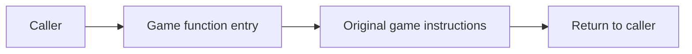
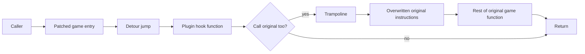
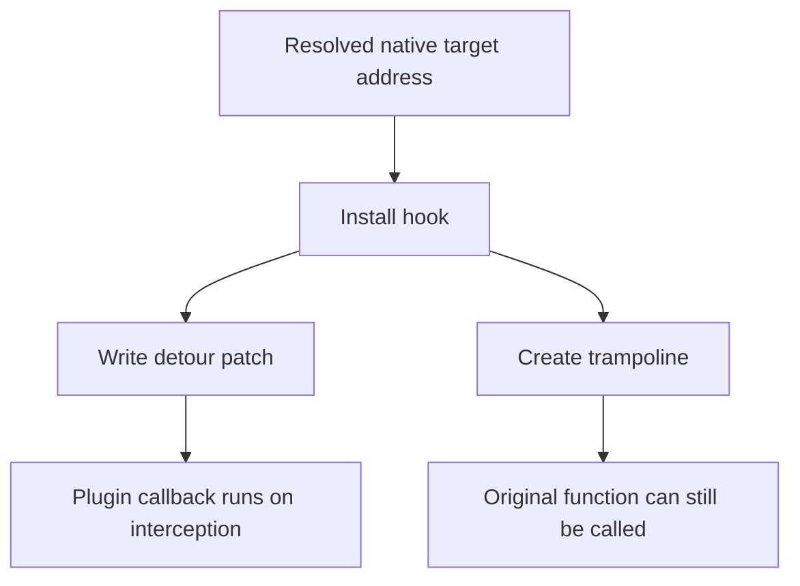
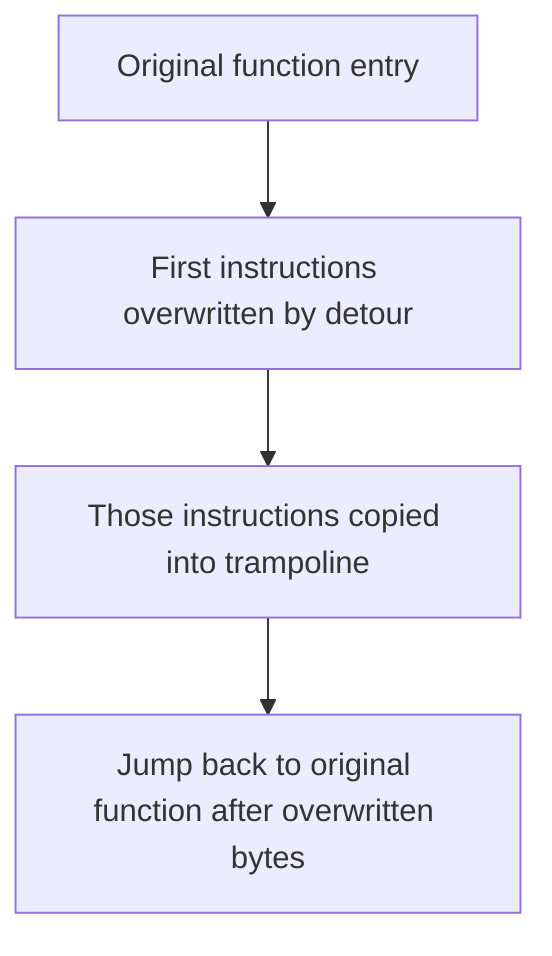
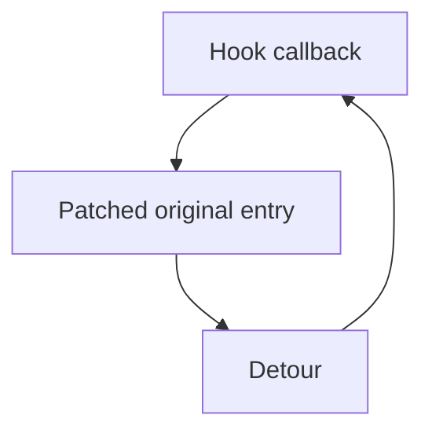
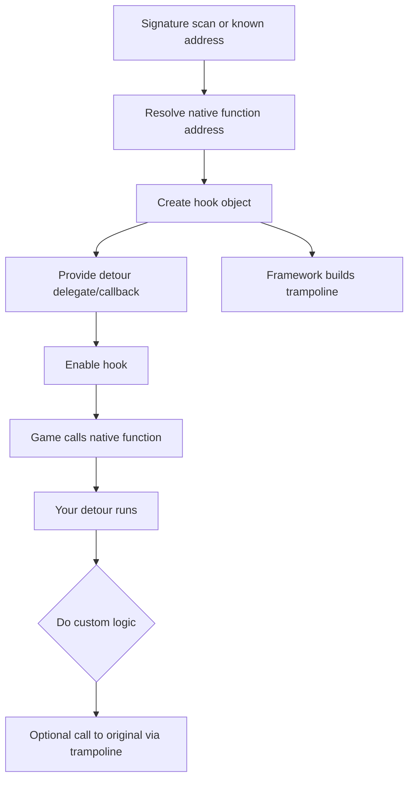
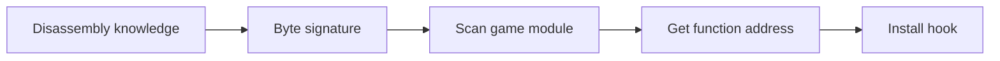
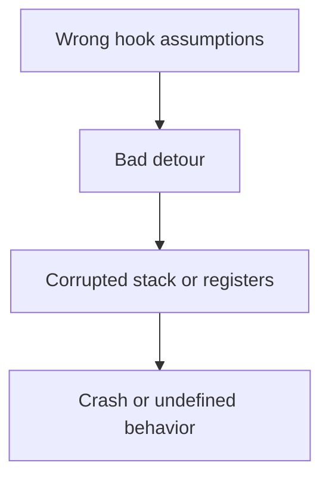
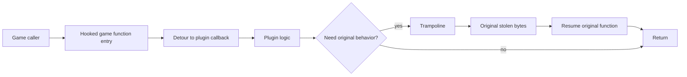

# Hooks, Trampolines, and Detours

This document explains the core reverse-engineering terms behind native
function interception in game plugins and why they matter in
Dalamud-adjacent work.

It is aimed at readers who may understand plugin code at a high level but want
a clearer mental model for what hook code is actually doing inside the target
process.

## Short Version

- **Hook**: the overall interception mechanism
- **Detour**: the redirection from original game code into your code
- **Trampoline**: the bridge that preserves the overwritten original
  instructions so you can still call the original function safely

If you remember only one sentence, remember this:

> A hook usually installs a detour and exposes a trampoline so your plugin can
> intercept a game function and still call the original implementation.

## Why This Exists In Dalamud Plugins

Dalamud plugins sometimes need to observe or alter behavior that the public API
does not expose directly.

Typical examples:

- intercepting a native game function when it is called
- observing arguments before the game uses them
- modifying return values or short-circuiting behavior
- attaching custom logic before or after a game routine runs

This is part of executable reverse engineering:

- locate code in memory
- understand calling conventions and parameter layout
- patch execution flow carefully
- avoid corrupting the game's original code path

## The Mental Model

Imagine the game executable contains a function like this:

```text
Game.exe
  Address 0x140123450
  SomeNativeFunction(...)
```

By default, execution goes like this:



After hooking, execution usually looks like this:



That single picture explains most of the terminology.

## What A Hook Is

A **hook** is the whole interception setup.

It usually includes:

- the target address or function to intercept
- the detour callback implemented by your plugin
- the trampoline pointer or delegate used to call the original function
- the enable/disable lifecycle

Conceptually:



So:

- **hook** = the system
- **detour** = the redirect
- **trampoline** = the safe path back into the original code

## What A Detour Is

A **detour** is the actual redirect.

In native executable terms, that usually means:

- patching the first bytes of a function
- replacing them with a jump/call to your own function

Very simplified:

```text
Original:
  0x140123450: push rbx
  0x140123451: sub rsp, 20h
  0x140123455: ...

After detour:
  0x140123450: jmp MyPluginCallback
  0x140123455: ...
```

That is why "detour" is the right word:

- execution is literally being diverted away from the original entry point

### Important detail

You cannot just overwrite bytes blindly.

You must:

- overwrite whole instructions
- preserve the original bytes somewhere
- ensure the redirection obeys the right calling convention and stack rules

That is where the trampoline comes in.

## What A Trampoline Is

A **trampoline** is a small chunk of executable memory that contains:

- the original instructions overwritten by the detour
- a jump back into the original function after those instructions

Graphically:



Another way to think about it:

- the detour steals the front door
- the trampoline recreates that front door somewhere else

So when your plugin wants to "call original", it usually does **not** jump to
the patched function entry again.

Instead it calls the trampoline:

```text
Plugin callback
  -> trampoline
      -> original stolen instructions
      -> jump back into original function body
```

## Why Trampolines Matter

Without a trampoline, this naive code would recurse forever:

```text
hook callback
  -> call original function entry
      -> detour triggers again
          -> callback
              -> call original function entry
```

That would become:



Infinite loop.

The trampoline prevents that by giving you:

- original bytes
- original continuation point
- no second detour at the entry point

## A Typical Dalamud-Style Flow

At a high level, the flow usually looks like this:



In plain language:

1. find the function in the game's memory
2. tell the hook framework what callback to run
3. framework installs the detour
4. framework gives you a callable "original" path
5. your code runs when the game hits that function

## Signature Scanning And Why It Usually Comes First

In reverse engineering, you often do not have a stable exported symbol name
like normal application code.

So instead of:

```text
GetProcAddress("SomeNicePublicFunction")
```

you often do:

- reverse engineer the function in IDA / Ghidra / x64dbg
- identify a stable byte pattern
- scan the module for that pattern at runtime
- treat the match as the function address

Very simplified:



This is why hook code in game plugins is often tightly coupled to:

- signatures
- patch version drift
- calling convention correctness
- pointer safety

## Pre-Hook, Post-Hook, and Full Override Patterns

Not every hook behaves the same way.

### Pre-hook style

You inspect or change inputs before calling original:

```text
Detour:
  inspect args
  maybe adjust args
  call trampoline
```

### Post-hook style

You call original first, then inspect or alter the result:

```text
Detour:
  result = trampoline(...)
  inspect result
  maybe replace result
  return result
```

### Full override style

You skip original entirely:

```text
Detour:
  do custom behavior
  return without trampoline
```

That last one is the most dangerous, because now you are replacing game logic,
not just observing it.

## Reverse Engineering Risks

Hooks are powerful because they operate inside the target process.

That also makes them fragile.

Common failure modes:

- wrong signature resolved
- wrong calling convention
- wrong parameter types
- patching too few or too many bytes
- not preserving registers correctly
- reentrancy or recursion bugs
- patch drift after a game update

Graphically:



This is why even when a hook compiles fine, it can still be catastrophically
wrong at runtime.

## In Practical Terms: What Reviewers Often Mean

When someone reviewing RE or Dalamud-adjacent code says:

### "This hook is unsafe"

They often mean:

- the target may be unstable
- the detour signature may be wrong
- the lifecycle is wrong
- the original path may recurse or be skipped incorrectly

### "The trampoline call is wrong"

They often mean:

- the code is calling the patched entry instead of the original trampoline
- arguments or return type do not match
- the callback is mixing pre/post semantics incorrectly

### "This should not be a detour"

They often mean:

- a lighter public API already exists
- the behavior should be observed rather than overridden
- the patch risk is too high for the value

## How This Relates To Dalamud

Dalamud tries to make the mechanics safer than rolling raw executable patches
by hand, but the underlying concepts are still the same.

Even when the framework gives you a nicer abstraction, the real underlying
operation is still:

- find address
- patch entry
- redirect flow
- preserve original bytes
- expose original path

So if you understand:

- hooks
- detours
- trampolines

then you understand the core execution model behind native interception in
Dalamud plugins too.

## A Good Intuition Rule

Use this rule of thumb:

- **hook** answers: "how do we intercept this function at all?"
- **detour** answers: "how does execution get into our callback?"
- **trampoline** answers: "how do we still run the original safely?"

## One Final Compact Diagram



If this diagram makes sense, the vocabulary usually starts making sense too.
