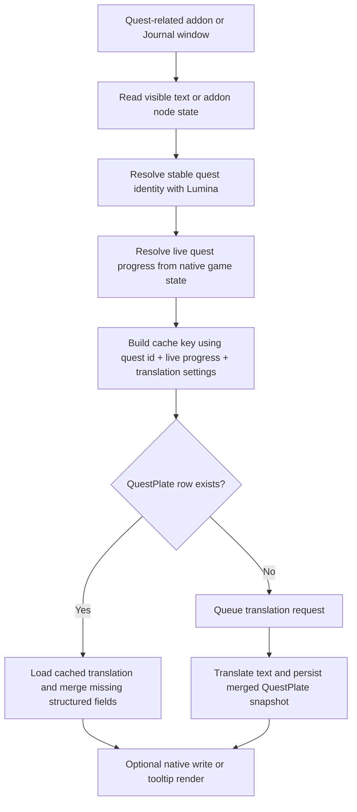
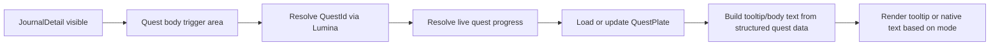
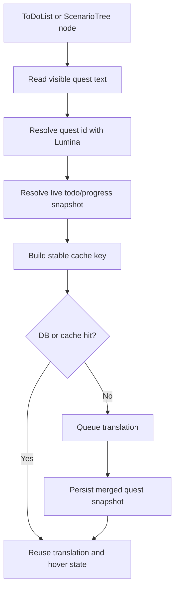

# Journal and Quest Data Model and Flow

## Purpose

This document describes the current and target data model for Journal-related quest content in Echoglossian, and the full runtime flow used to capture, translate, cache, persist, and render quest text.

The goal of the new system is:

- keep quest data keyed by stable quest identity instead of raw UI text alone
- preserve structured text and payloads instead of flattening everything into plain strings
- reduce repeated work in repaint-heavy quest windows
- keep tooltip-only, native translation, and swap modes separated
- make quest persistence predictable enough that the latest quest state can always be updated in place

## Current Reality

The local SQLite database still reflects the legacy quest storage shape.

Observed from the current `questplates` table:

- total rows: `3194`
- distinct quest names: `2005`
- rows with non-empty `QuestId`: `0`
- rows with objectives stored: `983`
- rows with summaries stored: `87`
- duplicate groups by `QuestName + TranslationLang + TranslationEngine`: `471`

This means the current table is not yet a single canonical row per quest. It is still fragmented by visible quest text and progression-driven variants.

## Target Data Model

The intended shape is one canonical row per:

- `QuestId`
- `TranslationLang`
- `TranslationEngine`
- `GameVersion`

That row should always represent the latest known quest state for that quest, language, engine, and game version.

### Canonical fields

Recommended fields for the quest record:

- `QuestId`
- `QuestName`
- `OriginalLang`
- `OriginalQuestMessage`
- `TranslatedQuestName`
- `TranslatedQuestMessage`
- `ObjectivesAsText`
- `SummariesAsText`
- `TranslationLang`
- `TranslationEngine`
- `GameVersion`
- `CreatedDate`
- `UpdatedDate`
- `RowVersion`

### Structured subfields

`ObjectivesAsText` and `SummariesAsText` are stored as JSON dictionaries.

This keeps the storage layer simple while still allowing:

- per-step quest objective translations
- per-step summary translations
- progressive enrichment over time

### Keying rules

The runtime should treat these as different kinds of keys:

- persistence key: `QuestId + TranslationLang + TranslationEngine + GameVersion`
- live progress key: `QuestId:QuestSequence`
- live todo key: `QuestId:QuestSequence:ObjectiveProgress:ObjectiveCount:QuestCount`

The live progress keys should only be used for cache and hover stability. They should not create new persistent quest rows.

## Why the legacy table is not ideal

The current storage behavior is still mostly driven by visible UI text.

That causes three problems:

- quests can be split into multiple rows as the visible text changes with progression
- identical quest names can collide across different states
- the database cannot reliably tell which row is the current canonical quest snapshot

The current database inspection shows that `QuestId` is effectively empty in stored rows, so the legacy table does not yet provide the stable identity we want.

## Data Sources

Quest-related data now comes from a layered set of sources.

### 1. Live addon/UI state

The plugin still reads the active addon tree and node values for the current quest window. This is the UX surface the player actually sees.

### 2. Lumina quest metadata

Lumina is used to resolve the stable quest identity and quest text sheet path.

The current helper path uses:

- `Quest` sheet lookup
- quest name normalization
- quest text sheet path generation based on quest id

### 3. Native quest progress

Live quest progress is resolved from native game state:

- `QuestManager.GetQuestSequence(questId)`
- `ToDoListNumberArray`
- `EventHandler.GetDirectorTodos()`

These are used to avoid keying quest state only by the visible text.

### 4. Translation cache and broker

Repeated translations are suppressed through the shared cache/broker layer so repaint-heavy windows do not requeue the same work every frame.

## Quest Sheet Acquisition Pipeline

The detailed sheet-mounting process is documented separately in [Quest Sheet Acquisition Pipeline](quest-sheet-acquisition-pipeline.md).

That companion document explains:

- the difference between `Quest.RowId` and `Quest.Id`
- how the quest text sheet path is derived
- how raw quest rows are read as structured text
- how live quest progress is layered on top of the mounted sheet

The broader SeString and payload-preservation rules that apply to quests, item tooltips, and action tooltips are documented in [Structured Text Payload Pipeline](structured-text-payload-pipeline.md).

Use that document as the memory reference when deciding whether a quest should be captured from UI, Lumina, or live quest state.

## Runtime Flow

### Read stage

The handlers first read what the UI or addon is currently exposing. This includes:

- quest title
- quest body text
- objectives
- summaries
- live todo-style progression text

This stage should remain read-only when overlay-only mode is selected.

### Identity stage

Quest identity is resolved from Lumina and live progression is resolved from the native quest manager.

That gives the plugin a stable way to distinguish:

- the same quest at different steps
- the same quest in different translation settings
- the same quest across different game versions

### Lookup stage

The plugin first checks the shared quest cache and then the database.

If a matching `QuestPlate` exists, the stored translation is reused.

If not, the text is sent to the translation queue and the resulting snapshot is persisted.

### Render stage

The output depends on the selected mode:

- overlay-only: render the translation in overlay only, do not mutate the addon
- native translation: write the translated text into the native UI
- swap: write the translation into the native UI and show the original in the tooltip

## Journal Flow

The Journal family is the highest-value quest UI path and the most sensitive one.

### Journal detail body

The quest body is now anchored to the `JournalCanvasComponentNode` trigger area. The body should be treated as the main hover trigger for the full quest text display.

The body tooltip should:

- use the quest body trigger area, not just the text glyph bounds
- show the full quest text for the current quest state
- keep paragraph boundaries between separate quest text parts
- stay stable while the quest advances

### Journal title

The title remains a separate path and should keep working independently.

### Journal state resolution

For the body tooltip and quest body translation, the intended flow is:

### Quest body text rules

Quest body text should be handled as structured content:

- preserve formatting payloads when possible
- do not flatten the full body into one unstructured blob
- preserve the current progression state
- keep quest body and quest title separate

## ToDoList and ScenarioTree Flow

These windows are best treated as live quest-progress surfaces, not just static text.

### ToDoList

The current approach uses the live quest progression resolver to key the hover and translation state.

This helps avoid:

- retriggering the same text every frame
- mixing adjacent quest steps
- showing stale tooltips when the quest text repaints

### ScenarioTree

ScenarioTree uses the quest name plus live progression state to stabilize translation and hover behavior.

This is important because the same quest name can appear in multiple progression contexts.

### Recommended flow

## Save and Merge Rules

The current save path already tries to enrich quest rows instead of blindly duplicating them.

That behavior should become stricter in the new model.

### Save rules

- populate `QuestId` whenever Lumina can resolve it
- merge into an existing row when the canonical key matches
- update the row in place when the quest advances
- only create a new persistent row when the canonical quest identity changes
- keep `ObjectivesAsText` and `SummariesAsText` merged as structured JSON dictionaries

### Merge rules

When a new snapshot arrives:

- keep already known quest identity fields
- fill in missing translation fields
- merge in new objective and summary translations
- refresh `UpdatedDate`
- preserve `CreatedDate`

### Important constraint

If the current quest progresses to a new step, that should update the existing canonical quest row rather than create a new row for each visible step.

The live step state belongs in the runtime progress key, not as a duplicate persistent row.

## Migration Guidance

Because the current table is still fragmented and `QuestId` is empty in the stored legacy rows, a clean migration is the least ambiguous path.

The quest-handler migration itself is documented separately in [Quest Addon Handler Migration Guide](./quest-addon-handler-migration-guide.md). That guide covers the runtime-side move from legacy partial classes to standalone quest handlers under `NativeUI/AddonHandlers/`.

Recommended options:

1. Rebuild the quest storage into a canonical quest table and backfill only what can be matched safely.
2. Keep the old table as a legacy archive and add a new quest table for the canonical model.
3. If a hard reset is acceptable, discard the old quest rows and repopulate them under the new keying rules.

Given the current data shape, a one-time clean recreation is easier to reason about than trying to infer a perfect backfill from UI text alone.

## Current Implementation Notes

The current runtime already includes pieces of the new design:

- `QuestProgressResolver` resolves stable quest identity and live quest sheet text
- `QuestTodoProgressResolver` resolves live progress from the native todo arrays
- `QuestLuminaResolver` populates quest ids from Lumina
- the Journal handlers use shared cache and broker helpers instead of retranslating everything every frame
- hover behavior is separated from native mutation modes

The remaining work is to make the persistence layer match that runtime model more directly.

## Summary

The target system is not “one row per visible UI string”.

The target system is:

- one canonical row per quest identity, language, engine, and game version
- live progress used only as a runtime key
- structured quest text preserved as structured data
- UI used as the capture surface, not the source of truth

That is the shape that should keep Journal and quest windows stable while still allowing the plugin to evolve toward direct game-data retrieval.
