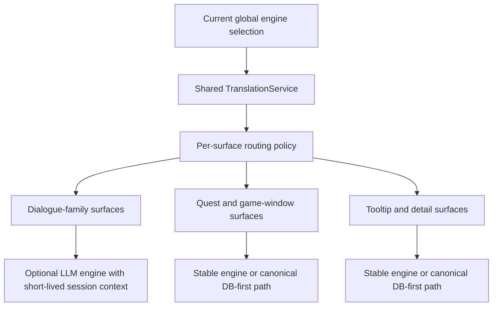
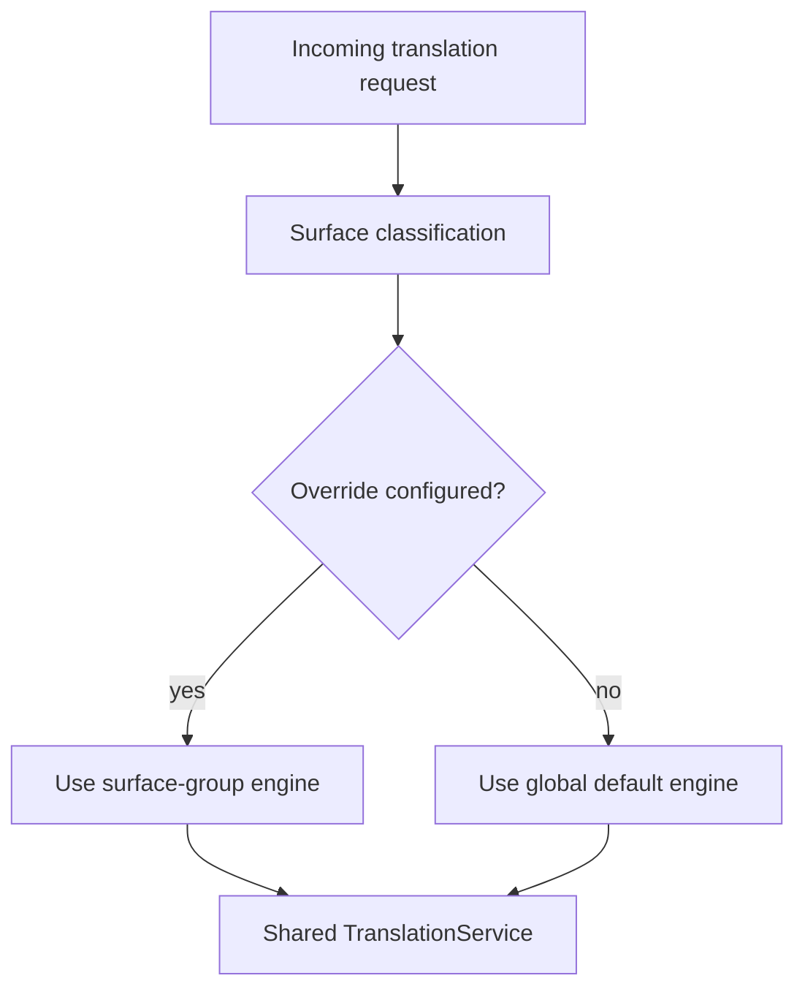

# LLM Translation Improvements Plan

## Purpose

This document captures the current direction for improving Echoglossian's
LLM-backed translation path.

The immediate motivation is twofold:

- reduce avoidable latency and token cost in the current single-shot LLM flow
- allow better control over which UI surfaces should use expensive LLM engines
  versus cheaper or simpler engines

This is a design-direction document, not a promise that every item here should
land in one branch or one release.

## Problem Summary

Today, Echoglossian mostly treats LLM-backed engines as stateless
single-request translators:

- one text in
- one prompt built
- one request sent
- one translated text returned

That keeps persistence and caching deterministic, but it has clear downsides:

- the same large instruction block is rebuilt and resent for many short lines
- local LLM setups such as LM Studio and Ollama pay repeated per-request
  overhead
- the plugin cannot distinguish between "use LLM for dialogue" and "use a
  cheaper engine for generic UI"
- there is no controlled concept of short-lived dialogue context

## Design Goals

1. Reduce avoidable token and request overhead for LLM engines.
2. Keep the current shared `TranslationService` architecture.
3. Avoid breaking DB semantics or canonical cache behavior.
4. Allow finer control over engine usage by UI surface category.
5. Introduce dialogue context only where it improves quality enough to justify
   the extra complexity.

## Non-Goals

- no global always-on chat session shared by the whole plugin
- no engine-specific persistence pipeline
- no context-dependent DB pollution by default
- no broad rewrite of non-LLM translators just to match the LLM flow

## Current Architectural Constraint

The current persistence model assumes that a translated output is primarily a
function of:

- source text
- source language
- target language
- chosen engine

Long-lived multi-turn history weakens that assumption.

If the same line is translated differently because a different history was
attached, then:

- cache reuse becomes less predictable
- DB rows become less stable
- reproducing bugs becomes harder

That means session/history support should start as an in-memory runtime
improvement, not as a new persistence contract.

## Recommendation Overview

The key idea is:

- **dialogue-family surfaces** may benefit from a short-lived LLM session
- **quest, tooltip, and canonical UI surfaces** usually benefit more from
  determinism, cache reuse, and lower token cost

## Improvement Areas

## 1. Shared LLM Request Infrastructure

This is the safest first step.

### Current pain

- prompt construction is duplicated across multiple translators
- some engines still embed a long monolithic prompt inline
- request shape is similar across OpenAI-style engines but implemented
  separately

### Desired outcome

- a shared prompt builder for LLM engines
- shared helper(s) for OpenAI-style chat-completions request assembly
- consistent trimming, quote removal, and synthetic-error handling

### Why this matters

It reduces drift, makes prompt compaction easier, and creates one place to
apply future improvements across:

- ChatGPT / OpenAI
- OpenRouter
- DeepSeek
- LM Studio
- possibly other OpenAI-compatible providers later

## 2. Compact Prompt Strategy

### Current pain

- local engines are paying for a verbose instruction block on every line
- issue `#176` suggests there is material overhead outside pure model runtime

### Desired outcome

- keep a high-quality default prompt
- add a shorter prompt variant specifically for local LLM workloads
- prefer `system` + `user` separation where the target API supports it

### Guardrail

Prompt shortening should be measured against translation quality and not be
treated as a free win.

## 3. Per-Surface Engine Routing

This is the feature most directly related to token control.

### User-facing need

A user may want:

- an LLM for `Talk`, `BattleTalk`, or other dialogue-family content
- a cheaper or simpler engine for UI surfaces such as mission windows,
  tooltips, or menus

That is a valid and useful direction.

### Why it helps

- reduces token spend
- reduces local-LLM queue pressure
- allows stable non-dialogue surfaces to stay on more deterministic engines
- lets users reserve LLM quality for the places where tone and context matter
  most

### Recommended scope model

Do not start with per-addon-per-engine for every single handler.

Start with **surface groups**:

- `Dialogue LLM surfaces`
  - `Talk`
  - `BattleTalk`
  - `TalkSubtitle`
  - `MiniTalk`
- `Quest and mission UI`
  - `Journal`
  - `JournalDetail`
  - `ScenarioTree`
  - `ToDoList`
  - `RecommendList`
  - `JournalAccept`
  - `JournalResult`
- `Reference and game-window UI`
  - `MainCommand`
  - `ActionMenu`
  - `AddonContextMenuTitle`
  - other DB-first game windows
- `Tooltip and detail UI`
  - structured tooltip/detail families once re-enabled

This gives meaningful token control without exploding the config model.

### Suggested routing model

### Guardrails

- keep one shared `TranslationService`
- do not fork persistence by engine family
- do not create per-addon bespoke translator pipelines
- route by policy before translator invocation

## 4. Short-Lived Dialogue Session Context

This is the most attractive feature for quality, but also the riskiest.

### Where it makes sense

- `Talk`
- maybe `BattleTalk`
- maybe `MiniTalk`

### Where it does **not** make sense

- `Journal`
- `JournalDetail`
- `ScenarioTree`
- `ToDoList`
- `MainCommand`
- `ActionMenu`
- tooltip/detail surfaces

### Recommended constraints

- in-memory only
- no cross-surface session sharing
- short TTL
- small rolling window, for example the last 2 to 4 translated turns
- keyed by conversation-like runtime identity

### Example session key inputs

- addon family
- speaker name when available
- active conversation or visible addon instance identity
- optional target language / engine

### Why not a global chat session

A single global session would:

- bleed context across unrelated NPCs and windows
- make translations less deterministic
- increase debugging difficulty
- create more pressure to persist or replay history

### First safe policy

- use session context only for runtime quality
- do not let that history redefine canonical DB semantics at first

## 5. Persistence and Cache Semantics

This is the main safety boundary.

### Recommendation

For the first version of dialogue session context:

- keep persistence behavior conservative
- prefer runtime-only benefit over aggressive DB reuse
- do not assume history-aware output is equivalent to a canonical no-history
  translation

### Practical options

1. **No persistence for session-aware output initially**
   - safest
   - lowest semantic risk
   - loses some reuse

2. **Persist only when output matches the base no-history result**
   - safer than unconditional persistence
   - more complex

3. **Persist session-aware output with explicit metadata**
   - richest
   - highest complexity
   - not a first-pass target

The recommended first option is **runtime-only session improvement**.

## Implementation Phases

## Phase 1: Shared LLM Infrastructure

Target:

- prompt builder shared by LLM translators
- OpenAI-style request helper(s)
- consistent response normalization

Expected benefit:

- lower maintenance cost
- easier future compaction and instrumentation

## Phase 2: Prompt Compaction and Telemetry

Target:

- compact prompt profile for local LLMs
- optional instrumentation for:
  - request latency
  - prompt size
  - completion size

Expected benefit:

- measurable path to improve `#176`

## Phase 3: Surface-Group Engine Routing

Target:

- optional engine override per surface group
- global engine remains default

Expected benefit:

- token-control feature users actually asked for
- better split between dialogue quality and UI-cost control

## Phase 4: Experimental Dialogue Session Context

Target:

- runtime-only short-lived context for `Talk`
- guarded rollout, ideally behind explicit config

Expected benefit:

- better tone and consistency across consecutive lines

## Phase 5: Expansion to Other Dialogue Families

Only after `Talk` proves stable:

- evaluate `BattleTalk`
- evaluate `MiniTalk`

Do not expand by default to non-dialogue surfaces.

## Suggested Configuration Direction

This is a direction, not a final schema:

- `GlobalTranslationEngine`
- `UseDialogueEngineOverride`
- `DialogueTranslationEngine`
- `UseQuestUiEngineOverride`
- `QuestUiTranslationEngine`
- `UseReferenceUiEngineOverride`
- `ReferenceUiTranslationEngine`
- `UseTooltipEngineOverride`
- `TooltipTranslationEngine`
- `EnableDialogueSessionContext`
- `DialogueSessionHistoryLimit`
- `DialogueSessionTtlSeconds`

That is already a lot. It should be introduced carefully and grouped in the UI
so it does not become a configuration disaster.

## Open Questions

1. Should surface-group routing be available for all engines, or only when the
   global engine is an LLM?
2. Should local-LLM compact prompts be per-engine or shared across local
   engines?
3. Should session-aware translations ever be persisted?
4. How should metrics be exposed without creating hot-path logging noise?
5. Is `BattleTalk` close enough to `Talk` to share the same session strategy,
   or does it need stricter isolation?

## Recommended Next Step

The next implementation step should be:

1. build shared LLM prompt/request infrastructure
2. introduce prompt-compaction support for local LLM engines
3. only then add surface-group engine routing

Dialogue session context should come after those pieces exist, not before.

That order gives the best chance of improving latency and token control without
making persistence and debugging dramatically worse.
