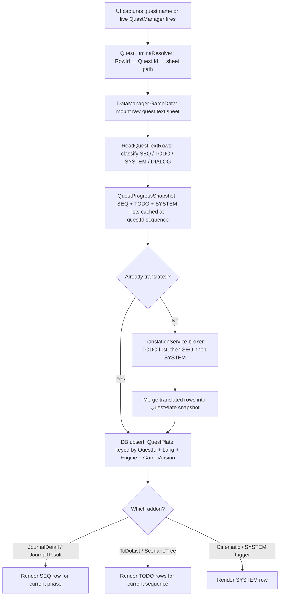

# Quest Full Pipeline Design

## Purpose

This document describes the intended end-to-end pipeline for quest text in Echoglossian:
from game data acquisition through translation to DB persistence and UI display.

It supersedes the earlier partial descriptions in `quest-sheet-acquisition-pipeline.md`
and `journal-quest-data-model-and-flow.md` by incorporating the confirmed row-type evidence
gathered through the offline `scripts/quest-reader` tool (April 2026).

---

## ScenarioTree Sheet — Quest Index

The **ScenarioTree** Excel sheet (`ScenarioTree` typed in Lumina) is a curated index of
main-scenario and important side-story quests. Its structure, confirmed by the offline
`scripts/quest-reader --scenario-tree` probe:

| Field           | Type                          | Meaning                                            |
|-----------------|-------------------------------|----------------------------------------------------|
| `RowId`         | `uint`                        | **Same as Quest.RowId** for the indexed quest      |
| `RowOffset`     | `int`                         | Ordered position in the scenario sequence           |
| `Name`          | `string`                      | Internal scenario chapter name (e.g. `T_VER600_02_14`) |
| `Addon`         | `RowRef<Addon>`               | Localized display text for the chapter header       |
| `QuestChapter`  | `RowRef<QuestChapter>`        | Points to the containing questline chapter          |
| `Type`          | `RowRef<ScenarioType>`        | Quest category (main story, side story, etc.)       |
| `Unknown0/1/2`  | `int`                         | Ordering/bitfield data, purpose TBD                 |

Total rows: **1,044** (as of the current game version in the test data).

### Key implication for the plugin

`ScenarioTree.RowId == Quest.RowId` — this is a direct join. When the in-game
`ScenarioTree` addon is open, we can identify the quest currently highlighted in it
by matching its `RowId` directly against `Quest.RowId`, without any string matching.

Not all quests have a `ScenarioTree` row. "The Paths We Walk" (`RowId=67011`) has no
entry, while "Strange Bedfellows" (`RowId=69929`) does. This means ScenarioTree covers
only the questlines that the in-game scenario tree UI lists.

### What the ScenarioTree addon renders

The in-game `ScenarioTree` UI renders the **active TODO row** (objective text) of each
quest in the list, using live quest manager state to determine which `_TODO_NN` slot
is currently active. The tab/chapter header text comes from `ScenarioTree.Addon`
(a localized string from the Addon sheet).

### Lookup strategy

When the `ScenarioTree` addon is open and we know the visible quest RowId:

1. Look up `ScenarioTree.RowId` → confirms membership in the scenario list.
2. Read the quest's TODO rows from the quest text sheet (already in `QuestProgressSnapshot.QuestSteps`).
3. Render the active TODO row for that quest in the overlay.
4. The chapter header text (`Addon` field) is a second translation source if chapter
   header translation is ever needed.

---

Every quest in FFXIV has a dedicated raw text sheet that contains all text associated with
that quest. The sheet path is derived from the internal quest identifier (`Quest.Id`),
**not** from `Quest.RowId`.

Sheet path formula: `quest/{internalId[-5..-3]}/{internalId}`

Example: `AktKmb114_04393` → `quest/043/AktKmb114_04393`

### Row classification

| Key pattern              | Type     | Count (typical) | Shown where                                              |
|--------------------------|----------|-----------------|----------------------------------------------------------|
| `_SEQ_NN`                | SEQ      | 1–10+           | `JournalDetail` body (one per quest phase/journal entry) |
| `_TODO_NN`               | TODO     | 1–8+ (padded)   | `ToDoList`, `ScenarioTree` objectives                    |
| `_SYSTEM_NNN_NNN`        | SYSTEM   | 0–10+           | Cinematic NPC captions                                   |
| `NPC_NAME_NNN_NNN` etc.  | DIALOG   | 20–100+         | NPC/character dialog lines                               |
| *(empty value)*          | EMPTY    | many            | Padding slots — safe to skip                             |

Sheet sizes confirmed from live data:

- "Strange Bedfellows" (`AktKmb114_04393`): 122 rows — 1 SEQ, 8 TODO, 1 SYSTEM, 73 DIALOG
- "The Paths We Walk" (`HeaVnz025_01475`): 130 rows — 10 SEQ, 8 TODO (padded to 24), 4 SYSTEM, ~85 DIALOG

---

## Pipeline Stages

### Stage 1 — Quest identity resolution

**Input:** quest name from UI or live `QuestManager` state  
**Tools:** `QuestLuminaResolver`, `QuestProgressResolver`

1. Resolve `Quest.RowId` from the display name or `QuestManager.Instance()`.
2. Read `Quest.Id.ExtractText()` to get the internal textual identifier.
3. Strip surrounding `[` `]` brackets if present (Lumina reflection artifact).
4. Derive the sheet path: `quest/{id[-5..-3]}/{id}`.

No UI text is used as input to identity resolution. The Quest sheet is the canonical source.

---

### Stage 2 — Sheet acquisition and row classification

**Input:** sheet path  
**Tools:** `DataManager.GameData.GetExcelSheet<RawRow>(name: sheetPath)`

Read every row from the quest text sheet. For each row:

1. Evaluate column 0 (key) and column 1 (value) as `SeString`.
2. Classify by key pattern:
   - Contains `_SEQ_` → **SEQ**
   - Contains `_TODO_` → **TODO**
   - Contains `_SYSTEM_` → **SYSTEM**
   - Otherwise populated → **DIALOG** *(captured but not translated in this iteration)*
   - Empty value → **EMPTY** (skip)
3. Preserve both the raw `ReadOnlySeString` payload and the evaluated text per entry.

At stage end, the resolver holds three classified lists:
- `QuestSeqEntries` — journal summaries (one per phase)
- `QuestStepEntries` — active objectives
- `QuestSystemEntries` — cinematic text

DIALOG rows are counted but not stored in the progress snapshot at this time.
They may be added in a future iteration when NPC dialog overlay is implemented.

---

### Stage 3 — Live progress merge

**Input:** classified row lists + `QuestManager.GetQuestSequence(questId)`  
**Cache key:** `$"{questId}:{questSequence}"`

The current quest sequence (byte 0–255) tells us which phase the player is on. The SEQ
rows are indexed implicitly by their ordinal — `_SEQ_00` is phase 0, `_SEQ_01` is phase 1,
and so on. The TODO rows visible at any given sequence should be filtered by the runtime
todo bitfield from the live quest manager (future refinement; currently all non-empty TODOs
are included).

Cache the combined snapshot at `(questId, questSequence)`. Invalidate on zone change or
when the plugin detects the sequence advanced.

---

### Stage 4 — Translation

**Input:** `QuestProgressSnapshot` with classified row lists  
**Tools:** `TranslationService` brokered queue

Translate each type separately and in priority order:

1. **TODO rows** (highest priority — visible in `ToDoList`/`ScenarioTree` immediately)
2. **SEQ rows** (shown in `JournalDetail` body — translate one per phase advance)
3. **SYSTEM rows** (cinematic — translate on demand when the cinematic fires)
4. **DIALOG rows** — future / opt-in; not translated in this iteration

Rules:
- Each row is a separate translation unit preserving its `ReadOnlySeString` payload.
- A row that was already translated at an earlier sequence should not be retranslated.
- If translation fails, cache the failure and do not retry every frame.
- Translated rows are stored in the DB snapshot (see Stage 5).

---

### Stage 5 — DB persistence

**Model:** `QuestPlate` (see schema below)  
**Key:** `(QuestId, TranslationLang, TranslationEngine, GameVersion)`

Update-or-insert logic:
1. Look up by key.
2. If not found, create a new row with all classified source rows.
3. If found, merge: add any new translated rows; do not overwrite translations that already
   exist for a given phase/step index.
4. Always update `UpdatedDate` and `QuestTextSheetName`.

---

### Stage 6 — Display routing

Each addon renders a specific subset of the classified data:

| Addon              | Data used              | Mode                  |
|--------------------|------------------------|-----------------------|
| `JournalDetail`    | SEQ row for current phase | Overlay or native  |
| `ToDoList`         | TODO rows              | Overlay or native     |
| `ScenarioTree`     | TODO rows              | Overlay or native     |
| `JournalAccept`    | TODO rows (preview)    | Overlay or native     |
| `JournalResult`    | SEQ row for last phase | Overlay or native     |
| Future dialog UI   | DIALOG rows            | Overlay only          |

In overlay-only mode, native addon nodes are never mutated.
In native mode, translated text is written into the addon text nodes.
In swap mode, the overlay shows the original text while native shows the translation.

---

## Proposed QuestPlate Schema

### New columns (additive)

| Column                       | Type    | Purpose                                              |
|------------------------------|---------|------------------------------------------------------|
| `QuestTextSheetName`         | TEXT    | Canonical sheet path used at last snapshot time      |
| `TranslatedObjectivesAsText` | TEXT    | JSON dict of translated TODO rows                    |
| `TranslatedSummariesAsText`  | TEXT    | JSON dict of translated SEQ rows                     |
| `SystemRowsAsText`           | TEXT    | JSON dict of original SYSTEM rows                    |
| `TranslatedSystemRowsAsText` | TEXT    | JSON dict of translated SYSTEM rows                  |

### Existing columns (unchanged)

| Column                | Notes                                                                |
|-----------------------|----------------------------------------------------------------------|
| `QuestId`             | Quest row id as string (stable primary key component)               |
| `QuestName`           | Display name                                                         |
| `OriginalQuestMessage`| Kept for backward compat; represents the single UI-visible body text |
| `TranslatedQuestMessage` | Translation of the single body text                               |
| `ObjectivesAsText`    | JSON dict of original TODO rows — **now populated from sheet**      |
| `SummariesAsText`     | JSON dict of original SEQ rows — **now populated from sheet**       |
| `TranslationLang`     | Target language                                                      |
| `TranslationEngine`   | Engine id                                                            |
| `GameVersion`         | Snapshot version, guards against stale translations                  |

### Key dict layout (JSON)

SEQ / Summaries dict — key is row key string, value is text:

```json
{
  "HeaVnz025_01475_SEQ_00": "After a meeting with the Scions...",
  "HeaVnz025_01475_SEQ_01": "Having spoken with Estinien..."
}
```

TODO / Objectives dict — key is row key string, value is text:

```json
{
  "AktKmb114_04393_TODO_00": "Speak with Alisaie.",
  "AktKmb114_04393_TODO_01": "Speak with Sabinianus."
}
```

SYSTEM dict follows the same key→value pattern.

---

## Flow Diagram



---

## Gap Summary vs Current Implementation

| Area                         | Current state                         | Target state                              |
|------------------------------|---------------------------------------|-------------------------------------------|
| `ReadQuestStepTexts`         | Only reads `_TODO_` rows              | Reads and classifies SEQ + TODO + SYSTEM  |
| `QuestProgressSnapshot`      | Has `QuestSteps` only                 | Also has `QuestSeqTexts`, `QuestSystemTexts` |
| `QuestPlate.SummariesAsText` | Always empty                          | Populated with SEQ rows from sheet        |
| `QuestPlate.ObjectivesAsText`| Always empty                          | Populated with TODO rows from sheet       |
| `QuestPlate.SystemRowsAsText`| Does not exist                        | New column, populated with SYSTEM rows    |
| Translated dicts             | No translated dict columns             | `TranslatedObjectivesAsText` + `TranslatedSummariesAsText` + `TranslatedSystemRowsAsText` |
| `QuestTextSheetName`         | Not stored                            | Stored per snapshot for diagnostics       |
| `JournalDetail` body source  | UI-scraped text in `OriginalQuestMessage` | SEQ row from sheet for current phase  |

---

## Related References

- [Quest Sheet Acquisition Pipeline](./quest-sheet-acquisition-pipeline.md)
- [Journal Quest Data Model and Flow](./journal-quest-data-model-and-flow.md)
- [Quest Probe Command](./quest-probe-command.md)
- [Quest Addon Handler Migration Guide](./quest-addon-handler-migration-guide.md)
- [scripts/quest-reader](../scripts/quest-reader/) — offline Lumina-based verification tool
- Lumina docs: https://lumina.xiv.dev/docs/intro.html
- EXDViewer: https://exd.camora.dev/sheet/Quest
