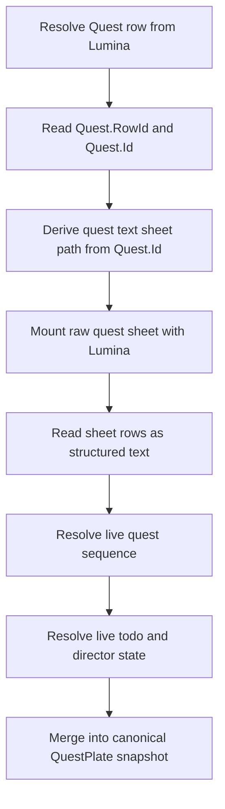
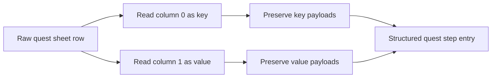

# Quest Sheet Acquisition Pipeline

## Purpose

This document is the reusable memory for how Echoglossian should obtain quest data from game sheets.

The goal is to avoid treating the Journal UI as the source of truth. The UI is the capture surface, but the stable quest data should come from Lumina and the live quest state exposed by the game.

## Core Identity Rules

There are three different pieces of quest identity that matter:

- `Quest.RowId` is the numeric quest id used for runtime progression and persistence keys.
- `Quest.Id` is the quest sheet identifier used to mount the quest text sheet from game files.
- `QuestSequence` is the live progression step returned by the game at runtime.

These are related, but they are not interchangeable.

Using the numeric quest id alone is not enough to mount the quest text sheet. The sheet path must be derived from the textual quest sheet id.

## How The Data Should Be Mounted

The acquisition flow should follow this order:

1. Resolve the `Quest` row from Lumina using the current language.
2. Read the quest's textual sheet identifier from `Quest.Id`.
3. Derive the quest text sheet path from that identifier.
4. Mount the raw sheet with Lumina.
5. Read the rows as structured text instead of flattening everything into one string.
6. Combine the sheet data with live quest progress from native game state.
7. Merge the result into the canonical `QuestPlate` snapshot.

## Sheet Path Derivation

The quest text sheets are mounted using the quest sheet id, not the numeric row id.

The path format follows the pattern:

```text
quest/<dir>/<questSheetId>
```

Where:

- `<questSheetId>` is the quest's `Id` value from the `Quest` row
- `<dir>` is derived from the last five characters of that sheet id, taking the first three of those five

Example:

```text
Quest.Id = AktKmb114_04393
Sheet path = quest/043/AktKmb114_04393
```

This is the same general pattern used by QuestShare's quest sheet loader and it matches the live quest sheet structure better than guessing from the numeric quest id.

## What To Read From The Sheet

When the quest sheet is mounted, the plugin should preserve the structure of the rows.

Important things to keep:

- row keys
- row values
- `ReadOnlySeString` payloads
- per-step `_TODO_` rows
- any other quest text rows that belong to the current quest state

The full sheet is useful because it shows the complete quest shape, not just the text currently visible in the UI.

## Runtime Progress Layer

Quest text sheets alone do not tell the whole story.

The live runtime state must also be consulted:

- `QuestManager.GetQuestSequence(questId)` for the current step
- `EventHandler.GetDirectorTodos()` for the live todo list
- `ToDoListNumberArray` for quest progress display and objective state

This live state is what keeps the plugin aligned with the current quest step instead of guessing from visible text.

## Recommended Flow



## Parsing Flow



## Why This Matters

Using the UI alone leads to problems:

- quest text can change as the quest advances
- the visible body may not contain the complete state
- different quest steps can be mixed together when the UI repaints
- the table can fragment into many rows that are not a clean canonical snapshot

Using Lumina plus live progress gives the plugin a stable way to:

- identify the correct quest
- mount the correct sheet
- preserve the quest payload structure
- update the canonical row in place as the quest advances

## Where This Is Used In Echoglossian

This pipeline is currently relevant to:

- the quest probe command
- Journal quest body inspection
- ToDoList and ScenarioTree progress handling
- `QuestProgressResolver`
- `QuestTodoProgressResolver`
- `QuestProbeCommandHelpers`

## References

- Lumina API: [`Lumina.GetExcelSheet<T>(Language)`](https://lumina.xiv.dev/api/Lumina.Lumina.html)
- Lumina Excel docs: [Advanced Excel](https://lumina.xiv.dev/docs/guides/excel.html)
- QuestShare: [`GameQuestManager.cs`](https://github.com/Era-FFXIV/QuestShare.Plugin/blob/main/QuestShare.Plugin/Common/GameQuestManager.cs)
- FFXIVClientStructs: `EventHandler.GetDirectorTodos()`

## External Validation Sources

These are useful when validating the quest-sheet pipeline against independent tools:

- [EXDViewer web](https://exd.camora.dev/sheet/Quest) for quick sheet browsing and row inspection
- [WorkingRobot/EXDViewer](https://github.com/WorkingRobot/EXDViewer) for the underlying viewer implementation and EXDSchema integration

EXDViewer is useful as a sanity-check because it is explicitly built to explore FFXIV Excel sheets, including large sheets like `Quest`, and it supports EXDSchema-backed structure inspection.

When a quest sheet path or row shape looks suspicious in Echoglossian, compare it with EXDViewer before changing the persistence model.

## Related Pipeline

Structured quest text should follow the shared payload-aware pipeline documented in [Structured Text Payload Pipeline](./structured-text-payload-pipeline.md). That document covers the broader SeString and payload preservation rules that also apply to item tooltips and action tooltips.

## Notes For Future Refactors

- If the quest sheet path cannot be resolved from `Quest.Id`, log the failure and fall back to the UI as a capture surface.
- Do not create persistent quest rows from live step state alone.
- Keep live progress keys strictly in-memory.
- If the quest data becomes available directly from sheets more reliably than from UI, prefer the sheet data as the primary source and the UI as fallback.
- The quest-family addon migration plan is documented in [Quest Addon Handler Migration Guide](./quest-addon-handler-migration-guide.md).
