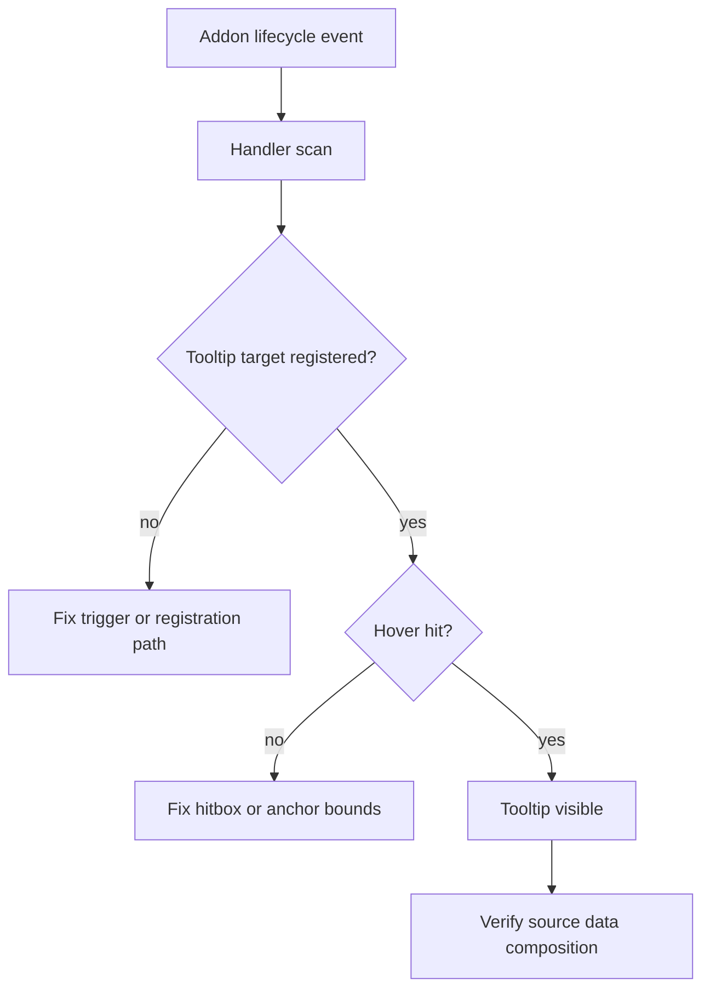

# Quest Tooltip Validation Notes

## Purpose

This document captures the current in-game validation state for quest-family
tooltips and hover triggers in Echoglossian.

It is intentionally focused on observed runtime behavior rather than desired
design. The goal is to keep a short, reusable memory of what was seen while
testing the current quest runtime stack.

## Validation Snapshot

The current live config snapshot has the quest family enabled for translation
and hover support:

- `TranslateJournal = true`
- `TranslateJournalAccept = true`
- `TranslateJournalResult = true`
- `TranslateRecommendList = true`
- `TranslateAreaMap = true`
- `TranslateScenarioTree = true`
- `TranslateToDoList = true`
- `TranslateTooltips = true`
- `JournalTranslationDisplayMode = 1`

The in-game test results were:

- `Journal` and `JournalDetail` produced tooltip registrations.
- `JournalDetail` hitbox coverage improved, but the body trigger still feels
  smaller than ideal.
- `JournalDetail` body tooltips show original text first and then translate as
  the DB catches up, which is acceptable.
- The body content still does not always match the full `QuestPlate` content;
  in practice it mostly shows the description and multiple objectives, while
  the summary only appears occasionally.
- `ToDoList`, `ScenarioTree`, `RecommendList`, and `AreaMap` did not emit
  tooltip registrations in the observed test window.
- `AreaMap` lifecycle events did fire when the addon opened, but no tooltip
  registration followed.

## Updated Validation Snapshot - 2026-04-13 12:55:02 -03:00

After the `ToDoList` row-bounds and `JournalDetail` body rebuild changes, the
runtime picture moved forward:

- `ToDoList` is now validated end-to-end.
- Real hover hits were observed repeatedly for `ToDoList`; it is no longer just
  registering targets without drawing the tooltip.
- `ToDoList` should be considered stable for now and should not be touched
  unless a new regression appears.
- `JournalDetail` now produces consistent body hover hits over a much larger
  region.
- The remaining `JournalDetail` issue is now content stability, not trigger
  liveness.
- The `JournalDetail` body bounds still vary across refresh cycles, which
  suggests the body content is still being recomposed from a changing set of
  visible nodes.
- `ScenarioTree`, `RecommendList`, and `AreaMap` still need focused runtime
  validation in their own test window; they were not materially represented in
  the most recent log slice.

## What This Suggests

The current runtime behavior points to two separate problems:

1. `Journal` and `JournalDetail` are mostly working, but `JournalDetail` still
   needs a more stable body composition strategy.
2. `ToDoList` no longer belongs in the active-problem list after the latest
   validation pass.
3. The other quest addons likely still have a trigger or registration gap, not
   just a translation gap.
4. In dense UIs, overlapping hover rects can hide the more specific target if
   selection follows registration or dictionary order instead of choosing the
   smallest valid hovered region.

The data-source direction remains the same:

- UI is good for identifying the active quest surface.
- Lumina and quest sheet acquisition should drive the actual quest content.
- Runtime progress should come from director data.
- Tooltip registration should only consume the final composed text.

## JournalDetail persistence and cache note - 2026-04-13 13:18:42 -03:00

A later code inspection plus live DB check exposed a real persistence gap
behind the remaining `JournalDetail` inconsistency:

- existing rows could be found by quest identity but still have an empty
  `TranslatedQuestMessage`
- translated SEQ/current-summary rows were not being materialized consistently
  into the translated quest maps
- `QuestTextSheetName` and `SourceContentHash` were not guaranteed to be
  persisted when the row originated from an earlier Journal-list-only path

The runtime flow was adjusted so `JournalDetail` now backfills those fields on
the first live detail resolution. A controlled wipe of `questplates` is now a
reasonable validation step after loading that build, because it removes legacy
partial rows from the equation.

## JournalDetail DB contamination note - 2026-04-13 15:59:46 -03:00

The latest runtime DB inspection showed that the remaining `JournalDetail`
inconsistency was not only a tooltip-composition issue; it was also a
persistence issue.

Observed state:

- multiple recent `questplates` rows still had empty `QuestTextSheetName` and
  `SourceContentHash`
- several `TranslatedSummariesAsText` payloads contained a legitimate
  translation, but also carried an unrelated summary fragment from a different
  quest

The root causes were:

- the `QuestPlate` merge path was not persisting `QuestTextSheetName` or
  `SourceContentHash`
- the `JournalDetail` body still persisted the wider set of visible UI summary
  nodes, which can retain stale text across quest switches

Current mitigation:

- metadata fields are now merged during save
- the canonical `JournalDetail` body no longer persists the extra summary-node
  set; it stays anchored to description, current objective, live summary node,
  and the current `SEQ` row only

## Hover-selection and requested-update note - 2026-04-13 19:05:00 -03:00

Two more runtime causes were identified after the latest `ToDoList` and
`ScenarioTree` pass:

- the hover manager previously chose the first overlapping hovered target it
  encountered, which can cause a larger quest-title or row rect to swallow a
  smaller objective rect underneath the cursor
- `ScenarioTree` and `AreaMap` were both wired to `PreRequestedUpdate`, but
  their handlers only accepted `AddonRefreshArgs`, turning that trigger path
  into a no-op whenever the addon refreshed without refresh args

Current mitigation:

- overlapping hover targets now prefer the smallest hovered rectangle
- `ScenarioTree` and `AreaMap` now fall back to the live addon's `AtkValues`
  when the requested-update event fires without refresh args

## Runtime isolation note - 2026-04-13 20:20:09 -03:00

The latest 10-minute `dalamud.log` slice suggests the quest-family runtime is
still too coupled across addons.

Observed state in that slice:

- `JournalList` dominated the log window
- `JournalDetail` was still alive, but only lightly represented
- `_ToDoList`, `ScenarioTree`, `RecommendList`, and `AreaMap` had no useful
  lines in the same window
- no new translation activity appeared in that slice; it was almost entirely
  hover traffic

What this suggests:

- the shared DB and shared translation broker remain sensible common
  infrastructure
- the shared UI/runtime caches are probably too broad for the quest family
- each quest addon should keep its own short-lived runtime cache and hover
  state, while still reading from the same canonical `questplates` rows and
  quest-sheet/progress resolvers

## Suggested Debug Flow

When these issues recur, the safest order is:

1. confirm the addon lifecycle event is firing
2. confirm a tooltip target is registered
3. confirm the hover rect is large enough to hit
4. confirm the tooltip body is reading the right source data

## Related Docs

- [Quest Addon Translation Runtime Flow](./quest-addon-translation-runtime-flow.md)
- [Journal Quest Data Model and Flow](./journal-quest-data-model-and-flow.md)
- [Quest Sheet Acquisition Pipeline](./quest-sheet-acquisition-pipeline.md)
- [Structured Text Payload Pipeline](./structured-text-payload-pipeline.md)
