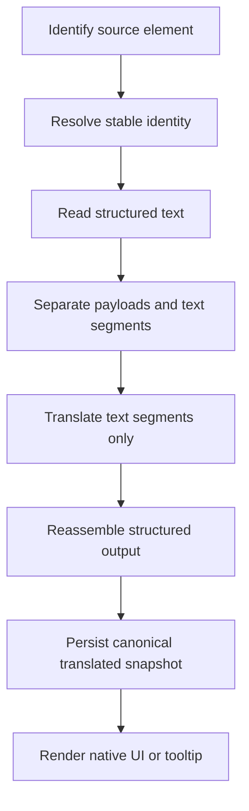
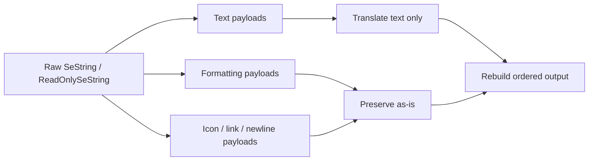
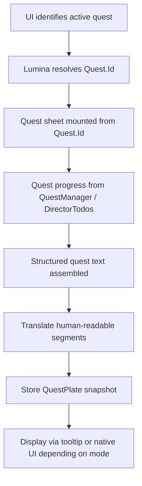
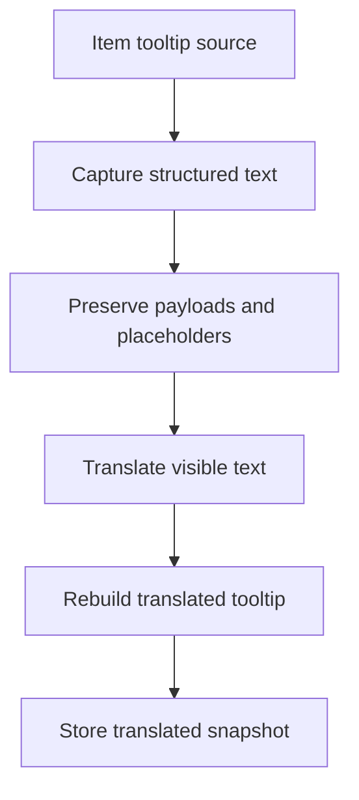
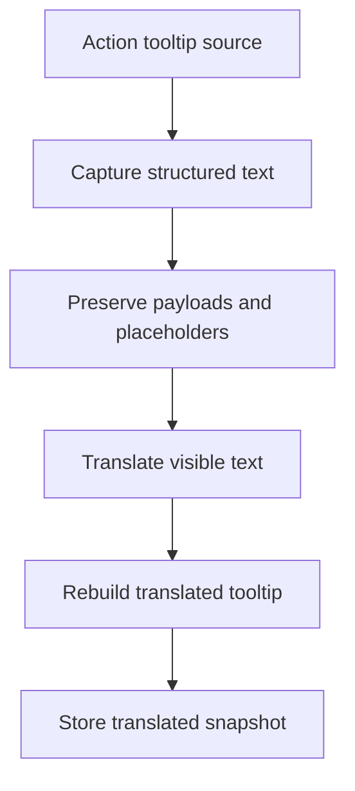

# Structured Text Payload Pipeline

## Purpose

This document is the reusable memory for how Echoglossian should handle structured game text across quests, item tooltips, action tooltips, and other SeString-backed UI surfaces.

The key rule is simple: **preserve payload structure and translate only the human-readable text segments**.

Do not flatten structured game text into plain strings unless the feature is explicitly meant to be lossy.

## Why This Exists

Echoglossian already touches several text families:

- quest sheets and quest progress
- `Journal` / `ToDoList` / `ScenarioTree` / `RecommendList`
- `ItemTooltip`
- `ActionTooltip`
- `StringArrayData`
- addon text nodes that expose `SeString` or `ReadOnlySeString`
- addon text nodes that are more stable than `AtkValues` for reused addon
  contexts such as `_MainCommand` and `AddonContextMenuTitle`

These surfaces can contain:

- formatting payloads
- icon payloads
- newline payloads
- hyperlinks / references
- placeholders
- dynamic names, counters, and tokens

If the plugin translates them as plain strings, payloads can be lost and the final UI can become unstable, incomplete, or visually incorrect.

## Core Rule Set

### Capture

- Read the original text from the correct source.
- Preserve the raw structured representation whenever possible.
- Use the UI only to identify the element or the current runtime state, not as the source of truth for long-term text content.

### Parse

- Split structured text into text-bearing segments and non-text payloads.
- Keep payloads in order.
- Keep placeholders, numbering, and formatting markers intact.

### Translate

- Translate only the text-bearing portions.
- Do not ask the translation engine to infer payload meaning.
- If a translation request is batched, preserve the segment order in the batch key and in the reassembly step.

### Reassemble

- Rebuild the structured output with the original payload ordering.
- If a feature can only store plain text, store the payload-aware translated variant separately.
- Never mutate native addon state in overlay-only mode.

### Persist

- Persist the canonical translated result together with the original structured source.
- Keep the current DB semantics stable unless a migration is explicitly requested.
- Use versioned or additive migrations for new structured fields.

## Data Sources

The pipeline should prefer these sources in this order:

1. Native runtime state for identification and progress
2. Lumina sheets for stable quest and data identity
3. Raw `SeString` / `ReadOnlySeString` text payloads
4. UI text as a fallback capture surface only

### Quest Flow

For quests, the recommended split is:

- `Quest.Id` identifies the quest sheet
- `QuestManager.GetQuestSequence()` and `GetDirectorTodos()` identify live progress
- Lumina quest sheets provide the stable structured text
- the UI is used only to identify the active quest and display surface

### Item Tooltip Flow

For item tooltips, the source should be:

- item sheet data
- tooltip payloads from the item surface
- the DB cache for previously translated structured variants

### Action Tooltip Flow

For action tooltips, the source should be:

- action sheet data
- tooltip payloads from the action surface
- the DB cache for previously translated structured variants

## Existing Repo Patterns

The repository already shows several useful patterns:

- the legacy `StringArrayDataHandler` showed that raw bytes and extracted text
  should be kept together, even though that global runtime has now been
  removed from the live plugin path.
- `QuestProgressResolver` keeps quest identity separate from the displayed UI text.
- `QuestProbeCommandHelpers` and `QuestSheetAcquisitionPipeline` demonstrate how to mount structured quest sheets from stable identifiers.
- `UiActionDetailHandler` and the `SeString` helper paths show where tooltip payload inspection already starts.
- the DB-first `GameWindow` runtime now supports a `textNodes` payload branch for
  surfaces where visible `AtkTextNode`s are more stable than `AtkValues`
- `HoverTooltipManager` keeps hover presentation separate from content capture.

These are the building blocks we should reuse rather than inventing parallel pipelines.

## Recommended Pipeline

## Payload Preservation Flow

## Quest-Specific Flow

## Item Tooltip Flow

## Action Tooltip Flow

## Storage Guidance

For tooltip-like data, the DB should keep both the original and translated variants in a way that preserves structure.

Recommended fields conceptually:

- stable identity
- original language
- target translation language
- translation engine
- game version
- original structured source
- translated structured output
- optional payload-aware serialized form
- timestamps

This is already conceptually close to:

- `StringArrayDatas`
- `ItemTooltip`
- `ActionTooltip`
- `QuestPlate`

The difference is that quests need progression-aware identity, while item and action tooltips generally do not.

## What Not To Do

- Do not translate payload tokens as if they were normal words.
- Do not flatten the structured text and hope the formatting survives.
- Do not depend on UI text as the sole long-term source of quest content.
- Do not create a second translation queue just for payload-aware text.
- Do not mutate native addon nodes when the active mode is tooltip-only.
- Do not assume `AtkValue` slot index is a stable identity when one addon
  reuses the same slots for different runtime contexts.

## Reusable Helpers To Keep In Mind

- `GenericAddonHandlerHelper` for structured batch translation/save patterns
- `QuestProgressResolver` for stable quest identity and live progress
- `QuestProbeCommandHelpers` for quest-sheet inspection
- `HoverTooltipManager` for hover presentation and wrapping
- `TranslationQueueHelpers` for cached/brokered translation reuse

## External References

These references are useful when validating the pipeline:

- Lumina: <https://github.com/NotAdam/Lumina>
- Lumina.Excel: <https://github.com/NotAdam/Lumina.Excel>
- Lumina docs: <https://lumina.xiv.dev/docs/intro.html>
- QuestShare: <https://github.com/Era-FFXIV/QuestShare.Plugin>
- EXDViewer: <https://github.com/WorkingRobot/EXDViewer>
- EXD viewer for quick inspection: <https://exd.camora.dev/sheet/Quest>
- HaselDebug: <https://github.com/Haselnussbomber/HaselDebug>
- Dalamud SeString docs: <https://dalamud.dev/plugin-development/sestring/>

## Notes For Future Refactors

- If a surface exposes `ReadOnlySeString`, treat it as structured text by default.
- If a surface exposes only plain strings, prefer a structured source upstream whenever one exists.
- If a quest advances, update the canonical quest snapshot instead of creating per-step fragments.
- If an item or action tooltip contains payloads, keep payload order stable across translation and persistence.
- When in doubt, use the UI to identify the current element and Lumina or native runtime state to define the real text source.
