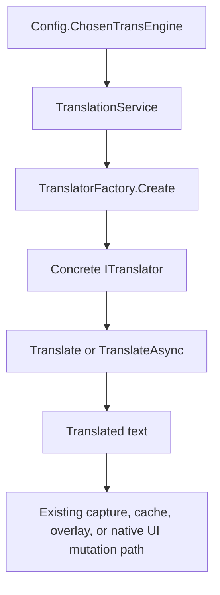
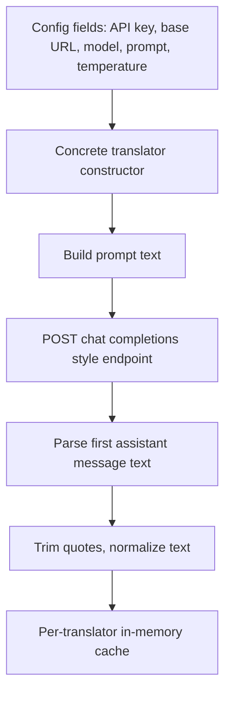
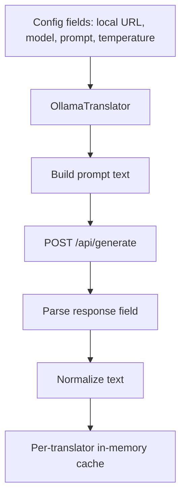
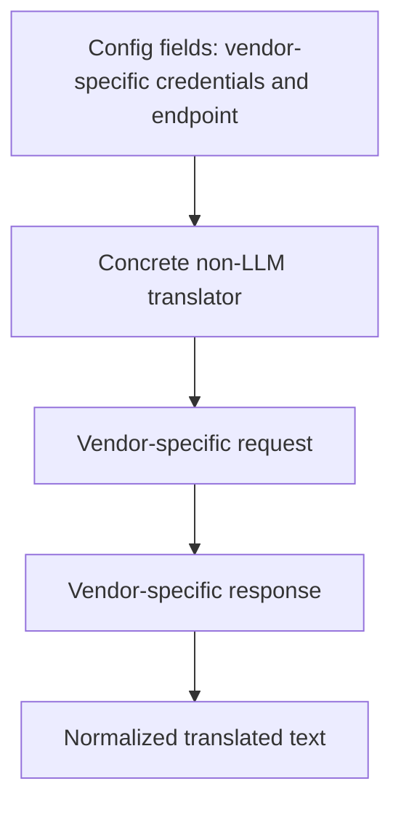

# Translation Engines Architecture And Flows

## Purpose

This document describes how Echoglossian translation engines are wired today, where the engine-specific behavior lives, and which parts must be updated together when a new engine is added.

The immediate target is Claude support, but the goal of this document is broader: keep engine work predictable, reviewable, and consistent.

## Core Principle

Echoglossian has one shared translation pipeline and many engine adapters.

The engine should only own:

- remote or local API client setup
- engine-specific request payload shape
- engine-specific response parsing
- engine-specific model catalog
- engine-specific configuration UI

The engine should not create a parallel translation service, a separate cache strategy, or a custom persistence path.

## Shared Runtime Flow



## Engine Integration Surface

When adding a new engine, update all of these surfaces together.

| Surface | Current owner | Why it matters |
| --- | --- | --- |
| Engine enum value | `GeneralHelpers/Utils.cs` | Persistent engine id and factory selection |
| Engine display list | `PluginUI/PluginUI.cs` | User-visible engine picker order |
| Per-language support | `LanguagesHandling/LanguageEngineSupport.cs` | Whether the engine appears for a chosen target language |
| Factory wiring | `Translators/TranslatorFactory.cs` | Runtime translator construction |
| Stable implementation map | `Translators/TranslatorEngineMap.cs` | Tests and non-instantiating checks |
| Prompt type | `GeneralHelpers/Utils.cs` | Prompt editor routing |
| Prompt storage | `PluginUI/Helpers/PromptTemplateManager.cs` | Prompt load/save/default behavior |
| Engine config fields | `Config.cs` | Persisted API key, model, prompt, toggle, endpoint |
| Engine UI panel | `PluginUI/EngineConfigUI/*.cs` | Settings UX and live model toggle |
| Model defaults | `Translators/<Engine>/*TextModelDefaults.cs` | Offline static fallback list |
| Live model manager | `Translators/<Engine>/*ModelManager.cs` | Optional runtime refresh |
| Translator implementation | `Translators/*Translator.cs` | Actual request and response handling |
| Resources | `Properties/Resources.resx` | Localized labels and warning text |
| Tests | `Echoglossian.Tests/*` | Factory coverage and engine-support verification |

## Current Engine Inventory

| Engine | Enum id | Translator | Model source | Prompt-aware | Live model list |
| --- | ---: | --- | --- | --- | --- |
| Google | 0 | `GoogleTranslator` | n/a | no | no |
| DeepL | 1 | `DeepLTranslator` | n/a | no | no |
| ChatGPT / OpenAI | 2 | `ChatGPTTranslator` | `OpenAITextModelDefaults` + `OpenAIModelManager` | yes | yes |
| YandexCloud | 3 | `YandexTranslator` | n/a | yes | no |
| GTranslate | 4 | `GTranslateTranslator` | n/a | no | no |
| DeepSeek | 5 | `DeepSeekTranslator` | `DeepSeekTextModelDefaults` + `DeepSeekModelManager` | yes | yes |
| Ollama | 6 | `OllamaTranslator` | `OllamaTextModelDefaults` + live local runtime | yes | yes |
| LibreTranslate | 7 | `LibreTranslateTranslator` | n/a | limited | no |
| Microsoft | 8 | `MicrosoftTranslator` | n/a | yes | no |
| Amazon | 9 | `AmazonTranslateTranslator` | n/a | yes | no |
| Gemini | 10 | `GeminiTranslator` | `GeminiTextModelDefaults` + `GeminiModelManager` | yes | yes |
| YandexPublic | 11 | `YandexPublicTranslator` | n/a | no | no |
| OpenRouter | 12 | `OpenRouterTranslator` | `OpenRouterTextModelDefaults` + `OpenRouterModelManager` | yes | yes |
| LmStudio | 13 | `LmStudioTranslator` | `LmStudioTextModelDefaults` + `LmStudioModelManager` | yes | yes |
| Claude | 14 | `ClaudeTranslator` | `ClaudeTextModelDefaults` + `ClaudeModelManager` | yes | yes |

## Engine Families

### 1. OpenAI-style Chat Completions Engines

This family currently includes:

- ChatGPT / OpenAI
- OpenRouter
- DeepSeek
- LM Studio

They all follow the same broad request pattern: a single prompt is packed into one user message and sent to a chat-completions-like endpoint.



### 2. Gemini GenerateContent Engine

Gemini does not use OpenAI-style chat completions.

```mermaid
flowchart TD
    A[Config fields: API key, model, prompt, temperature] --> B[GeminiTranslator]
    B --> C[Build prompt text]
    C --> D[POST v1beta models/{model}:generateContent]
    D --> E[Parse candidates[0].content.parts[0].text]
    E --> F[Trim quotes, normalize text]
    F --> G[Per-translator in-memory cache]
```

### 3. Ollama Local Generate Engine

Ollama is local and uses its own generate endpoint.



### 4. Claude Messages Engine

Claude is its own family.

```mermaid
flowchart TD
    A[Config fields: API key, base URL, model, prompt, temperature] --> B[ClaudeTranslator]
    B --> C[Build prompt text from template placeholders]
    C --> D[POST /v1/messages]
    D --> E[Headers: x-api-key + anthropic-version]
    E --> F[Parse content[] text blocks]
    F --> G[Trim quotes, normalize text]
    G --> H[Per-translator in-memory cache]
```

### 5. Non-LLM Vendor Translation Engines

This family includes:

- Google
- DeepL
- Microsoft
- Amazon
- YandexCloud
- YandexPublic
- GTranslate
- LibreTranslate

They do not use model dropdowns, live model managers, or prompt-template editing in the same way as the LLM-backed engines.



## Claude-Specific Notes

Claude uses Anthropic's Messages API rather than OpenAI-compatible chat completions.

The important differences are:

- endpoint: `POST /v1/messages`
- auth header: `x-api-key`
- required version header: `anthropic-version`
- model catalog endpoint: `GET /v1/models`
- response text lives in `content[]` blocks rather than `choices[0].message.content`

Because of that, Claude should not be bolted onto `ChatGPTTranslator`, `OpenRouterTranslator`, or `DeepSeekTranslator`.

It needs its own adapter even though the surrounding plugin architecture stays shared.

## Language Support Model

Engine visibility in the UI is gated by `LanguageEngineSupport`.

Two categories exist:

- vendor-listed engines with an explicit support table
- broad-coverage LLM engines without a fixed vendor translation-language table

Claude belongs in the second group today, alongside:

- ChatGPT
- DeepSeek
- Gemini
- OpenRouter
- Ollama
- LM Studio

That means Claude should be added to `BroadCoverageLlms`, which makes it available for every language entry after support normalization runs.

## Current Architectural Debt To Be Aware Of

These are not blockers for Claude, but they matter for future maintenance:

1. `TransEngines` is marked with `[Flags]`, but the values are sequential integers rather than bit flags.
2. Engine visibility in the UI depends on positional integer ids, so inserting an engine in the middle would break config compatibility and language support lists.
3. Prompt handling is not fully uniform across all existing LLM engines.
4. `PromptTemplateManager.GetPromptTypeForEngine` was index-coupled and easy to drift; new engine work should prefer enum-based routing.
5. The live model managers are not normalized behind a single interface; each engine currently owns its own refresh logic.

## Safe Rule For Future Engine Work

When adding or modifying an engine:

1. append the engine to the end of the enum and engine list instead of inserting it in the middle
2. update `LanguageEngineSupport` in the same change
3. keep the translator implementation narrow and engine-specific
4. reuse `TranslationService` and `ITranslator`
5. add or update a model defaults file even if live fetch exists
6. validate with build and tests after every engine-wide change

## Files To Read First For Engine Work

- `Config.cs`
- `GeneralHelpers/Utils.cs`
- `PluginUI/PluginUI.cs`
- `PluginUI/Tabs/TranslationEnginesTab.cs`
- `PluginUI/Helpers/PromptTemplateManager.cs`
- `PluginUI/Components/ModelDropdownUI.cs`
- `LanguagesHandling/LanguageEngineSupport.cs`
- `Translators/TranslatorFactory.cs`
- `Translators/TranslatorEngineMap.cs`
- `Translators/TranslationService.cs`
- `Translators/<Engine>/*`

## Future Backlog

For requested-but-not-yet-implemented engine candidates, see:

- [translation-engine-backlog.md](translation-engine-backlog.md)

For planned improvements specific to LLM-backed engines, including compact
prompting, surface-group engine routing, and optional short-lived dialogue
session context, see:

- [llm-translation-improvements-plan.md](llm-translation-improvements-plan.md)

## Governance Reminder

Development-time AI usage disclosure for official repository submissions is a
separate governance concern from runtime translation engines. See:

- [official-plugin-repo-ai-usage-disclosure.md](official-plugin-repo-ai-usage-disclosure.md)
