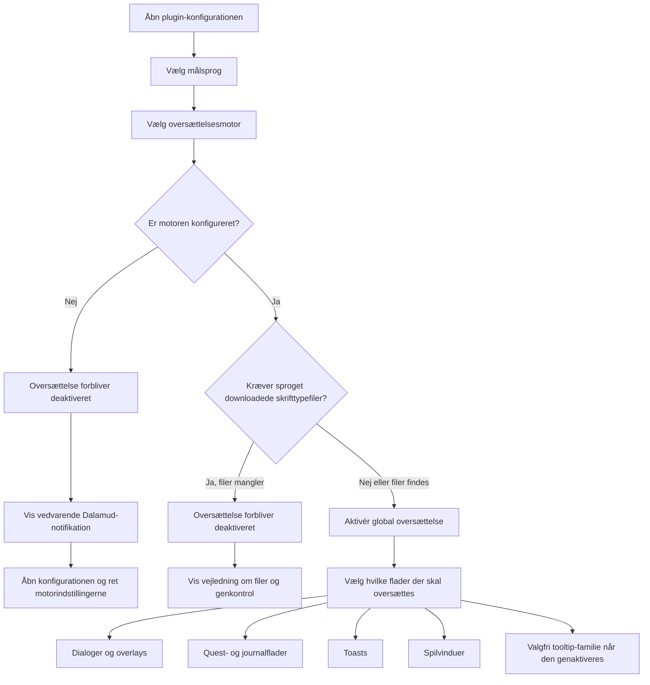

<!--
  Copyright (c) lokinmodar. All rights reserved.
  Licensed under the Creative Commons Attribution-NonCommercial-NoDerivatives 4.0 International Public License license.
-->

# Oversigt over understøttede oversættelsesflader

Dette dokument er den kanoniske oversigt over Echoglossians bruger-konfigurerbare oversættelsesflader.

Hold det opdateret, hver gang en ny flade, tilstand eller release-begrænsning bliver tilføjet eller fjernet.

## Aktiveringsflow

## Familier af oversættelsestilstande

| Tilstandsfamilie | Tilstande | Bruges af |
| --- | --- | --- |
| Quest-/native-vindue-familie | `Native UI Translation`, `Tooltip Translation Only`, `Native UI Translation With Original Tooltips` | Journal-familiens flader og DB-first spilvinduer |
| Overlay-familie | `Native UI Translation`, `Overlay Translation Only`, `Native UI Translation With Original Overlay` | Talk, BattleTalk, undertekster, MiniTalk, CutSceneSelectString og toast-familien |

## Dialog- og overlayflader

| Flade | Konfig-toggle | Tilstande | Bemærkninger | Status i nuværende release |
| --- | --- | --- | --- | --- |
| Talk | `TranslateTalk` | Overlay-familie | Understøtter oversatte NPC-navne via `TranslateTalkNpcNames` | Aktiveret |
| BattleTalk | `TranslateBattleTalk` | Overlay-familie | Understøtter oversatte NPC-navne via `TranslateBattleTalkNpcNames` | Aktiveret |
| TalkSubtitle | `TranslateTalkSubtitle` | Overlay-familie | Overlay uden titel, når overlay-tilstand er aktiv | Aktiveret |
| MiniTalk | `TranslateMiniTalk` | Overlay-familie | Lille native flade; ordrige tekster kræver stadig omhyggelig native reflow | Aktiveret |
| CutSceneSelectString | `TranslateCutSceneSelectString` | Overlay-familie | Spørgsmålet bliver titel, og valgmulighederne bliver brødteksten i overlay-tilstand | Aktiveret |

## Quest- og journalflader

| Flade | Konfig-toggle | Tilstande | Bemærkninger | Status i nuværende release |
| --- | --- | --- | --- | --- |
| Journal | `TranslateJournal` | Quest-/native-vindue-familie | Questliste | Aktiveret |
| JournalDetail | `TranslateJournalDetail` | Quest-/native-vindue-familie | Tæt indholdslayout; native tilstand kræver eksplicit block reflow | Aktiveret |
| ToDoList | `TranslateToDoList` | Quest-/native-vindue-familie | Quest-tracker / målliste | Aktiveret |
| ScenarioTree | `TranslateScenarioTree` | Quest-/native-vindue-familie | Hovedscenarie-tracker | Aktiveret |
| JournalAccept | `TranslateJournalAccept` | Quest-/native-vindue-familie | Quest-acceptvindue | Aktiveret |
| JournalResult | `TranslateJournalResult` | Quest-/native-vindue-familie | Quest-resultat / afslutningsvindue | Aktiveret |
| RecommendList | `TranslateRecommendList` | Quest-/native-vindue-familie | Anbefalingsliste | Aktiveret |
| AreaMap | `TranslateAreaMap` | Quest-/native-vindue-familie | Questtekst i kortrelateret quest-UI | Aktiveret |

## Toast-flader

| Flade | Konfig-toggle | Tilstande | Bemærkninger | Status i nuværende release |
| --- | --- | --- | --- | --- |
| WideText / Screen Info toast | `TranslateWideTextToast` | Overlay-familie | Stor informations-toast midt på skærmen | Aktiveret |
| Error toast | `TranslateErrorToast` | Overlay-familie | Fejl- og advarselsnotifikationer | Aktiveret |
| Area toast | `TranslateAreaToast` | Overlay-familie | Område- og lokationsnotifikationer | Aktiveret |
| Class / Job change toast | `TranslateClassChangeToast` | Overlay-familie | Meddelelse om class/job-skift | Aktiveret |
| Text gimmick hint | `TranslateTextGimmickHint` | Overlay-familie | Gimmick-/tutorial-hint | Aktiveret |
| Quest toast | `TranslateQuestToast` | Overlay-familie | Quest-relateret toast-notifikation | Aktiveret |

## Spilvinduesflader

| Flade | Konfig-toggle | Tilstande | Bemærkninger | Status i nuværende release |
| --- | --- | --- | --- | --- |
| Character window | `TranslateCharacterWindow` | Quest-/native-vindue-familie | DB-first game-window-runtime | Aktiveret |
| Main Command | `TranslateMainCommandWindow` | Quest-/native-vindue-familie | DB-first game-window-runtime | Aktiveret |
| Action Menu | `TranslateActionMenuWindow` | Quest-/native-vindue-familie | DB-first game-window-runtime | Aktiveret |
| HUD windows | `TranslateHudWindow` | Quest-/native-vindue-familie | DB-first game-window-runtime | Aktiveret |
| Operation Guide | `TranslateOperationGuideWindow` | Quest-/native-vindue-familie | DB-first game-window-runtime | Aktiveret |
| Addon Context Menu Title | `TranslateAddonContextMenuTitle` | Quest-/native-vindue-familie | DB-first game-window-runtime | Aktiveret |

## Skjulte eller midlertidigt begrænsede flader

| Flade | Konfig-toggle | Tilstande | Bemærkninger | Status i nuværende release |
| --- | --- | --- | --- | --- |
| Action / item detail tooltips | `TranslateTooltips` | Overlay-familie | Struktureret tooltip-oversættelse deaktiveres tvunget ved opstart, mens `ActionDetail` / `ItemDetail` stadig er ustabile | Midlertidigt deaktiveret i release |
| Yes/No dialog | `TranslateYesNoScreen` | Kun toggle | Findes i konfigurationsmodellen og tab-implementeringen, men er ikke eksponeret i det aktive Overlay-tab-flow | Implementeret men skjult i nuværende UI |
| SelectString dialog | `TranslateSelectString` | Kun toggle | Findes i konfigurationsmodellen og tab-implementeringen, men er ikke eksponeret i det aktive Overlay-tab-flow | Implementeret men skjult i nuværende UI |
| SelectOk dialog | `TranslateSelectOk` | Kun toggle | Findes i konfigurationsmodellen og tab-implementeringen, men er ikke eksponeret i det aktive Overlay-tab-flow | Implementeret men skjult i nuværende UI |

## Driftsnoter

| Emne | Adfærd |
| --- | --- |
| Global aktivering | Oversættelse forbliver ikke aktiveret, medmindre den valgte motor er gyldig og konfigureret til det valgte sprog |
| Downloadede skrifttypefiler | Nogle sprog kræver downloadede skrifttypefiler, før oversættelse kan aktiveres sikkert |
| Kun-overlay-sprog | Når sproget er overlay-only, normaliseres native-erstatningstilstande til overlay-/tooltip-præsentation |
| Aktivering pr. flade | Hver familie kræver stadig sin egen toggle pr. flade, selv efter global oversættelse er aktiveret |
| Release-gating | En flade kan eksistere i konfiguration eller kode, men stadig være bevidst skjult eller tvangsdeaktiveret i en given release |

## Vedligeholdelsesregler

- Opdater denne matrix, hver gang en ny oversættelsesflade tilføjes.
- Opdater denne matrix, hver gang en flade skifter tilstandsfamilie.
- Opdater denne matrix, hver gang en release midlertidigt deaktiverer eller skjuler en funktion.
- Foretræk at dokumentere faktisk runtime-adfærd frem for ønsket fremtidig adfærd.
