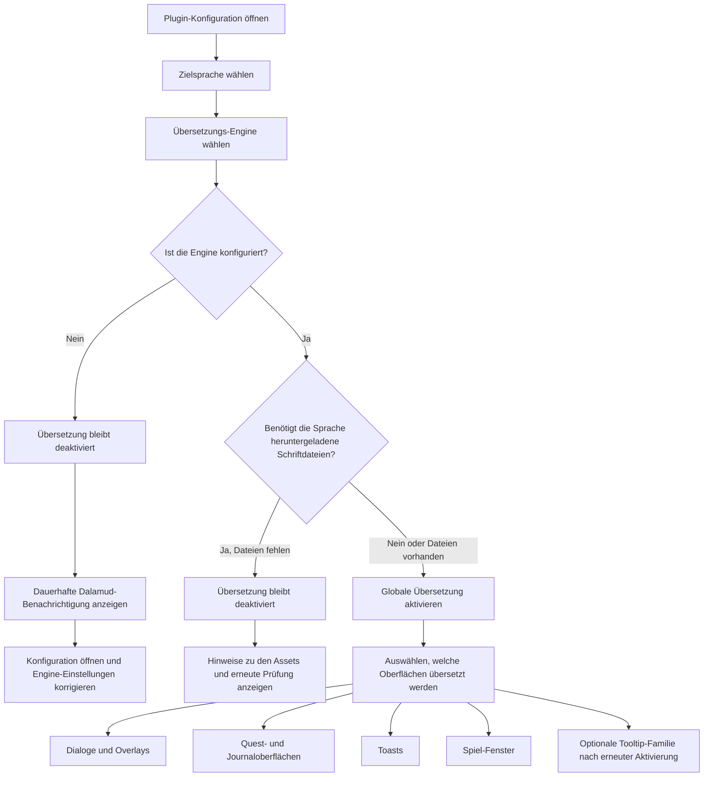

<!--
  Copyright (c) lokinmodar. All rights reserved.
  Licensed under the Creative Commons Attribution-NonCommercial-NoDerivatives 4.0 International Public License license.
-->

# Matrix der unterstützten Übersetzungsoberflächen

Dieses Dokument ist die kanonische Übersicht über die vom Benutzer konfigurierbaren Übersetzungsoberflächen von Echoglossian.

Es sollte jedes Mal aktualisiert werden, wenn eine neue Oberfläche, ein neuer Modus oder eine Release-Beschränkung hinzugefügt oder entfernt wird.

## Aktivierungsablauf

## Übersetzungsmodus-Familien

| Modusfamilie | Modi | Verwendet von |
| --- | --- | --- |
| Quest-/Native-Window-Familie | `Native UI Translation`, `Tooltip Translation Only`, `Native UI Translation With Original Tooltips` | Journal-Familie und DB-first-Spiel-Fenster |
| Overlay-Familie | `Native UI Translation`, `Overlay Translation Only`, `Native UI Translation With Original Overlay` | Talk, BattleTalk, Untertitel, MiniTalk, CutSceneSelectString und Toast-Familie |

## Dialog- und Overlay-Oberflächen

| Oberfläche | Konfigurations-Toggle | Modi | Hinweise | Status der aktuellen Release |
| --- | --- | --- | --- | --- |
| Talk | `TranslateTalk` | Overlay-Familie | Unterstützt übersetzte NPC-Namen über `TranslateTalkNpcNames` | Aktiviert |
| BattleTalk | `TranslateBattleTalk` | Overlay-Familie | Unterstützt übersetzte NPC-Namen über `TranslateBattleTalkNpcNames` | Aktiviert |
| TalkSubtitle | `TranslateTalkSubtitle` | Overlay-Familie | Titellose Overlay-Darstellung, wenn der Overlay-Modus aktiv ist | Aktiviert |
| MiniTalk | `TranslateMiniTalk` | Overlay-Familie | Kleine native Oberfläche; ausführlichere Texte benötigen weiterhin sorgfältiges natives Reflow | Aktiviert |
| CutSceneSelectString | `TranslateCutSceneSelectString` | Overlay-Familie | Die Frage wird im Overlay-Modus zum Titel und die Optionen zum Haupttext | Aktiviert |

## Quest- und Journal-Oberflächen

| Oberfläche | Konfigurations-Toggle | Modi | Hinweise | Status der aktuellen Release |
| --- | --- | --- | --- | --- |
| Journal | `TranslateJournal` | Quest-/Native-Window-Familie | Questlisten-Oberfläche | Aktiviert |
| JournalDetail | `TranslateJournalDetail` | Quest-/Native-Window-Familie | Dichtes Body-Layout; der native Modus erfordert explizites Block-Reflow | Aktiviert |
| ToDoList | `TranslateToDoList` | Quest-/Native-Window-Familie | Quest-Tracker / Zielliste | Aktiviert |
| ScenarioTree | `TranslateScenarioTree` | Quest-/Native-Window-Familie | Hauptszenario-Tracker | Aktiviert |
| JournalAccept | `TranslateJournalAccept` | Quest-/Native-Window-Familie | Quest-Annahmefenster | Aktiviert |
| JournalResult | `TranslateJournalResult` | Quest-/Native-Window-Familie | Quest-Ergebnis- / Abschlussfenster | Aktiviert |
| RecommendList | `TranslateRecommendList` | Quest-/Native-Window-Familie | Empfehlungsliste | Aktiviert |
| AreaMap | `TranslateAreaMap` | Quest-/Native-Window-Familie | Questtext in kartenbezogener Quest-UI | Aktiviert |

## Toast-Oberflächen

| Oberfläche | Konfigurations-Toggle | Modi | Hinweise | Status der aktuellen Release |
| --- | --- | --- | --- | --- |
| WideText / Screen Info toast | `TranslateWideTextToast` | Overlay-Familie | Große Informations-Toast in der Bildschirmmitte | Aktiviert |
| Error toast | `TranslateErrorToast` | Overlay-Familie | Fehler- und Störungsmeldungen | Aktiviert |
| Area toast | `TranslateAreaToast` | Overlay-Familie | Gebiets- und Ortsbenachrichtigungen | Aktiviert |
| Class / Job change toast | `TranslateClassChangeToast` | Overlay-Familie | Ankündigung eines Klassen-/Jobwechsels | Aktiviert |
| Text gimmick hint | `TranslateTextGimmickHint` | Overlay-Familie | Gimmick-/Tutorial-Hinweis | Aktiviert |
| Quest toast | `TranslateQuestToast` | Overlay-Familie | Quest-bezogene Toast-Benachrichtigung | Aktiviert |

## Spiel-Fenster-Oberflächen

| Oberfläche | Konfigurations-Toggle | Modi | Hinweise | Status der aktuellen Release |
| --- | --- | --- | --- | --- |
| Character window | `TranslateCharacterWindow` | Quest-/Native-Window-Familie | DB-first-Game-Window-Runtime | Aktiviert |
| Main Command | `TranslateMainCommandWindow` | Quest-/Native-Window-Familie | DB-first-Game-Window-Runtime | Aktiviert |
| Action Menu | `TranslateActionMenuWindow` | Quest-/Native-Window-Familie | DB-first-Game-Window-Runtime | Aktiviert |
| HUD windows | `TranslateHudWindow` | Quest-/Native-Window-Familie | DB-first-Game-Window-Runtime | Aktiviert |
| Operation Guide | `TranslateOperationGuideWindow` | Quest-/Native-Window-Familie | DB-first-Game-Window-Runtime | Aktiviert |
| Addon Context Menu Title | `TranslateAddonContextMenuTitle` | Quest-/Native-Window-Familie | DB-first-Game-Window-Runtime | Aktiviert |

## Versteckte oder vorübergehend eingeschränkte Oberflächen

| Oberfläche | Konfigurations-Toggle | Modi | Hinweise | Status der aktuellen Release |
| --- | --- | --- | --- | --- |
| Action / item detail tooltips | `TranslateTooltips` | Overlay-Familie | Strukturierte Tooltip-Übersetzung wird beim Start zwangsweise deaktiviert, solange `ActionDetail` / `ItemDetail` instabil bleiben | Vorübergehend für die Release deaktiviert |
| Yes/No dialog | `TranslateYesNoScreen` | Nur Toggle | Im Konfigurationsmodell und in der Tab-Implementierung vorhanden, aber derzeit nicht im aktiven Overlay-Tab-Flow sichtbar | Implementiert, aber in der aktuellen UI verborgen |
| SelectString dialog | `TranslateSelectString` | Nur Toggle | Im Konfigurationsmodell und in der Tab-Implementierung vorhanden, aber derzeit nicht im aktiven Overlay-Tab-Flow sichtbar | Implementiert, aber in der aktuellen UI verborgen |
| SelectOk dialog | `TranslateSelectOk` | Nur Toggle | Im Konfigurationsmodell und in der Tab-Implementierung vorhanden, aber derzeit nicht im aktiven Overlay-Tab-Flow sichtbar | Implementiert, aber in der aktuellen UI verborgen |

## Betriebsnotizen

| Thema | Verhalten |
| --- | --- |
| Globale Aktivierung | Übersetzung bleibt nicht aktiv, wenn die gewählte Engine für die gewählte Sprache nicht gültig und korrekt konfiguriert ist |
| Heruntergeladene Schriftdateien | Manche Sprachen benötigen zusätzliche heruntergeladene Schriftdateien, bevor die Übersetzung sicher aktiviert werden kann |
| Reine Overlay-Sprachen | Wenn die Sprache nur Overlay unterstützt, werden Native-Replacement-Modi zu Overlay-/Tooltip-Darstellung normalisiert |
| Aktivierung pro Oberfläche | Jede Familie benötigt weiterhin ihren eigenen Toggle pro Oberfläche, auch wenn die globale Übersetzung bereits aktiviert ist |
| Release-Gating | Eine Oberfläche kann in der Konfiguration oder im Code existieren und dennoch in einer bestimmten Release absichtlich verborgen oder zwangsdeaktiviert sein |

## Wartungsregeln

- Diese Matrix aktualisieren, sobald eine neue Übersetzungsoberfläche hinzugefügt wird.
- Diese Matrix aktualisieren, sobald eine Oberfläche die Modusfamilie wechselt.
- Diese Matrix aktualisieren, sobald eine Release eine Funktion vorübergehend deaktiviert oder verbirgt.
- Bevorzuge die Dokumentation des tatsächlichen Runtime-Verhaltens statt eines nur angestrebten Soll-Zustands.
