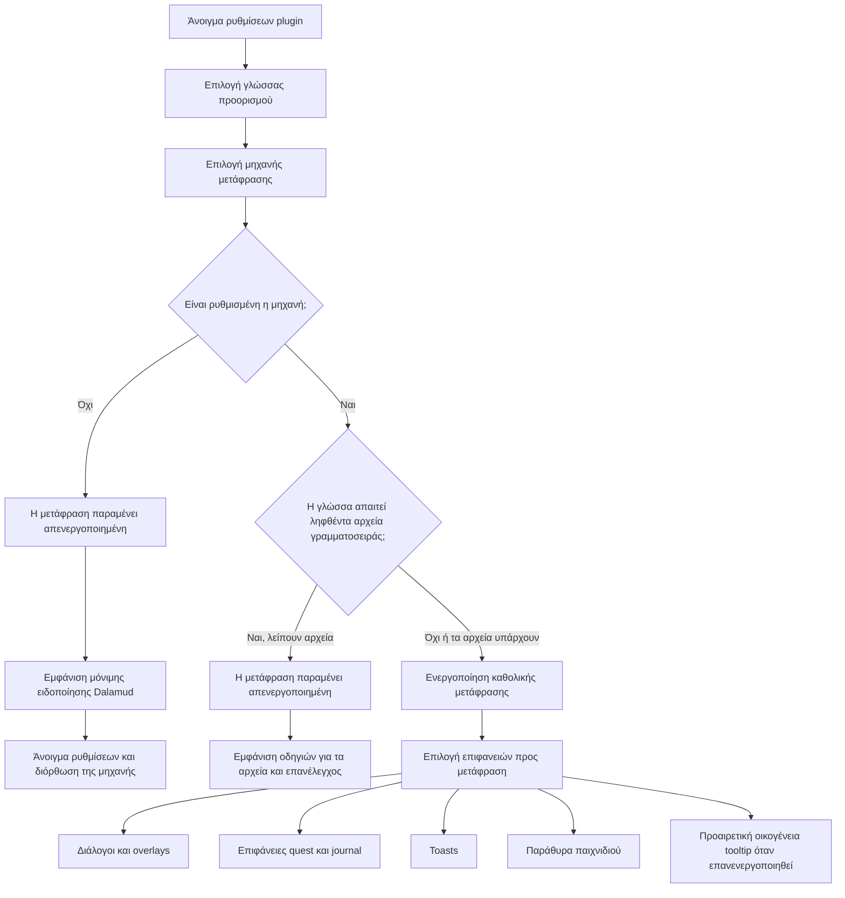

<!--
  Copyright (c) lokinmodar. All rights reserved.
  Licensed under the Creative Commons Attribution-NonCommercial-NoDerivatives 4.0 International Public License license.
-->

# Πίνακας υποστήριξης επιφανειών μετάφρασης

Αυτό το έγγραφο είναι η κανονική απογραφή των επιφανειών μετάφρασης του Echoglossian που μπορούν να ρυθμιστούν από τον χρήστη.

Να ενημερώνεται κάθε φορά που προστίθεται ή αφαιρείται μια νέα επιφάνεια, λειτουργία ή περιορισμός έκδοσης.

## Ροή ενεργοποίησης

## Οικογένειες λειτουργιών μετάφρασης

| Οικογένεια λειτουργιών | Λειτουργίες | Χρησιμοποιείται από |
| --- | --- | --- |
| Οικογένεια quest / native-window | `Native UI Translation`, `Tooltip Translation Only`, `Native UI Translation With Original Tooltips` | Επιφάνειες οικογένειας Journal και DB-first παράθυρα παιχνιδιού |
| Οικογένεια overlay | `Native UI Translation`, `Overlay Translation Only`, `Native UI Translation With Original Overlay` | Talk, BattleTalk, υπότιτλοι, MiniTalk, CutSceneSelectString και οικογένεια toast |

## Επιφάνειες διαλόγων και overlay

| Επιφάνεια | Toggle ρύθμισης | Λειτουργίες | Σημειώσεις | Κατάσταση τρέχουσας έκδοσης |
| --- | --- | --- | --- | --- |
| Talk | `TranslateTalk` | Οικογένεια overlay | Υποστηρίζει μεταφρασμένα ονόματα NPC μέσω `TranslateTalkNpcNames` | Ενεργό |
| BattleTalk | `TranslateBattleTalk` | Οικογένεια overlay | Υποστηρίζει μεταφρασμένα ονόματα NPC μέσω `TranslateBattleTalkNpcNames` | Ενεργό |
| TalkSubtitle | `TranslateTalkSubtitle` | Οικογένεια overlay | Overlay χωρίς τίτλο όταν η λειτουργία overlay είναι ενεργή | Ενεργό |
| MiniTalk | `TranslateMiniTalk` | Οικογένεια overlay | Μικρή native επιφάνεια· τα πιο εκτενή κείμενα χρειάζονται ακόμη προσεκτικό native reflow | Ενεργό |
| CutSceneSelectString | `TranslateCutSceneSelectString` | Οικογένεια overlay | Η ερώτηση γίνεται τίτλος και οι επιλογές γίνονται το σώμα στο overlay mode | Ενεργό |

## Επιφάνειες quest και journal

| Επιφάνεια | Toggle ρύθμισης | Λειτουργίες | Σημειώσεις | Κατάσταση τρέχουσας έκδοσης |
| --- | --- | --- | --- | --- |
| Journal | `TranslateJournal` | Οικογένεια quest / native-window | Επιφάνεια λίστας quest | Ενεργό |
| JournalDetail | `TranslateJournalDetail` | Οικογένεια quest / native-window | Πυκνή διάταξη σώματος· η native λειτουργία απαιτεί ρητό block reflow | Ενεργό |
| ToDoList | `TranslateToDoList` | Οικογένεια quest / native-window | Quest tracker / λίστα στόχων | Ενεργό |
| ScenarioTree | `TranslateScenarioTree` | Οικογένεια quest / native-window | Tracker κύριου σεναρίου | Ενεργό |
| JournalAccept | `TranslateJournalAccept` | Οικογένεια quest / native-window | Παράθυρο αποδοχής quest | Ενεργό |
| JournalResult | `TranslateJournalResult` | Οικογένεια quest / native-window | Παράθυρο αποτελέσματος / ολοκλήρωσης quest | Ενεργό |
| RecommendList | `TranslateRecommendList` | Οικογένεια quest / native-window | Λίστα προτάσεων | Ενεργό |
| AreaMap | `TranslateAreaMap` | Οικογένεια quest / native-window | Quest κείμενο μέσα σε σχετικό με χάρτη quest UI | Ενεργό |

## Επιφάνειες toast

| Επιφάνεια | Toggle ρύθμισης | Λειτουργίες | Σημειώσεις | Κατάσταση τρέχουσας έκδοσης |
| --- | --- | --- | --- | --- |
| WideText / Screen Info toast | `TranslateWideTextToast` | Οικογένεια overlay | Μεγάλο informational toast στο κέντρο της οθόνης | Ενεργό |
| Error toast | `TranslateErrorToast` | Οικογένεια overlay | Ειδοποιήσεις σφάλματος / αποτυχίας | Ενεργό |
| Area toast | `TranslateAreaToast` | Οικογένεια overlay | Ειδοποιήσεις περιοχής και τοποθεσίας | Ενεργό |
| Class / Job change toast | `TranslateClassChangeToast` | Οικογένεια overlay | Ανακοίνωση αλλαγής class/job | Ενεργό |
| Text gimmick hint | `TranslateTextGimmickHint` | Οικογένεια overlay | Επιφάνεια hint για gimmick/tutorial | Ενεργό |
| Quest toast | `TranslateQuestToast` | Οικογένεια overlay | Toast ειδοποίηση σχετική με quest | Ενεργό |

## Επιφάνειες παραθύρων παιχνιδιού

| Επιφάνεια | Toggle ρύθμισης | Λειτουργίες | Σημειώσεις | Κατάσταση τρέχουσας έκδοσης |
| --- | --- | --- | --- | --- |
| Character window | `TranslateCharacterWindow` | Οικογένεια quest / native-window | DB-first runtime παραθύρων παιχνιδιού | Ενεργό |
| Main Command | `TranslateMainCommandWindow` | Οικογένεια quest / native-window | DB-first runtime παραθύρων παιχνιδιού | Ενεργό |
| Action Menu | `TranslateActionMenuWindow` | Οικογένεια quest / native-window | DB-first runtime παραθύρων παιχνιδιού | Ενεργό |
| HUD windows | `TranslateHudWindow` | Οικογένεια quest / native-window | DB-first runtime παραθύρων παιχνιδιού | Ενεργό |
| Operation Guide | `TranslateOperationGuideWindow` | Οικογένεια quest / native-window | DB-first runtime παραθύρων παιχνιδιού | Ενεργό |
| Addon Context Menu Title | `TranslateAddonContextMenuTitle` | Οικογένεια quest / native-window | DB-first runtime παραθύρων παιχνιδιού | Ενεργό |

## Κρυφές ή προσωρινά περιορισμένες επιφάνειες

| Επιφάνεια | Toggle ρύθμισης | Λειτουργίες | Σημειώσεις | Κατάσταση τρέχουσας έκδοσης |
| --- | --- | --- | --- | --- |
| Action / item detail tooltips | `TranslateTooltips` | Οικογένεια overlay | Η δομημένη μετάφραση tooltip απενεργοποιείται υποχρεωτικά στην εκκίνηση όσο τα `ActionDetail` / `ItemDetail` παραμένουν ασταθή | Προσωρινά απενεργοποιημένο στην έκδοση |
| Yes/No dialog | `TranslateYesNoScreen` | Μόνο toggle | Υπάρχει στο μοντέλο ρυθμίσεων και στην υλοποίηση tab, αλλά δεν εκτίθεται σήμερα στο ενεργό overlay-tab flow | Υλοποιημένο αλλά κρυφό στο τρέχον UI |
| SelectString dialog | `TranslateSelectString` | Μόνο toggle | Υπάρχει στο μοντέλο ρυθμίσεων και στην υλοποίηση tab, αλλά δεν εκτίθεται σήμερα στο ενεργό overlay-tab flow | Υλοποιημένο αλλά κρυφό στο τρέχον UI |
| SelectOk dialog | `TranslateSelectOk` | Μόνο toggle | Υπάρχει στο μοντέλο ρυθμίσεων και στην υλοποίηση tab, αλλά δεν εκτίθεται σήμερα στο ενεργό overlay-tab flow | Υλοποιημένο αλλά κρυφό στο τρέχον UI |

## Λειτουργικές σημειώσεις

| Θέμα | Συμπεριφορά |
| --- | --- |
| Καθολική ενεργοποίηση | Η μετάφραση δεν παραμένει ενεργή εκτός αν η επιλεγμένη μηχανή είναι έγκυρη και ρυθμισμένη για τη γλώσσα προορισμού |
| Ληφθέντα αρχεία γραμματοσειράς | Ορισμένες γλώσσες απαιτούν επιπλέον ληφθέντα αρχεία γραμματοσειράς πριν ενεργοποιηθεί με ασφάλεια η μετάφραση |
| Γλώσσες μόνο overlay | Όταν η γλώσσα είναι overlay-only, οι native-replacement λειτουργίες κανονικοποιούνται σε overlay/tooltip παρουσίαση |
| Ενεργοποίηση ανά επιφάνεια | Κάθε οικογένεια απαιτεί το δικό της toggle ανά επιφάνεια ακόμη και μετά την ενεργοποίηση της καθολικής μετάφρασης |
| Περιορισμοί release | Μια επιφάνεια μπορεί να υπάρχει στη ρύθμιση ή στον κώδικα, αλλά να είναι σκόπιμα κρυφή ή υποχρεωτικά απενεργοποιημένη σε συγκεκριμένη έκδοση |

## Κανόνες συντήρησης

- Ενημερώνετε αυτόν τον πίνακα κάθε φορά που προστίθεται νέα επιφάνεια μετάφρασης.
- Ενημερώνετε αυτόν τον πίνακα κάθε φορά που μια επιφάνεια αλλάζει οικογένεια λειτουργίας.
- Ενημερώνετε αυτόν τον πίνακα κάθε φορά που μια έκδοση απενεργοποιεί ή κρύβει προσωρινά ένα χαρακτηριστικό.
- Να προτιμάται η τεκμηρίωση της πραγματικής συμπεριφοράς runtime και όχι μιας μόνο επιθυμητής μελλοντικής συμπεριφοράς.
