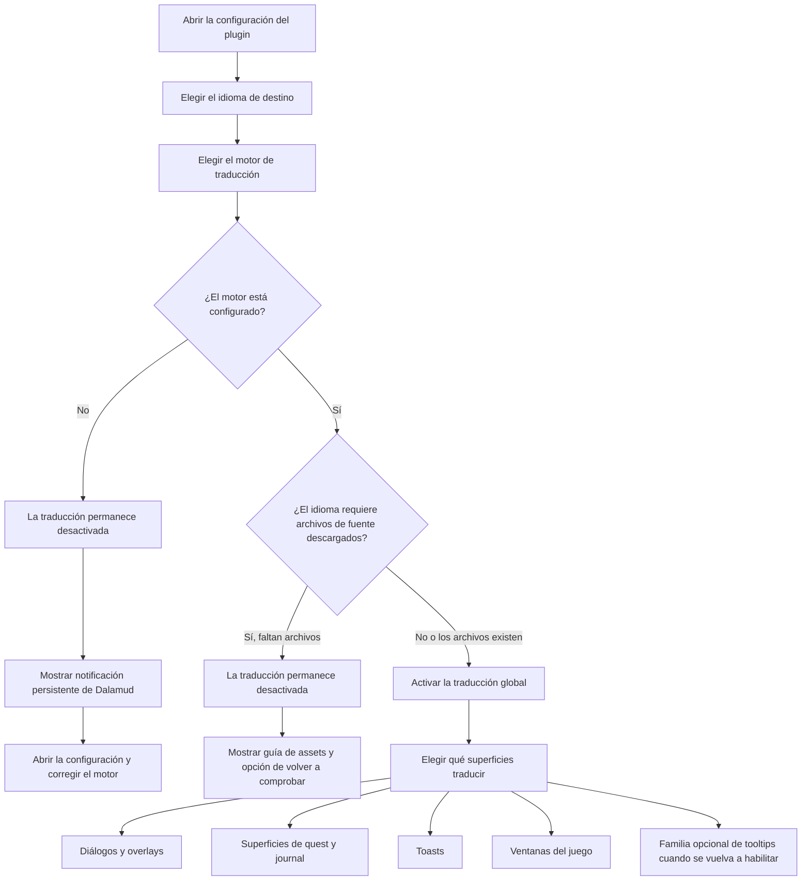

<!--
  Copyright (c) lokinmodar. All rights reserved.
  Licensed under the Creative Commons Attribution-NonCommercial-NoDerivatives 4.0 International Public License license.
-->

# Matriz de compatibilidad de superficies de traducción

Este documento es el inventario canónico de las superficies de traducción configurables por el usuario en Echoglossian.

Debe mantenerse actualizado cada vez que se añada o elimine una nueva superficie, modo o restricción de la release.

## Flujo de activación

## Familias de modos de traducción

| Familia de modos | Modos | Utilizada por |
| --- | --- | --- |
| Familia quest / native-window | `Native UI Translation`, `Tooltip Translation Only`, `Native UI Translation With Original Tooltips` | Superficies de la familia Journal y ventanas de juego DB-first |
| Familia overlay | `Native UI Translation`, `Overlay Translation Only`, `Native UI Translation With Original Overlay` | Talk, BattleTalk, subtítulos, MiniTalk, CutSceneSelectString y la familia de toasts |

## Superficies de diálogo y overlay

| Superficie | Toggle de configuración | Modos | Notas | Estado actual de la release |
| --- | --- | --- | --- | --- |
| Talk | `TranslateTalk` | Familia overlay | Soporta nombres de NPC traducidos mediante `TranslateTalkNpcNames` | Habilitado |
| BattleTalk | `TranslateBattleTalk` | Familia overlay | Soporta nombres de NPC traducidos mediante `TranslateBattleTalkNpcNames` | Habilitado |
| TalkSubtitle | `TranslateTalkSubtitle` | Familia overlay | Presentación overlay sin barra de título cuando el modo overlay está activo | Habilitado |
| MiniTalk | `TranslateMiniTalk` | Familia overlay | Superficie nativa pequeña; el texto más verboso todavía requiere native reflow cuidadoso | Habilitado |
| CutSceneSelectString | `TranslateCutSceneSelectString` | Familia overlay | La pregunta se convierte en el título y las opciones en el cuerpo en modo overlay | Habilitado |

## Superficies de quest y journal

| Superficie | Toggle de configuración | Modos | Notas | Estado actual de la release |
| --- | --- | --- | --- | --- |
| Journal | `TranslateJournal` | Familia quest / native-window | Superficie de lista de quests | Habilitado |
| JournalDetail | `TranslateJournalDetail` | Familia quest / native-window | Diseño de cuerpo denso; el modo nativo requiere block reflow explícito | Habilitado |
| ToDoList | `TranslateToDoList` | Familia quest / native-window | Seguimiento de quest / lista de objetivos | Habilitado |
| ScenarioTree | `TranslateScenarioTree` | Familia quest / native-window | Seguimiento del escenario principal | Habilitado |
| JournalAccept | `TranslateJournalAccept` | Familia quest / native-window | Ventana de aceptación de quest | Habilitado |
| JournalResult | `TranslateJournalResult` | Familia quest / native-window | Ventana de resultado / finalización de quest | Habilitado |
| RecommendList | `TranslateRecommendList` | Familia quest / native-window | Lista de recomendaciones | Habilitado |
| AreaMap | `TranslateAreaMap` | Familia quest / native-window | Texto de quest dentro de la UI de quests relacionada con el mapa | Habilitado |

## Superficies de toast

| Superficie | Toggle de configuración | Modos | Notas | Estado actual de la release |
| --- | --- | --- | --- | --- |
| WideText / Screen Info toast | `TranslateWideTextToast` | Familia overlay | Toast informativo grande en el centro de la pantalla | Habilitado |
| Error toast | `TranslateErrorToast` | Familia overlay | Notificaciones de error o fallo | Habilitado |
| Area toast | `TranslateAreaToast` | Familia overlay | Notificaciones de área y ubicación | Habilitado |
| Class / Job change toast | `TranslateClassChangeToast` | Familia overlay | Aviso de cambio de class/job | Habilitado |
| Text gimmick hint | `TranslateTextGimmickHint` | Familia overlay | Superficie de pista de gimmick/tutorial | Habilitado |
| Quest toast | `TranslateQuestToast` | Familia overlay | Notificación toast relacionada con quest | Habilitado |

## Superficies de ventanas del juego

| Superficie | Toggle de configuración | Modos | Notas | Estado actual de la release |
| --- | --- | --- | --- | --- |
| Character window | `TranslateCharacterWindow` | Familia quest / native-window | Runtime DB-first de ventanas del juego | Habilitado |
| Main Command | `TranslateMainCommandWindow` | Familia quest / native-window | Runtime DB-first de ventanas del juego | Habilitado |
| Action Menu | `TranslateActionMenuWindow` | Familia quest / native-window | Runtime DB-first de ventanas del juego | Habilitado |
| HUD windows | `TranslateHudWindow` | Familia quest / native-window | Runtime DB-first de ventanas del juego | Habilitado |
| Operation Guide | `TranslateOperationGuideWindow` | Familia quest / native-window | Runtime DB-first de ventanas del juego | Habilitado |
| Addon Context Menu Title | `TranslateAddonContextMenuTitle` | Familia quest / native-window | Runtime DB-first de ventanas del juego | Habilitado |

## Superficies ocultas o temporalmente restringidas

| Superficie | Toggle de configuración | Modos | Notas | Estado actual de la release |
| --- | --- | --- | --- | --- |
| Action / item detail tooltips | `TranslateTooltips` | Familia overlay | La traducción estructurada de tooltips se desactiva a la fuerza al iniciar mientras `ActionDetail` / `ItemDetail` sigan inestables | Desactivado temporalmente en la release |
| Yes/No dialog | `TranslateYesNoScreen` | Solo toggle | Presente en el modelo de configuración y en la implementación de la pestaña, pero no expuesto actualmente en el flujo activo de la pestaña Overlay | Implementado pero oculto en la UI actual |
| SelectString dialog | `TranslateSelectString` | Solo toggle | Presente en el modelo de configuración y en la implementación de la pestaña, pero no expuesto actualmente en el flujo activo de la pestaña Overlay | Implementado pero oculto en la UI actual |
| SelectOk dialog | `TranslateSelectOk` | Solo toggle | Presente en el modelo de configuración y en la implementación de la pestaña, pero no expuesto actualmente en el flujo activo de la pestaña Overlay | Implementado pero oculto en la UI actual |

## Notas operativas

| Tema | Comportamiento |
| --- | --- |
| Activación global | La traducción no permanece activada a menos que el motor seleccionado sea válido y esté configurado para el idioma seleccionado |
| Archivos de fuente descargados | Algunos idiomas requieren archivos de fuente descargados antes de poder activar la traducción de forma segura |
| Idiomas solo overlay | Cuando el idioma es solo overlay, los modos de reemplazo nativo se normalizan a presentación overlay/tooltip |
| Activación por superficie | Cada familia sigue requiriendo su propio toggle por superficie incluso después de activar la traducción global |
| Restricción por release | Una superficie puede existir en la configuración o en el código y aun así estar ocultada o desactivada a propósito en una release concreta |

## Reglas de mantenimiento

- Actualizar esta matriz cada vez que se añada una nueva superficie de traducción.
- Actualizar esta matriz cada vez que una superficie cambie de familia de modos.
- Actualizar esta matriz cada vez que una release desactive u oculte temporalmente una característica.
- Debe priorizarse documentar el comportamiento real en runtime y no un comportamiento ideal todavía no implementado.
