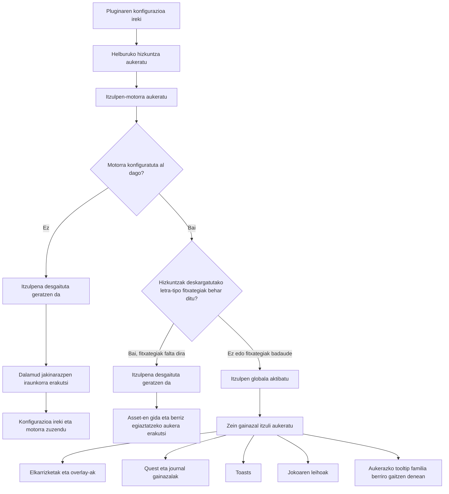

<!--
  Copyright (c) lokinmodar. All rights reserved.
  Licensed under the Creative Commons Attribution-NonCommercial-NoDerivatives 4.0 International Public License license.
-->

# Itzulpen-gainazalen euskarrien matrizea

Dokumentu hau Echoglossianen erabiltzaileak konfigura ditzakeen itzulpen-gainazalen inbentario kanonikoa da.

Eguneratuta mantendu behar da gainazal, modu edo release-murrizketa berri bat gehitzen edo kentzen den bakoitzean.

## Aktibazio-fluxua

## Itzulpen-moduen familiak

| Modu-familia | Moduak | Zertan erabiltzen da |
| --- | --- | --- |
| Quest / native-window familia | `Native UI Translation`, `Tooltip Translation Only`, `Native UI Translation With Original Tooltips` | Journal familiako gainazalak eta DB-first joko-leihoak |
| Overlay familia | `Native UI Translation`, `Overlay Translation Only`, `Native UI Translation With Original Overlay` | Talk, BattleTalk, azpitituluak, MiniTalk, CutSceneSelectString eta toast familia |

## Elkarrizketa eta overlay gainazalak

| Gainazala | Konfigurazio-togglea | Moduak | Oharrak | Uneko release-aren egoera |
| --- | --- | --- | --- | --- |
| Talk | `TranslateTalk` | Overlay familia | NPC izen itzuliak onartzen ditu `TranslateTalkNpcNames` bidez | Gaituta |
| BattleTalk | `TranslateBattleTalk` | Overlay familia | NPC izen itzuliak onartzen ditu `TranslateBattleTalkNpcNames` bidez | Gaituta |
| TalkSubtitle | `TranslateTalkSubtitle` | Overlay familia | Izenbururik gabeko overlay aurkezpena overlay modua aktibo dagoenean | Gaituta |
| MiniTalk | `TranslateMiniTalk` | Overlay familia | Native gainazal txikia; testu luzeagoek native reflow zaindua behar dute oraindik | Gaituta |
| CutSceneSelectString | `TranslateCutSceneSelectString` | Overlay familia | Galdera izenburu bihurtzen da eta aukerak gorputz testu overlay moduan | Gaituta |

## Quest eta journal gainazalak

| Gainazala | Konfigurazio-togglea | Moduak | Oharrak | Uneko release-aren egoera |
| --- | --- | --- | --- | --- |
| Journal | `TranslateJournal` | Quest / native-window familia | Quest zerrendaren gainazala | Gaituta |
| JournalDetail | `TranslateJournalDetail` | Quest / native-window familia | Gorputz diseinu trinkoa; native moduak block reflow esplizitua behar du | Gaituta |
| ToDoList | `TranslateToDoList` | Quest / native-window familia | Quest jarraipena / helburuen zerrenda | Gaituta |
| ScenarioTree | `TranslateScenarioTree` | Quest / native-window familia | Eszenatoki nagusiaren jarraipena | Gaituta |
| JournalAccept | `TranslateJournalAccept` | Quest / native-window familia | Quest onartzeko leihoa | Gaituta |
| JournalResult | `TranslateJournalResult` | Quest / native-window familia | Quest emaitza / amaiera leihoa | Gaituta |
| RecommendList | `TranslateRecommendList` | Quest / native-window familia | Gomendioen zerrenda | Gaituta |
| AreaMap | `TranslateAreaMap` | Quest / native-window familia | Maparekin lotutako quest UI barruko quest testua | Gaituta |

## Toast gainazalak

| Gainazala | Konfigurazio-togglea | Moduak | Oharrak | Uneko release-aren egoera |
| --- | --- | --- | --- | --- |
| WideText / Screen Info toast | `TranslateWideTextToast` | Overlay familia | Pantailaren erdiko informazio-toast handia | Gaituta |
| Error toast | `TranslateErrorToast` | Overlay familia | Errore edo hutsegite jakinarazpenak | Gaituta |
| Area toast | `TranslateAreaToast` | Overlay familia | Eremu eta kokapen jakinarazpenak | Gaituta |
| Class / Job change toast | `TranslateClassChangeToast` | Overlay familia | Class/job aldaketaren iragarkia | Gaituta |
| Text gimmick hint | `TranslateTextGimmickHint` | Overlay familia | Gimmick/tutorial pistaren gainazala | Gaituta |
| Quest toast | `TranslateQuestToast` | Overlay familia | Quest-ekin lotutako toast jakinarazpena | Gaituta |

## Joko-leihoen gainazalak

| Gainazala | Konfigurazio-togglea | Moduak | Oharrak | Uneko release-aren egoera |
| --- | --- | --- | --- | --- |
| Character window | `TranslateCharacterWindow` | Quest / native-window familia | DB-first game-window runtime | Gaituta |
| Main Command | `TranslateMainCommandWindow` | Quest / native-window familia | DB-first game-window runtime | Gaituta |
| Action Menu | `TranslateActionMenuWindow` | Quest / native-window familia | DB-first game-window runtime | Gaituta |
| HUD windows | `TranslateHudWindow` | Quest / native-window familia | DB-first game-window runtime | Gaituta |
| Operation Guide | `TranslateOperationGuideWindow` | Quest / native-window familia | DB-first game-window runtime | Gaituta |
| Addon Context Menu Title | `TranslateAddonContextMenuTitle` | Quest / native-window familia | DB-first game-window runtime | Gaituta |

## Ezkutuko edo aldi baterako mugatutako gainazalak

| Gainazala | Konfigurazio-togglea | Moduak | Oharrak | Uneko release-aren egoera |
| --- | --- | --- | --- | --- |
| Action / item detail tooltips | `TranslateTooltips` | Overlay familia | Egituratutako tooltip itzulpena indarrez desgaitzen da abioan, `ActionDetail` / `ItemDetail` oraindik ezegonkorrak direlako | Aldi baterako desgaitua release honetan |
| Yes/No dialog | `TranslateYesNoScreen` | Toggle hutsa | Konfigurazio ereduan eta tab inplementazioan dago, baina gaur egun ez dago ikusgai overlay tab aktiboaren fluxuan | Inplementatuta baina ezkutuan uneko UIan |
| SelectString dialog | `TranslateSelectString` | Toggle hutsa | Konfigurazio ereduan eta tab inplementazioan dago, baina gaur egun ez dago ikusgai overlay tab aktiboaren fluxuan | Inplementatuta baina ezkutuan uneko UIan |
| SelectOk dialog | `TranslateSelectOk` | Toggle hutsa | Konfigurazio ereduan eta tab inplementazioan dago, baina gaur egun ez dago ikusgai overlay tab aktiboaren fluxuan | Inplementatuta baina ezkutuan uneko UIan |

## Ohar operatiboak

| Gaia | Portaera |
| --- | --- |
| Aktibazio globala | Itzulpena ez da aktibo geratzen hautatutako motorra baliozkoa eta hautatutako hizkuntzarako konfiguratuta ez badago |
| Deskargatutako letra-tipo fitxategiak | Hizkuntza batzuek letra-tipo fitxategi osagarriak behar dituzte itzulpena segurtasunez aktibatu aurretik |
| Overlay-only hizkuntzak | Hizkuntza overlay-only bada, native replacement moduak overlay/tooltip aurkezpenera normalizatzen dira |
| Gainazal-mailako aktibazioa | Familia bakoitzak bere toggle propioa behar du gainazal bakoitzeko, nahiz eta itzulpen globala aktibatuta egon |
| Release gating | Gainazal bat konfigurazioan edo kodean egon daiteke, baina release jakin batean nahita ezkutatuta edo indarrez desgaituta egon |

## Mantentze-arauak

- Eguneratu matrize hau itzulpen-gainazal berri bat gehitzen den bakoitzean.
- Eguneratu matrize hau gainazal batek modu-familia aldatzen duen bakoitzean.
- Eguneratu matrize hau release batek funtzio bat aldi baterako desgaitzen edo ezkutatzen duen bakoitzean.
- Lehenetsi benetako runtime portaera dokumentatzea etorkizunean nahiko litzatekeen portaera ideal baten aurretik.
