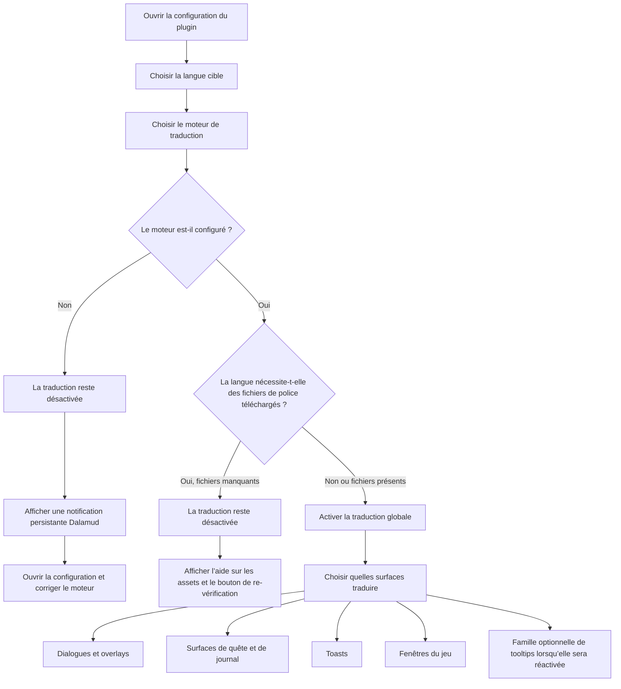

<!--
  Copyright (c) lokinmodar. All rights reserved.
  Licensed under the Creative Commons Attribution-NonCommercial-NoDerivatives 4.0 International Public License license.
-->

# Matrice de prise en charge des surfaces de traduction

Ce document constitue l’inventaire canonique des surfaces de traduction configurables par l’utilisateur dans Echoglossian.

Il doit être mis à jour chaque fois qu’une nouvelle surface, un nouveau mode ou une restriction de release est ajouté ou supprimé.

## Flux d’activation

## Familles de modes de traduction

| Famille de modes | Modes | Utilisée par |
| --- | --- | --- |
| Famille quête / fenêtre native | `Native UI Translation`, `Tooltip Translation Only`, `Native UI Translation With Original Tooltips` | Surfaces de la famille Journal et fenêtres de jeu DB-first |
| Famille overlay | `Native UI Translation`, `Overlay Translation Only`, `Native UI Translation With Original Overlay` | Talk, BattleTalk, sous-titres, MiniTalk, CutSceneSelectString et la famille des toasts |

## Surfaces de dialogue et d’overlay

| Surface | Toggle de configuration | Modes | Notes | État de la release actuelle |
| --- | --- | --- | --- | --- |
| Talk | `TranslateTalk` | Famille overlay | Prend en charge les noms de PNJ traduits via `TranslateTalkNpcNames` | Activé |
| BattleTalk | `TranslateBattleTalk` | Famille overlay | Prend en charge les noms de PNJ traduits via `TranslateBattleTalkNpcNames` | Activé |
| TalkSubtitle | `TranslateTalkSubtitle` | Famille overlay | Présentation overlay sans barre de titre lorsque le mode overlay est actif | Activé |
| MiniTalk | `TranslateMiniTalk` | Famille overlay | Petite surface native ; les textes plus verbeux nécessitent encore un reflow natif soigné | Activé |
| CutSceneSelectString | `TranslateCutSceneSelectString` | Famille overlay | La question devient le titre et les options deviennent le corps en mode overlay | Activé |

## Surfaces de quête et de journal

| Surface | Toggle de configuration | Modes | Notes | État de la release actuelle |
| --- | --- | --- | --- | --- |
| Journal | `TranslateJournal` | Famille quête / fenêtre native | Surface de liste de quêtes | Activé |
| JournalDetail | `TranslateJournalDetail` | Famille quête / fenêtre native | Mise en page de corps dense ; le mode natif nécessite un block reflow explicite | Activé |
| ToDoList | `TranslateToDoList` | Famille quête / fenêtre native | Suivi de quête / liste d’objectifs | Activé |
| ScenarioTree | `TranslateScenarioTree` | Famille quête / fenêtre native | Suivi du scénario principal | Activé |
| JournalAccept | `TranslateJournalAccept` | Famille quête / fenêtre native | Fenêtre d’acceptation de quête | Activé |
| JournalResult | `TranslateJournalResult` | Famille quête / fenêtre native | Fenêtre de résultat / de fin de quête | Activé |
| RecommendList | `TranslateRecommendList` | Famille quête / fenêtre native | Liste de recommandations | Activé |
| AreaMap | `TranslateAreaMap` | Famille quête / fenêtre native | Texte de quête dans l’interface de quête liée à la carte | Activé |

## Surfaces de toast

| Surface | Toggle de configuration | Modes | Notes | État de la release actuelle |
| --- | --- | --- | --- | --- |
| WideText / Screen Info toast | `TranslateWideTextToast` | Famille overlay | Grand toast d’information au centre de l’écran | Activé |
| Error toast | `TranslateErrorToast` | Famille overlay | Notifications d’erreur ou d’échec | Activé |
| Area toast | `TranslateAreaToast` | Famille overlay | Notifications de zone et de localisation | Activé |
| Class / Job change toast | `TranslateClassChangeToast` | Famille overlay | Annonce de changement de class/job | Activé |
| Text gimmick hint | `TranslateTextGimmickHint` | Famille overlay | Surface d’indice de gimmick/tutorial | Activé |
| Quest toast | `TranslateQuestToast` | Famille overlay | Notification toast liée à une quête | Activé |

## Surfaces des fenêtres du jeu

| Surface | Toggle de configuration | Modes | Notes | État de la release actuelle |
| --- | --- | --- | --- | --- |
| Character window | `TranslateCharacterWindow` | Famille quête / fenêtre native | Runtime DB-first des fenêtres du jeu | Activé |
| Main Command | `TranslateMainCommandWindow` | Famille quête / fenêtre native | Runtime DB-first des fenêtres du jeu | Activé |
| Action Menu | `TranslateActionMenuWindow` | Famille quête / fenêtre native | Runtime DB-first des fenêtres du jeu | Activé |
| HUD windows | `TranslateHudWindow` | Famille quête / fenêtre native | Runtime DB-first des fenêtres du jeu | Activé |
| Operation Guide | `TranslateOperationGuideWindow` | Famille quête / fenêtre native | Runtime DB-first des fenêtres du jeu | Activé |
| Addon Context Menu Title | `TranslateAddonContextMenuTitle` | Famille quête / fenêtre native | Runtime DB-first des fenêtres du jeu | Activé |

## Surfaces cachées ou temporairement restreintes

| Surface | Toggle de configuration | Modes | Notes | État de la release actuelle |
| --- | --- | --- | --- | --- |
| Action / item detail tooltips | `TranslateTooltips` | Famille overlay | La traduction structurée des tooltips est désactivée de force au démarrage tant que `ActionDetail` / `ItemDetail` restent instables | Temporairement désactivé pour la release |
| Yes/No dialog | `TranslateYesNoScreen` | Toggle uniquement | Présent dans le modèle de configuration et l’implémentation de l’onglet, mais non exposé actuellement dans le flux actif de l’onglet Overlay | Implémenté mais caché dans l’interface actuelle |
| SelectString dialog | `TranslateSelectString` | Toggle uniquement | Présent dans le modèle de configuration et l’implémentation de l’onglet, mais non exposé actuellement dans le flux actif de l’onglet Overlay | Implémenté mais caché dans l’interface actuelle |
| SelectOk dialog | `TranslateSelectOk` | Toggle uniquement | Présent dans le modèle de configuration et l’implémentation de l’onglet, mais non exposé actuellement dans le flux actif de l’onglet Overlay | Implémenté mais caché dans l’interface actuelle |

## Notes opérationnelles

| Sujet | Comportement |
| --- | --- |
| Activation globale | La traduction ne reste pas activée tant que le moteur sélectionné n’est pas valide et configuré pour la langue choisie |
| Fichiers de police téléchargés | Certaines langues nécessitent des fichiers de police supplémentaires téléchargés avant que la traduction puisse être activée en toute sécurité |
| Langues overlay-only | Lorsque la langue est en mode overlay-only, les modes de remplacement natif sont normalisés vers une présentation overlay/tooltip |
| Activation par surface | Chaque famille nécessite toujours son propre toggle par surface même après l’activation de la traduction globale |
| Blocage par release | Une surface peut exister dans la configuration ou le code tout en étant volontairement cachée ou désactivée de force dans une release donnée |

## Règles de maintenance

- Mettre à jour cette matrice chaque fois qu’une nouvelle surface de traduction est ajoutée.
- Mettre à jour cette matrice chaque fois qu’une surface change de famille de modes.
- Mettre à jour cette matrice chaque fois qu’une release désactive ou masque temporairement une fonctionnalité.
- Il faut privilégier la documentation du comportement réel en runtime plutôt qu’un comportement seulement souhaité à terme.
