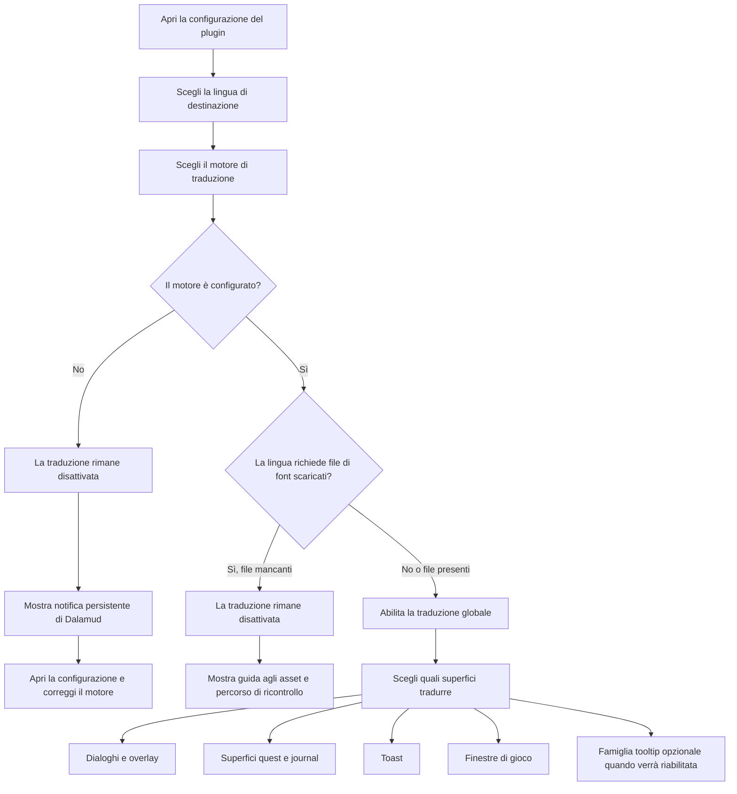

<!--
  Copyright (c) lokinmodar. All rights reserved.
  Licensed under the Creative Commons Attribution-NonCommercial-NoDerivatives 4.0 International Public License license.
-->

# Matrice di supporto delle superfici di traduzione

Questo documento è l’inventario canonico delle superfici di traduzione configurabili dall’utente in Echoglossian.

Va mantenuto aggiornato ogni volta che viene aggiunta o rimossa una nuova superficie, modalità o restrizione di release.

## Flusso di attivazione

## Famiglie di modalità di traduzione

| Famiglia di modalità | Modalità | Utilizzata da |
| --- | --- | --- |
| Famiglia quest / native-window | `Native UI Translation`, `Tooltip Translation Only`, `Native UI Translation With Original Tooltips` | Superfici della famiglia Journal e finestre di gioco DB-first |
| Famiglia overlay | `Native UI Translation`, `Overlay Translation Only`, `Native UI Translation With Original Overlay` | Talk, BattleTalk, sottotitoli, MiniTalk, CutSceneSelectString e famiglia toast |

## Superfici di dialogo e overlay

| Superficie | Toggle di configurazione | Modalità | Note | Stato della release corrente |
| --- | --- | --- | --- | --- |
| Talk | `TranslateTalk` | Famiglia overlay | Supporta nomi NPC tradotti tramite `TranslateTalkNpcNames` | Abilitato |
| BattleTalk | `TranslateBattleTalk` | Famiglia overlay | Supporta nomi NPC tradotti tramite `TranslateBattleTalkNpcNames` | Abilitato |
| TalkSubtitle | `TranslateTalkSubtitle` | Famiglia overlay | Presentazione overlay senza barra del titolo quando la modalità overlay è attiva | Abilitato |
| MiniTalk | `TranslateMiniTalk` | Famiglia overlay | Piccola superficie nativa; testi più verbosi richiedono ancora un native reflow accurato | Abilitato |
| CutSceneSelectString | `TranslateCutSceneSelectString` | Famiglia overlay | La domanda diventa il titolo e le opzioni diventano il corpo in modalità overlay | Abilitato |

## Superfici quest e journal

| Superficie | Toggle di configurazione | Modalità | Note | Stato della release corrente |
| --- | --- | --- | --- | --- |
| Journal | `TranslateJournal` | Famiglia quest / native-window | Superficie lista quest | Abilitato |
| JournalDetail | `TranslateJournalDetail` | Famiglia quest / native-window | Layout del corpo denso; la modalità nativa richiede block reflow esplicito | Abilitato |
| ToDoList | `TranslateToDoList` | Famiglia quest / native-window | Tracker quest / lista obiettivi | Abilitato |
| ScenarioTree | `TranslateScenarioTree` | Famiglia quest / native-window | Tracker dello scenario principale | Abilitato |
| JournalAccept | `TranslateJournalAccept` | Famiglia quest / native-window | Finestra di accettazione quest | Abilitato |
| JournalResult | `TranslateJournalResult` | Famiglia quest / native-window | Finestra di risultato / completamento quest | Abilitato |
| RecommendList | `TranslateRecommendList` | Famiglia quest / native-window | Lista raccomandazioni | Abilitato |
| AreaMap | `TranslateAreaMap` | Famiglia quest / native-window | Testo quest all’interno della UI di quest collegata alla mappa | Abilitato |

## Superfici toast

| Superficie | Toggle di configurazione | Modalità | Note | Stato della release corrente |
| --- | --- | --- | --- | --- |
| WideText / Screen Info toast | `TranslateWideTextToast` | Famiglia overlay | Grande toast informativo al centro dello schermo | Abilitato |
| Error toast | `TranslateErrorToast` | Famiglia overlay | Notifiche di errore o fallimento | Abilitato |
| Area toast | `TranslateAreaToast` | Famiglia overlay | Notifiche di area e posizione | Abilitato |
| Class / Job change toast | `TranslateClassChangeToast` | Famiglia overlay | Annuncio di cambio class/job | Abilitato |
| Text gimmick hint | `TranslateTextGimmickHint` | Famiglia overlay | Superficie hint per gimmick/tutorial | Abilitato |
| Quest toast | `TranslateQuestToast` | Famiglia overlay | Notifica toast relativa alle quest | Abilitato |

## Superfici delle finestre di gioco

| Superficie | Toggle di configurazione | Modalità | Note | Stato della release corrente |
| --- | --- | --- | --- | --- |
| Character window | `TranslateCharacterWindow` | Famiglia quest / native-window | Runtime DB-first delle finestre di gioco | Abilitato |
| Main Command | `TranslateMainCommandWindow` | Famiglia quest / native-window | Runtime DB-first delle finestre di gioco | Abilitato |
| Action Menu | `TranslateActionMenuWindow` | Famiglia quest / native-window | Runtime DB-first delle finestre di gioco | Abilitato |
| HUD windows | `TranslateHudWindow` | Famiglia quest / native-window | Runtime DB-first delle finestre di gioco | Abilitato |
| Operation Guide | `TranslateOperationGuideWindow` | Famiglia quest / native-window | Runtime DB-first delle finestre di gioco | Abilitato |
| Addon Context Menu Title | `TranslateAddonContextMenuTitle` | Famiglia quest / native-window | Runtime DB-first delle finestre di gioco | Abilitato |

## Superfici nascoste o temporaneamente limitate

| Superficie | Toggle di configurazione | Modalità | Note | Stato della release corrente |
| --- | --- | --- | --- | --- |
| Action / item detail tooltips | `TranslateTooltips` | Famiglia overlay | La traduzione strutturata dei tooltip viene disattivata forzatamente all’avvio finché `ActionDetail` / `ItemDetail` restano instabili | Temporaneamente disabilitato per la release |
| Yes/No dialog | `TranslateYesNoScreen` | Solo toggle | Presente nel modello di configurazione e nell’implementazione della scheda, ma non esposto attualmente nel flusso attivo della scheda Overlay | Implementato ma nascosto nell’interfaccia attuale |
| SelectString dialog | `TranslateSelectString` | Solo toggle | Presente nel modello di configurazione e nell’implementazione della scheda, ma non esposto attualmente nel flusso attivo della scheda Overlay | Implementato ma nascosto nell’interfaccia attuale |
| SelectOk dialog | `TranslateSelectOk` | Solo toggle | Presente nel modello di configurazione e nell’implementazione della scheda, ma non esposto attualmente nel flusso attivo della scheda Overlay | Implementato ma nascosto nell’interfaccia attuale |

## Note operative

| Argomento | Comportamento |
| --- | --- |
| Attivazione globale | La traduzione non rimane attiva a meno che il motore selezionato non sia valido e configurato per la lingua scelta |
| File di font scaricati | Alcune lingue richiedono file di font scaricati prima che la traduzione possa essere attivata in sicurezza |
| Lingue solo overlay | Quando la lingua è overlay-only, le modalità di sostituzione nativa vengono normalizzate verso presentazione overlay/tooltip |
| Attivazione per superficie | Ogni famiglia richiede comunque il proprio toggle per superficie anche dopo l’attivazione della traduzione globale |
| Gating di release | Una superficie può esistere nella configurazione o nel codice ma essere comunque nascosta o disattivata intenzionalmente in una determinata release |

## Regole di manutenzione

- Aggiornare questa matrice ogni volta che viene aggiunta una nuova superficie di traduzione.
- Aggiornare questa matrice ogni volta che una superficie cambia famiglia di modalità.
- Aggiornare questa matrice ogni volta che una release disattiva o nasconde temporaneamente una funzionalità.
- È preferibile documentare il comportamento reale in runtime invece di un comportamento solo desiderato ma non ancora effettivo.
