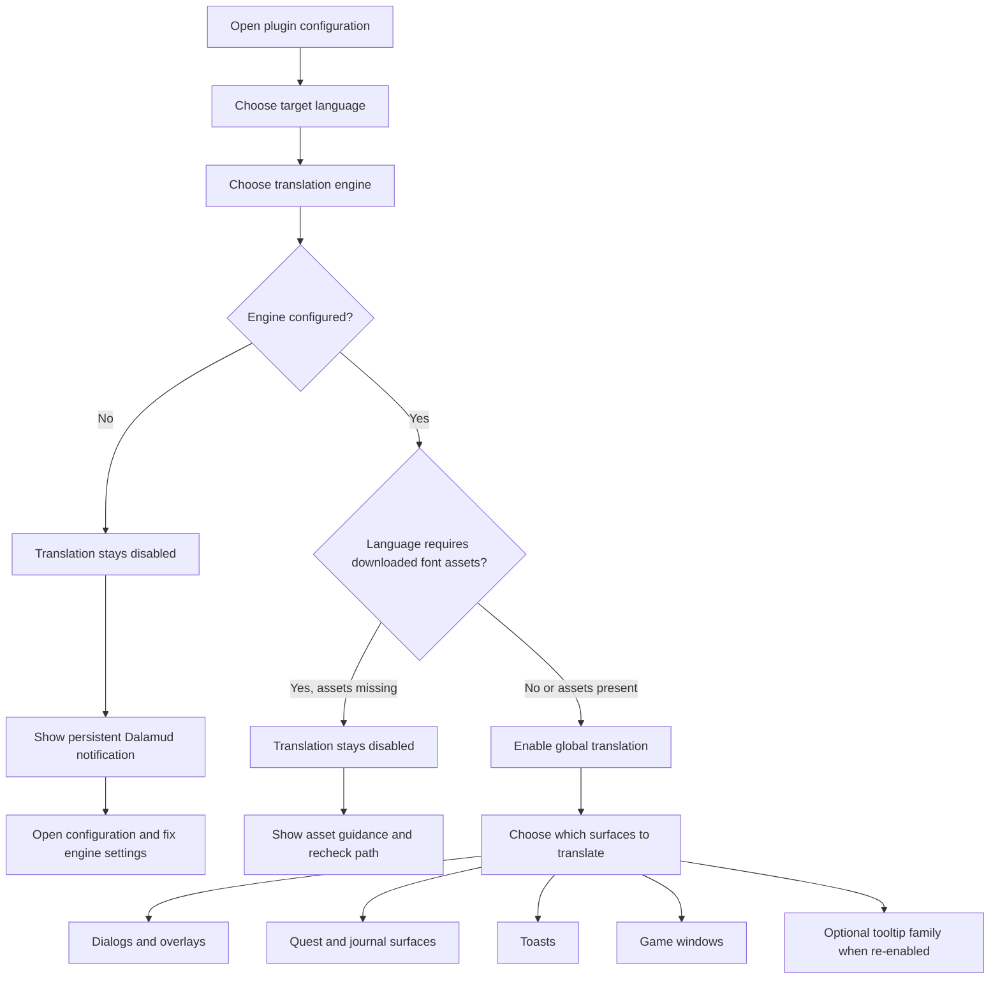

<!--
  Copyright (c) lokinmodar. All rights reserved.
  Licensed under the Creative Commons Attribution-NonCommercial-NoDerivatives 4.0 International Public License license.
-->

# Translation Surface Support Matrix

This document is the canonical inventory of Echoglossian's user-configurable
translation surfaces.

Keep it updated whenever a new surface, mode, or release-level restriction is
introduced or removed.

## Activation Flow

## Translation Mode Families

| Mode Family | Modes | Used By |
| --- | --- | --- |
| Quest / native-window family | `Native UI Translation`, `Tooltip Translation Only`, `Native UI Translation With Original Tooltips` | Journal-family surfaces and DB-first game windows |
| Overlay family | `Native UI Translation`, `Overlay Translation Only`, `Native UI Translation With Original Overlay` | Talk, BattleTalk, subtitles, MiniTalk, CutSceneSelectString, and toast-family surfaces |

## Dialog and Overlay Surfaces

| Surface | Config Toggle | Modes | Notes | Current Release Status |
| --- | --- | --- | --- | --- |
| Talk | `TranslateTalk` | Overlay family | Supports translated NPC names through `TranslateTalkNpcNames` | Enabled |
| BattleTalk | `TranslateBattleTalk` | Overlay family | Supports translated NPC names through `TranslateBattleTalkNpcNames` | Enabled |
| TalkSubtitle | `TranslateTalkSubtitle` | Overlay family | Titleless overlay presentation when overlay mode is active | Enabled |
| MiniTalk | `TranslateMiniTalk` | Overlay family | Small native surface; verbose text still requires careful native reflow | Enabled |
| CutSceneSelectString | `TranslateCutSceneSelectString` | Overlay family | Question becomes the title and options become the body in overlay mode | Enabled |

## Quest and Journal Surfaces

| Surface | Config Toggle | Modes | Notes | Current Release Status |
| --- | --- | --- | --- | --- |
| Journal | `TranslateJournal` | Quest / native-window family | Quest list surface | Enabled |
| JournalDetail | `TranslateJournalDetail` | Quest / native-window family | Dense body layout; native mode requires explicit block reflow | Enabled |
| ToDoList | `TranslateToDoList` | Quest / native-window family | Quest tracker / objective list | Enabled |
| ScenarioTree | `TranslateScenarioTree` | Quest / native-window family | Main scenario tracker | Enabled |
| JournalAccept | `TranslateJournalAccept` | Quest / native-window family | Quest accept window | Enabled |
| JournalResult | `TranslateJournalResult` | Quest / native-window family | Quest result / completion window | Enabled |
| RecommendList | `TranslateRecommendList` | Quest / native-window family | Recommendation list | Enabled |
| AreaMap | `TranslateAreaMap` | Quest / native-window family | Quest text inside map-related quest UI | Enabled |

## Toast Surfaces

| Surface | Config Toggle | Modes | Notes | Current Release Status |
| --- | --- | --- | --- | --- |
| WideText / Screen Info toast | `TranslateWideTextToast` | Overlay family | Large center-screen information toast | Enabled |
| Error toast | `TranslateErrorToast` | Overlay family | Error / failure notifications | Enabled |
| Area toast | `TranslateAreaToast` | Overlay family | Area and location notifications | Enabled |
| Class / Job change toast | `TranslateClassChangeToast` | Overlay family | Class/job change announcement | Enabled |
| Text gimmick hint | `TranslateTextGimmickHint` | Overlay family | Gimmick/tutorial hint surface | Enabled |
| Quest toast | `TranslateQuestToast` | Overlay family | Quest-related toast notification | Enabled |

## Game Window Surfaces

| Surface | Config Toggle | Modes | Notes | Current Release Status |
| --- | --- | --- | --- | --- |
| Character window | `TranslateCharacterWindow` | Quest / native-window family | DB-first game-window runtime | Enabled |
| Main Command | `TranslateMainCommandWindow` | Quest / native-window family | DB-first game-window runtime | Enabled |
| Action Menu | `TranslateActionMenuWindow` | Quest / native-window family | DB-first game-window runtime | Enabled |
| HUD windows | `TranslateHudWindow` | Quest / native-window family | DB-first game-window runtime | Enabled |
| Operation Guide | `TranslateOperationGuideWindow` | Quest / native-window family | DB-first game-window runtime | Enabled |
| Addon Context Menu Title | `TranslateAddonContextMenuTitle` | Quest / native-window family | DB-first game-window runtime | Enabled |

## Hidden or Temporarily Restricted Surfaces

| Surface | Config Toggle | Modes | Notes | Current Release Status |
| --- | --- | --- | --- | --- |
| Action / item detail tooltips | `TranslateTooltips` | Overlay family | Structured tooltip translation is force-disabled at startup while `ActionDetail` / `ItemDetail` remain unstable | Temporarily disabled for release |
| Yes/No dialog | `TranslateYesNoScreen` | Toggle only | Present in config model and tab implementation, but not currently exposed in the active Overlay tab flow | Implemented but hidden in current UI |
| SelectString dialog | `TranslateSelectString` | Toggle only | Present in config model and tab implementation, but not currently exposed in the active Overlay tab flow | Implemented but hidden in current UI |
| SelectOk dialog | `TranslateSelectOk` | Toggle only | Present in config model and tab implementation, but not currently exposed in the active Overlay tab flow | Implemented but hidden in current UI |

## Operational Notes

| Topic | Behavior |
| --- | --- |
| Global activation | Translation does not stay enabled unless the selected engine is valid and configured for the selected language |
| Downloaded font assets | Some languages require downloaded font assets before translation can be activated safely |
| Overlay-only languages | When the language is overlay-only, native-replacement display modes are normalized to overlay/tooltip presentation |
| Surface-level activation | Each family still requires its own per-surface toggle even after global translation is enabled |
| Release gating | A surface may exist in config or code but still be intentionally hidden or force-disabled in a given release |

## Maintenance Rules

- Update this matrix whenever a new translation surface is added.
- Update this matrix whenever a surface changes mode family.
- Update this matrix whenever a release temporarily disables or hides a
  feature.
- Prefer documenting real runtime behavior rather than aspirational behavior.
