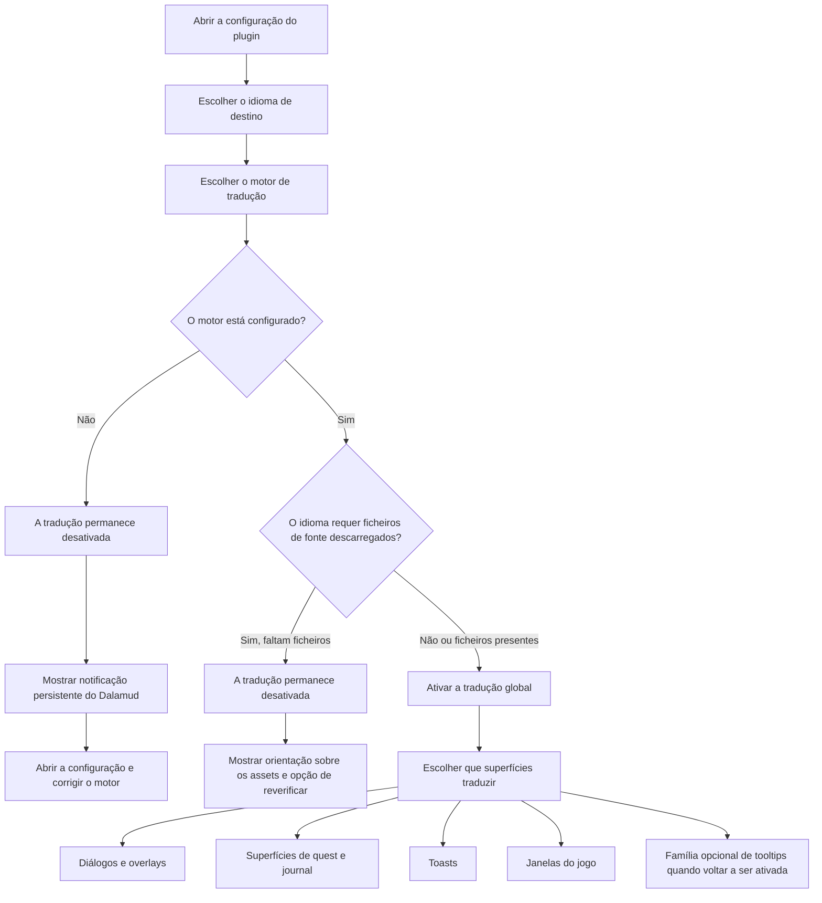

<!--
  Copyright (c) lokinmodar. All rights reserved.
  Licensed under the Creative Commons Attribution-NonCommercial-NoDerivatives 4.0 International Public License license.
-->

# Matriz de suporte das superfícies de tradução

Este documento é o inventário canônico das superfícies de tradução configuráveis pelo utilizador no Echoglossian.

Deve ser atualizado sempre que uma nova superfície, modo ou restrição de release for introduzida ou removida.

## Fluxo de ativação

## Famílias de modos de tradução

| Família de modos | Modos | Utilizada por |
| --- | --- | --- |
| Família quest / native-window | `Native UI Translation`, `Tooltip Translation Only`, `Native UI Translation With Original Tooltips` | Superfícies da família Journal e janelas de jogo DB-first |
| Família overlay | `Native UI Translation`, `Overlay Translation Only`, `Native UI Translation With Original Overlay` | Talk, BattleTalk, legendas, MiniTalk, CutSceneSelectString e família de toasts |

## Superfícies de diálogo e overlay

| Superfície | Toggle de configuração | Modos | Notas | Estado da release atual |
| --- | --- | --- | --- | --- |
| Talk | `TranslateTalk` | Família overlay | Suporta nomes de NPC traduzidos através de `TranslateTalkNpcNames` | Ativado |
| BattleTalk | `TranslateBattleTalk` | Família overlay | Suporta nomes de NPC traduzidos através de `TranslateBattleTalkNpcNames` | Ativado |
| TalkSubtitle | `TranslateTalkSubtitle` | Família overlay | Apresentação overlay sem barra de título quando o modo overlay está ativo | Ativado |
| MiniTalk | `TranslateMiniTalk` | Família overlay | Pequena superfície nativa; textos mais verbosos ainda exigem native reflow cuidadoso | Ativado |
| CutSceneSelectString | `TranslateCutSceneSelectString` | Família overlay | A pergunta torna-se o título e as opções tornam-se o corpo no modo overlay | Ativado |

## Superfícies de quest e journal

| Superfície | Toggle de configuração | Modos | Notas | Estado da release atual |
| --- | --- | --- | --- | --- |
| Journal | `TranslateJournal` | Família quest / native-window | Superfície de lista de quests | Ativado |
| JournalDetail | `TranslateJournalDetail` | Família quest / native-window | Layout de corpo denso; o modo nativo exige block reflow explícito | Ativado |
| ToDoList | `TranslateToDoList` | Família quest / native-window | Quest tracker / lista de objetivos | Ativado |
| ScenarioTree | `TranslateScenarioTree` | Família quest / native-window | Tracker do cenário principal | Ativado |
| JournalAccept | `TranslateJournalAccept` | Família quest / native-window | Janela de aceitação de quest | Ativado |
| JournalResult | `TranslateJournalResult` | Família quest / native-window | Janela de resultado / conclusão de quest | Ativado |
| RecommendList | `TranslateRecommendList` | Família quest / native-window | Lista de recomendações | Ativado |
| AreaMap | `TranslateAreaMap` | Família quest / native-window | Texto de quest dentro da UI de quests relacionada com o mapa | Ativado |

## Superfícies de toast

| Superfície | Toggle de configuração | Modos | Notas | Estado da release atual |
| --- | --- | --- | --- | --- |
| WideText / Screen Info toast | `TranslateWideTextToast` | Família overlay | Grande toast informativo no centro do ecrã | Ativado |
| Error toast | `TranslateErrorToast` | Família overlay | Notificações de erro ou falha | Ativado |
| Area toast | `TranslateAreaToast` | Família overlay | Notificações de área e localização | Ativado |
| Class / Job change toast | `TranslateClassChangeToast` | Família overlay | Anúncio de mudança de class/job | Ativado |
| Text gimmick hint | `TranslateTextGimmickHint` | Família overlay | Superfície de pista de gimmick/tutorial | Ativado |
| Quest toast | `TranslateQuestToast` | Família overlay | Notificação toast relacionada com quest | Ativado |

## Superfícies de janelas do jogo

| Superfície | Toggle de configuração | Modos | Notas | Estado da release atual |
| --- | --- | --- | --- | --- |
| Character window | `TranslateCharacterWindow` | Família quest / native-window | Runtime DB-first de janelas do jogo | Ativado |
| Main Command | `TranslateMainCommandWindow` | Família quest / native-window | Runtime DB-first de janelas do jogo | Ativado |
| Action Menu | `TranslateActionMenuWindow` | Família quest / native-window | Runtime DB-first de janelas do jogo | Ativado |
| HUD windows | `TranslateHudWindow` | Família quest / native-window | Runtime DB-first de janelas do jogo | Ativado |
| Operation Guide | `TranslateOperationGuideWindow` | Família quest / native-window | Runtime DB-first de janelas do jogo | Ativado |
| Addon Context Menu Title | `TranslateAddonContextMenuTitle` | Família quest / native-window | Runtime DB-first de janelas do jogo | Ativado |

## Superfícies ocultas ou temporariamente restritas

| Superfície | Toggle de configuração | Modos | Notas | Estado da release atual |
| --- | --- | --- | --- | --- |
| Action / item detail tooltips | `TranslateTooltips` | Família overlay | A tradução estruturada de tooltips é desativada à força no arranque enquanto `ActionDetail` / `ItemDetail` permanecerem instáveis | Temporariamente desativado para a release |
| Yes/No dialog | `TranslateYesNoScreen` | Apenas toggle | Presente no modelo de configuração e na implementação da tab, mas não está atualmente exposto no fluxo ativo da tab Overlay | Implementado mas oculto na UI atual |
| SelectString dialog | `TranslateSelectString` | Apenas toggle | Presente no modelo de configuração e na implementação da tab, mas não está atualmente exposto no fluxo ativo da tab Overlay | Implementado mas oculto na UI atual |
| SelectOk dialog | `TranslateSelectOk` | Apenas toggle | Presente no modelo de configuração e na implementação da tab, mas não está atualmente exposto no fluxo ativo da tab Overlay | Implementado mas oculto na UI atual |

## Notas operacionais

| Tópico | Comportamento |
| --- | --- |
| Ativação global | A tradução não permanece ativa a menos que o motor selecionado seja válido e esteja configurado para o idioma escolhido |
| Ficheiros de fonte descarregados | Alguns idiomas exigem ficheiros de fonte descarregados antes de a tradução poder ser ativada com segurança |
| Idiomas apenas overlay | Quando o idioma é overlay-only, os modos de substituição nativa são normalizados para apresentação em overlay/tooltip |
| Ativação por superfície | Cada família continua a exigir o seu próprio toggle por superfície mesmo depois de a tradução global ser ativada |
| Gating de release | Uma superfície pode existir na configuração ou no código e ainda assim estar intencionalmente oculta ou desativada à força numa determinada release |

## Regras de manutenção

- Atualizar esta matriz sempre que uma nova superfície de tradução for adicionada.
- Atualizar esta matriz sempre que uma superfície mudar de família de modos.
- Atualizar esta matriz sempre que uma release desativar ou ocultar temporariamente uma funcionalidade.
- Deve ser privilegiada a documentação do comportamento real em runtime em vez de um comportamento apenas aspiracional.
