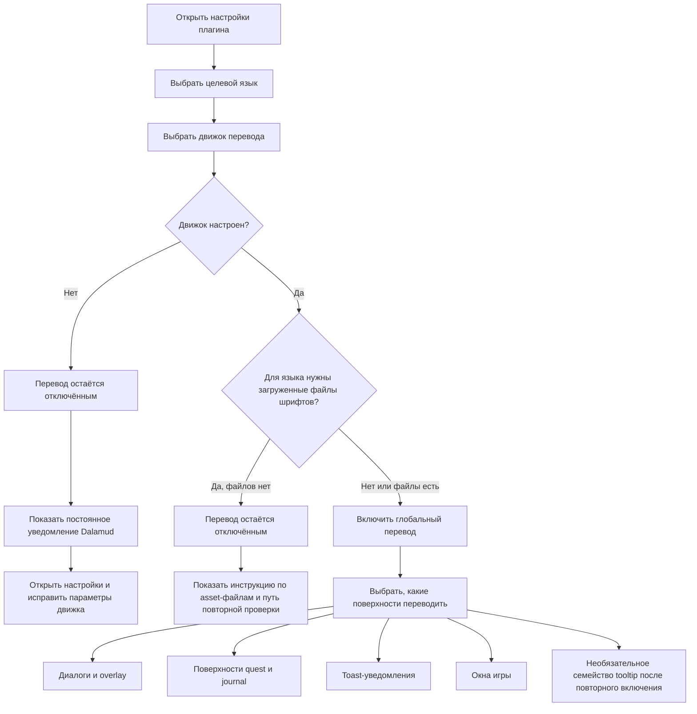

<!--
  Copyright (c) lokinmodar. All rights reserved.
  Licensed under the Creative Commons Attribution-NonCommercial-NoDerivatives 4.0 International Public License license.
-->

# Матрица поддержки поверхностей перевода

Этот документ является каноническим перечнем настраиваемых пользователем поверхностей перевода в Echoglossian.

Его следует обновлять всякий раз, когда добавляется или удаляется новая поверхность, режим или ограничение релиза.

## Поток активации

## Семейства режимов перевода

| Семейство режимов | Режимы | Используется для |
| --- | --- | --- |
| Семейство quest / native-window | `Native UI Translation`, `Tooltip Translation Only`, `Native UI Translation With Original Tooltips` | Поверхности семейства Journal и игровые окна DB-first |
| Семейство overlay | `Native UI Translation`, `Overlay Translation Only`, `Native UI Translation With Original Overlay` | Talk, BattleTalk, субтитры, MiniTalk, CutSceneSelectString и семейство toast |

## Диалоговые и overlay-поверхности

| Поверхность | Toggle в конфиге | Режимы | Примечания | Статус текущего релиза |
| --- | --- | --- | --- | --- |
| Talk | `TranslateTalk` | Семейство overlay | Поддерживает перевод имён NPC через `TranslateTalkNpcNames` | Включено |
| BattleTalk | `TranslateBattleTalk` | Семейство overlay | Поддерживает перевод имён NPC через `TranslateBattleTalkNpcNames` | Включено |
| TalkSubtitle | `TranslateTalkSubtitle` | Семейство overlay | Overlay-представление без заголовка, когда активен overlay-режим | Включено |
| MiniTalk | `TranslateMiniTalk` | Семейство overlay | Небольшая native-поверхность; более многословный текст всё ещё требует аккуратного native reflow | Включено |
| CutSceneSelectString | `TranslateCutSceneSelectString` | Семейство overlay | В overlay-режиме вопрос становится заголовком, а варианты ответа становятся основным текстом | Включено |

## Поверхности quest и journal

| Поверхность | Toggle в конфиге | Режимы | Примечания | Статус текущего релиза |
| --- | --- | --- | --- | --- |
| Journal | `TranslateJournal` | Семейство quest / native-window | Поверхность списка quest | Включено |
| JournalDetail | `TranslateJournalDetail` | Семейство quest / native-window | Плотная компоновка основного блока; native-режим требует явного block reflow | Включено |
| ToDoList | `TranslateToDoList` | Семейство quest / native-window | Трекер quest / список целей | Включено |
| ScenarioTree | `TranslateScenarioTree` | Семейство quest / native-window | Трекер основного сценария | Включено |
| JournalAccept | `TranslateJournalAccept` | Семейство quest / native-window | Окно принятия quest | Включено |
| JournalResult | `TranslateJournalResult` | Семейство quest / native-window | Окно результата / завершения quest | Включено |
| RecommendList | `TranslateRecommendList` | Семейство quest / native-window | Список рекомендаций | Включено |
| AreaMap | `TranslateAreaMap` | Семейство quest / native-window | Текст quest внутри UI, связанного с картой | Включено |

## Toast-поверхности

| Поверхность | Toggle в конфиге | Режимы | Примечания | Статус текущего релиза |
| --- | --- | --- | --- | --- |
| WideText / Screen Info toast | `TranslateWideTextToast` | Семейство overlay | Большое информационное уведомление в центре экрана | Включено |
| Error toast | `TranslateErrorToast` | Семейство overlay | Уведомления об ошибках и сбоях | Включено |
| Area toast | `TranslateAreaToast` | Семейство overlay | Уведомления об области и местоположении | Включено |
| Class / Job change toast | `TranslateClassChangeToast` | Семейство overlay | Сообщение о смене class/job | Включено |
| Text gimmick hint | `TranslateTextGimmickHint` | Семейство overlay | Поверхность подсказок gimmick/tutorial | Включено |
| Quest toast | `TranslateQuestToast` | Семейство overlay | Toast-уведомление, связанное с quest | Включено |

## Поверхности игровых окон

| Поверхность | Toggle в конфиге | Режимы | Примечания | Статус текущего релиза |
| --- | --- | --- | --- | --- |
| Character window | `TranslateCharacterWindow` | Семейство quest / native-window | DB-first runtime игровых окон | Включено |
| Main Command | `TranslateMainCommandWindow` | Семейство quest / native-window | DB-first runtime игровых окон | Включено |
| Action Menu | `TranslateActionMenuWindow` | Семейство quest / native-window | DB-first runtime игровых окон | Включено |
| HUD windows | `TranslateHudWindow` | Семейство quest / native-window | DB-first runtime игровых окон | Включено |
| Operation Guide | `TranslateOperationGuideWindow` | Семейство quest / native-window | DB-first runtime игровых окон | Включено |
| Addon Context Menu Title | `TranslateAddonContextMenuTitle` | Семейство quest / native-window | DB-first runtime игровых окон | Включено |

## Скрытые или временно ограниченные поверхности

| Поверхность | Toggle в конфиге | Режимы | Примечания | Статус текущего релиза |
| --- | --- | --- | --- | --- |
| Action / item detail tooltips | `TranslateTooltips` | Семейство overlay | Структурированный перевод tooltip принудительно отключается при запуске, пока `ActionDetail` / `ItemDetail` остаются нестабильными | Временно отключено в релизе |
| Yes/No dialog | `TranslateYesNoScreen` | Только toggle | Присутствует в модели конфигурации и реализации вкладки, но сейчас не отображается в активном потоке вкладки Overlay | Реализовано, но скрыто в текущем UI |
| SelectString dialog | `TranslateSelectString` | Только toggle | Присутствует в модели конфигурации и реализации вкладки, но сейчас не отображается в активном потоке вкладки Overlay | Реализовано, но скрыто в текущем UI |
| SelectOk dialog | `TranslateSelectOk` | Только toggle | Присутствует в модели конфигурации и реализации вкладки, но сейчас не отображается в активном потоке вкладки Overlay | Реализовано, но скрыто в текущем UI |

## Эксплуатационные заметки

| Тема | Поведение |
| --- | --- |
| Глобальная активация | Перевод не остаётся включённым, если выбранный движок не является валидным и не настроен для выбранного языка |
| Загруженные файлы шрифтов | Для некоторых языков требуются загруженные файлы шрифтов, прежде чем перевод можно будет безопасно включить |
| Языки только для overlay | Когда язык является overlay-only, режимы native replacement нормализуются в overlay/tooltip-представление |
| Активация по поверхности | Каждое семейство всё ещё требует собственного toggle для каждой поверхности даже после включения глобального перевода |
| Ограничения релиза | Поверхность может существовать в конфиге или коде, но при этом быть намеренно скрытой или принудительно отключённой в конкретном релизе |

## Правила сопровождения

- Обновляйте эту матрицу всякий раз, когда добавляется новая поверхность перевода.
- Обновляйте эту матрицу всякий раз, когда поверхность меняет семейство режимов.
- Обновляйте эту матрицу всякий раз, когда релиз временно отключает или скрывает функциональность.
- Следует отдавать приоритет документированию реального runtime-поведения, а не только желаемого будущего поведения.
