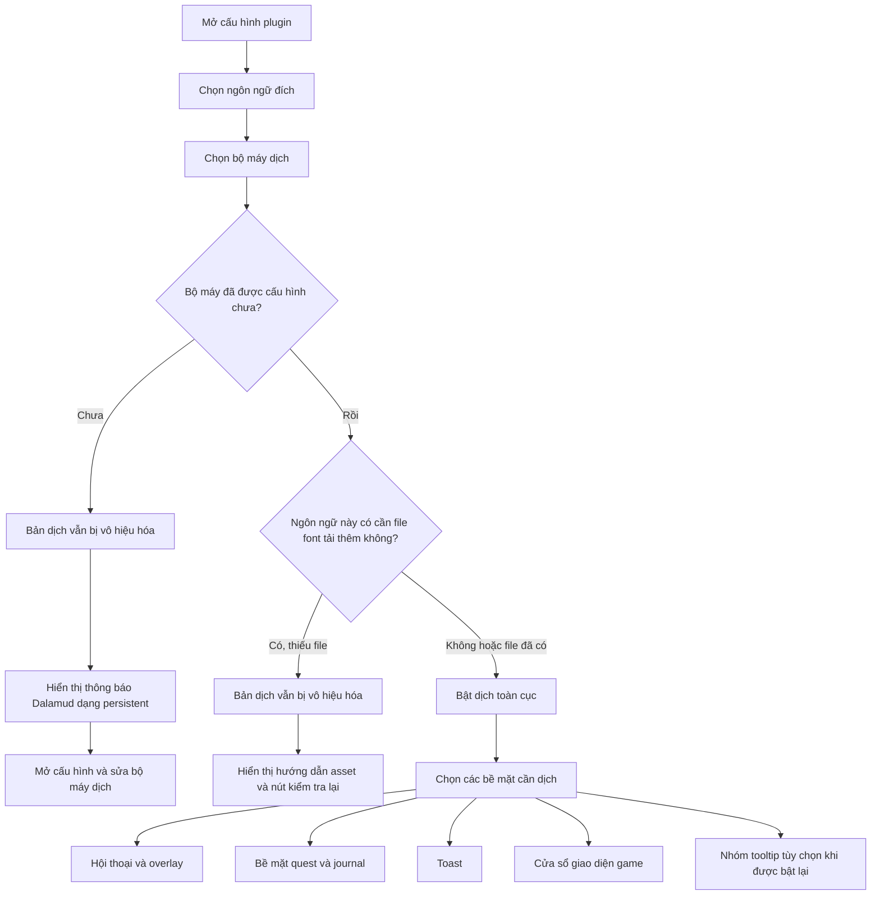

<!--
  Copyright (c) lokinmodar. All rights reserved.
  Licensed under the Creative Commons Attribution-NonCommercial-NoDerivatives 4.0 International Public License license.
-->

# Ma trận hỗ trợ các bề mặt dịch

Tài liệu này là danh mục chuẩn về các bề mặt dịch có thể cấu hình bởi người dùng trong Echoglossian.

Hãy cập nhật tài liệu này mỗi khi có thêm hoặc gỡ bỏ bề mặt mới, chế độ mới hoặc giới hạn ở cấp bản phát hành.

## Luồng kích hoạt

## Nhóm chế độ dịch

| Nhóm chế độ | Các chế độ | Được dùng bởi |
| --- | --- | --- |
| Nhóm quest / native-window | `Native UI Translation`, `Tooltip Translation Only`, `Native UI Translation With Original Tooltips` | Các bề mặt họ Journal và các cửa sổ game kiểu DB-first |
| Nhóm overlay | `Native UI Translation`, `Overlay Translation Only`, `Native UI Translation With Original Overlay` | Talk, BattleTalk, phụ đề, MiniTalk, CutSceneSelectString và họ toast |

## Bề mặt hội thoại và overlay

| Bề mặt | Toggle cấu hình | Chế độ | Ghi chú | Trạng thái trong bản phát hành hiện tại |
| --- | --- | --- | --- | --- |
| Talk | `TranslateTalk` | Nhóm overlay | Hỗ trợ dịch tên NPC qua `TranslateTalkNpcNames` | Đã bật |
| BattleTalk | `TranslateBattleTalk` | Nhóm overlay | Hỗ trợ dịch tên NPC qua `TranslateBattleTalkNpcNames` | Đã bật |
| TalkSubtitle | `TranslateTalkSubtitle` | Nhóm overlay | Overlay không có thanh tiêu đề khi chế độ overlay đang hoạt động | Đã bật |
| MiniTalk | `TranslateMiniTalk` | Nhóm overlay | Bề mặt native nhỏ; văn bản dài hơn vẫn cần native reflow cẩn thận | Đã bật |
| CutSceneSelectString | `TranslateCutSceneSelectString` | Nhóm overlay | Câu hỏi trở thành tiêu đề và các lựa chọn trở thành phần thân ở chế độ overlay | Đã bật |

## Bề mặt quest và journal

| Bề mặt | Toggle cấu hình | Chế độ | Ghi chú | Trạng thái trong bản phát hành hiện tại |
| --- | --- | --- | --- | --- |
| Journal | `TranslateJournal` | Nhóm quest / native-window | Bề mặt danh sách quest | Đã bật |
| JournalDetail | `TranslateJournalDetail` | Nhóm quest / native-window | Bố cục phần thân dày đặc; chế độ native cần block reflow rõ ràng | Đã bật |
| ToDoList | `TranslateToDoList` | Nhóm quest / native-window | Trình theo dõi quest / danh sách mục tiêu | Đã bật |
| ScenarioTree | `TranslateScenarioTree` | Nhóm quest / native-window | Trình theo dõi kịch bản chính | Đã bật |
| JournalAccept | `TranslateJournalAccept` | Nhóm quest / native-window | Cửa sổ nhận quest | Đã bật |
| JournalResult | `TranslateJournalResult` | Nhóm quest / native-window | Cửa sổ kết quả / hoàn thành quest | Đã bật |
| RecommendList | `TranslateRecommendList` | Nhóm quest / native-window | Danh sách gợi ý | Đã bật |
| AreaMap | `TranslateAreaMap` | Nhóm quest / native-window | Văn bản quest trong UI quest liên quan đến bản đồ | Đã bật |

## Bề mặt toast

| Bề mặt | Toggle cấu hình | Chế độ | Ghi chú | Trạng thái trong bản phát hành hiện tại |
| --- | --- | --- | --- | --- |
| WideText / Screen Info toast | `TranslateWideTextToast` | Nhóm overlay | Toast thông tin lớn ở giữa màn hình | Đã bật |
| Error toast | `TranslateErrorToast` | Nhóm overlay | Thông báo lỗi / thất bại | Đã bật |
| Area toast | `TranslateAreaToast` | Nhóm overlay | Thông báo khu vực và vị trí | Đã bật |
| Class / Job change toast | `TranslateClassChangeToast` | Nhóm overlay | Thông báo đổi class/job | Đã bật |
| Text gimmick hint | `TranslateTextGimmickHint` | Nhóm overlay | Bề mặt gợi ý gimmick/tutorial | Đã bật |
| Quest toast | `TranslateQuestToast` | Nhóm overlay | Toast liên quan đến quest | Đã bật |

## Bề mặt cửa sổ game

| Bề mặt | Toggle cấu hình | Chế độ | Ghi chú | Trạng thái trong bản phát hành hiện tại |
| --- | --- | --- | --- | --- |
| Character window | `TranslateCharacterWindow` | Nhóm quest / native-window | Runtime cửa sổ game DB-first | Đã bật |
| Main Command | `TranslateMainCommandWindow` | Nhóm quest / native-window | Runtime cửa sổ game DB-first | Đã bật |
| Action Menu | `TranslateActionMenuWindow` | Nhóm quest / native-window | Runtime cửa sổ game DB-first | Đã bật |
| HUD windows | `TranslateHudWindow` | Nhóm quest / native-window | Runtime cửa sổ game DB-first | Đã bật |
| Operation Guide | `TranslateOperationGuideWindow` | Nhóm quest / native-window | Runtime cửa sổ game DB-first | Đã bật |
| Addon Context Menu Title | `TranslateAddonContextMenuTitle` | Nhóm quest / native-window | Runtime cửa sổ game DB-first | Đã bật |

## Bề mặt ẩn hoặc bị giới hạn tạm thời

| Bề mặt | Toggle cấu hình | Chế độ | Ghi chú | Trạng thái trong bản phát hành hiện tại |
| --- | --- | --- | --- | --- |
| Action / item detail tooltips | `TranslateTooltips` | Nhóm overlay | Dịch tooltip có cấu trúc bị tắt cưỡng bức khi khởi động trong khi `ActionDetail` / `ItemDetail` vẫn chưa ổn định | Tạm thời bị vô hiệu hóa trong release |
| Yes/No dialog | `TranslateYesNoScreen` | Chỉ toggle | Có trong mô hình cấu hình và phần cài đặt tab, nhưng hiện chưa được hiển thị trong luồng tab Overlay đang hoạt động | Đã triển khai nhưng đang ẩn trong UI hiện tại |
| SelectString dialog | `TranslateSelectString` | Chỉ toggle | Có trong mô hình cấu hình và phần cài đặt tab, nhưng hiện chưa được hiển thị trong luồng tab Overlay đang hoạt động | Đã triển khai nhưng đang ẩn trong UI hiện tại |
| SelectOk dialog | `TranslateSelectOk` | Chỉ toggle | Có trong mô hình cấu hình và phần cài đặt tab, nhưng hiện chưa được hiển thị trong luồng tab Overlay đang hoạt động | Đã triển khai nhưng đang ẩn trong UI hiện tại |

## Ghi chú vận hành

| Chủ đề | Hành vi |
| --- | --- |
| Kích hoạt toàn cục | Bản dịch sẽ không tiếp tục được bật nếu bộ máy được chọn không hợp lệ hoặc chưa cấu hình đúng cho ngôn ngữ đã chọn |
| File font tải thêm | Một số ngôn ngữ yêu cầu file font tải thêm trước khi có thể bật dịch một cách an toàn |
| Ngôn ngữ chỉ overlay | Khi ngôn ngữ chỉ hỗ trợ overlay, các chế độ thay thế native sẽ được chuẩn hóa sang dạng overlay/tooltip |
| Kích hoạt theo bề mặt | Mỗi nhóm vẫn yêu cầu toggle riêng cho từng bề mặt ngay cả sau khi bật dịch toàn cục |
| Giới hạn theo release | Một bề mặt có thể tồn tại trong cấu hình hoặc trong mã nguồn nhưng vẫn bị ẩn hoặc bị tắt cưỡng bức trong một release nhất định |

## Quy tắc bảo trì

- Cập nhật ma trận này mỗi khi thêm bề mặt dịch mới.
- Cập nhật ma trận này mỗi khi một bề mặt đổi sang nhóm chế độ khác.
- Cập nhật ma trận này mỗi khi một release tạm thời tắt hoặc ẩn một tính năng.
- Ưu tiên ghi lại hành vi runtime thực tế thay vì hành vi lý tưởng chỉ mang tính định hướng.
