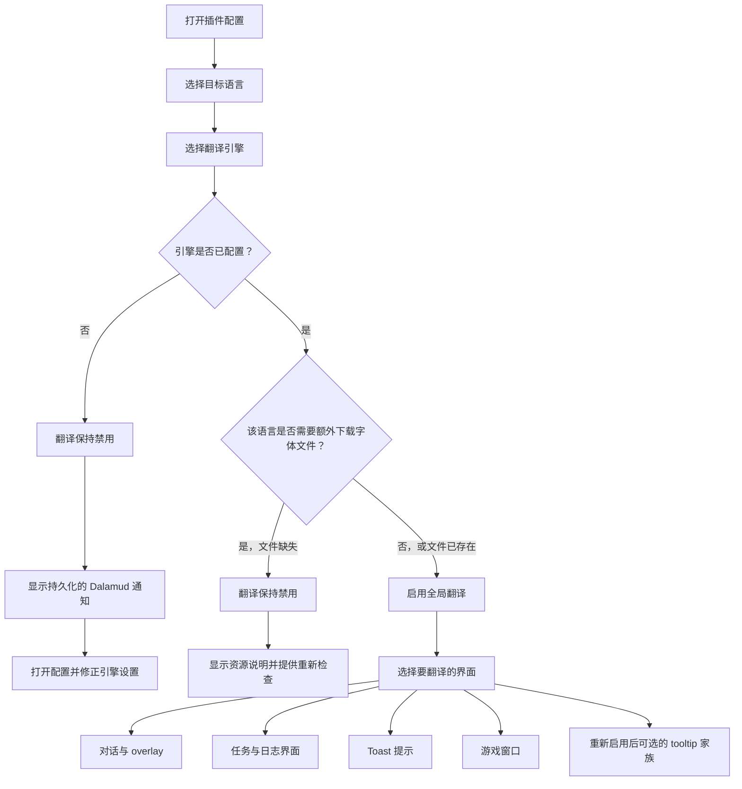

<!--
  Copyright (c) lokinmodar. All rights reserved.
  Licensed under the Creative Commons Attribution-NonCommercial-NoDerivatives 4.0 International Public License license.
-->

# 翻译界面支持矩阵

本文档是 Echoglossian 中用户可配置翻译界面的标准清单。

每当新增或移除某个界面、模式或发布级限制时，都应更新本文档。

## 启用流程

## 翻译模式家族

| 模式家族 | 模式 | 用于 |
| --- | --- | --- |
| 任务 / 原生窗口家族 | `Native UI Translation`, `Tooltip Translation Only`, `Native UI Translation With Original Tooltips` | Journal 家族界面和 DB-first 游戏窗口 |
| Overlay 家族 | `Native UI Translation`, `Overlay Translation Only`, `Native UI Translation With Original Overlay` | Talk、BattleTalk、字幕、MiniTalk、CutSceneSelectString 和 toast 家族 |

## 对话与 Overlay 界面

| 界面 | 配置开关 | 模式 | 说明 | 当前发布状态 |
| --- | --- | --- | --- | --- |
| Talk | `TranslateTalk` | Overlay 家族 | 通过 `TranslateTalkNpcNames` 支持翻译 NPC 名称 | 已启用 |
| BattleTalk | `TranslateBattleTalk` | Overlay 家族 | 通过 `TranslateBattleTalkNpcNames` 支持翻译 NPC 名称 | 已启用 |
| TalkSubtitle | `TranslateTalkSubtitle` | Overlay 家族 | 在 overlay 模式下使用无标题栏的 overlay 表现 | 已启用 |
| MiniTalk | `TranslateMiniTalk` | Overlay 家族 | 原生小型界面；更长的翻译文本仍需要谨慎的 native reflow | 已启用 |
| CutSceneSelectString | `TranslateCutSceneSelectString` | Overlay 家族 | 在 overlay 模式下，问题文本作为标题，选项作为正文 | 已启用 |

## 任务与 Journal 界面

| 界面 | 配置开关 | 模式 | 说明 | 当前发布状态 |
| --- | --- | --- | --- | --- |
| Journal | `TranslateJournal` | 任务 / 原生窗口家族 | 任务列表界面 | 已启用 |
| JournalDetail | `TranslateJournalDetail` | 任务 / 原生窗口家族 | 正文布局密集；原生模式需要显式 block reflow | 已启用 |
| ToDoList | `TranslateToDoList` | 任务 / 原生窗口家族 | 任务追踪 / 目标列表 | 已启用 |
| ScenarioTree | `TranslateScenarioTree` | 任务 / 原生窗口家族 | 主线剧情追踪 | 已启用 |
| JournalAccept | `TranslateJournalAccept` | 任务 / 原生窗口家族 | 接受任务窗口 | 已启用 |
| JournalResult | `TranslateJournalResult` | 任务 / 原生窗口家族 | 任务结果 / 完成窗口 | 已启用 |
| RecommendList | `TranslateRecommendList` | 任务 / 原生窗口家族 | 推荐列表 | 已启用 |
| AreaMap | `TranslateAreaMap` | 任务 / 原生窗口家族 | 地图相关任务 UI 中的任务文本 | 已启用 |

## Toast 界面

| 界面 | 配置开关 | 模式 | 说明 | 当前发布状态 |
| --- | --- | --- | --- | --- |
| WideText / Screen Info toast | `TranslateWideTextToast` | Overlay 家族 | 屏幕中央的大型信息提示 | 已启用 |
| Error toast | `TranslateErrorToast` | Overlay 家族 | 错误 / 失败通知 | 已启用 |
| Area toast | `TranslateAreaToast` | Overlay 家族 | 区域和地点通知 | 已启用 |
| Class / Job change toast | `TranslateClassChangeToast` | Overlay 家族 | 职业 / Job 变更提示 | 已启用 |
| Text gimmick hint | `TranslateTextGimmickHint` | Overlay 家族 | gimmick / 教程提示界面 | 已启用 |
| Quest toast | `TranslateQuestToast` | Overlay 家族 | 与任务相关的 toast 通知 | 已启用 |

## 游戏窗口界面

| 界面 | 配置开关 | 模式 | 说明 | 当前发布状态 |
| --- | --- | --- | --- | --- |
| Character window | `TranslateCharacterWindow` | 任务 / 原生窗口家族 | DB-first 游戏窗口运行时 | 已启用 |
| Main Command | `TranslateMainCommandWindow` | 任务 / 原生窗口家族 | DB-first 游戏窗口运行时 | 已启用 |
| Action Menu | `TranslateActionMenuWindow` | 任务 / 原生窗口家族 | DB-first 游戏窗口运行时 | 已启用 |
| HUD windows | `TranslateHudWindow` | 任务 / 原生窗口家族 | DB-first 游戏窗口运行时 | 已启用 |
| Operation Guide | `TranslateOperationGuideWindow` | 任务 / 原生窗口家族 | DB-first 游戏窗口运行时 | 已启用 |
| Addon Context Menu Title | `TranslateAddonContextMenuTitle` | 任务 / 原生窗口家族 | DB-first 游戏窗口运行时 | 已启用 |

## 隐藏或暂时受限的界面

| 界面 | 配置开关 | 模式 | 说明 | 当前发布状态 |
| --- | --- | --- | --- | --- |
| Action / item detail tooltips | `TranslateTooltips` | Overlay 家族 | 结构化 tooltip 翻译会在启动时被强制禁用，直到 `ActionDetail` / `ItemDetail` 稳定为止 | 当前版本中暂时禁用 |
| Yes/No dialog | `TranslateYesNoScreen` | 仅开关 | 已存在于配置模型和标签页实现中，但当前未在活动的 Overlay 标签流中暴露 | 已实现，但在当前 UI 中隐藏 |
| SelectString dialog | `TranslateSelectString` | 仅开关 | 已存在于配置模型和标签页实现中，但当前未在活动的 Overlay 标签流中暴露 | 已实现，但在当前 UI 中隐藏 |
| SelectOk dialog | `TranslateSelectOk` | 仅开关 | 已存在于配置模型和标签页实现中，但当前未在活动的 Overlay 标签流中暴露 | 已实现，但在当前 UI 中隐藏 |

## 运行说明

| 主题 | 行为 |
| --- | --- |
| 全局启用 | 只有当所选引擎对所选语言有效且配置正确时，翻译才会保持启用 |
| 下载的字体文件 | 某些语言需要额外下载字体文件后，才能安全启用翻译 |
| 仅 overlay 语言 | 当语言是 overlay-only 时，原生替换模式会被规范化为 overlay / tooltip 展示 |
| 按界面启用 | 即使已经启用全局翻译，每个家族仍然需要为每个界面单独开启对应的开关 |
| 发布限制 | 某个界面可能已经存在于配置或代码中，但在特定发布版本中仍会被有意隐藏或强制禁用 |

## 维护规则

- 每当新增翻译界面时，更新此矩阵。
- 每当某个界面切换到不同的模式家族时，更新此矩阵。
- 每当某个发布版本临时禁用或隐藏某项功能时，更新此矩阵。
- 优先记录真实的运行时行为，而不是仅仅记录理想中的未来行为。
