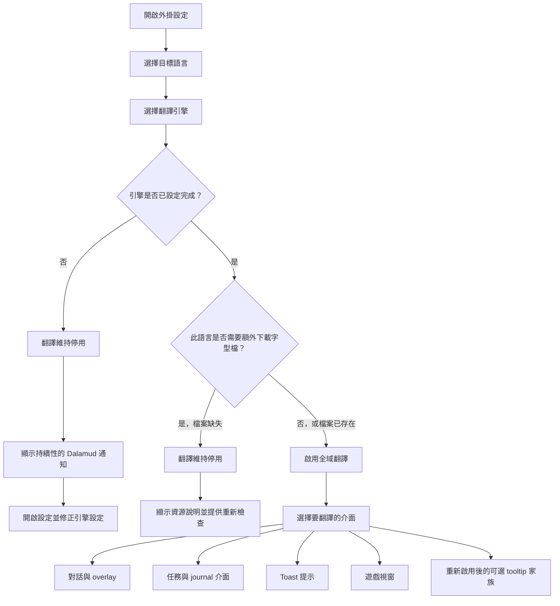

<!--
  Copyright (c) lokinmodar. All rights reserved.
  Licensed under the Creative Commons Attribution-NonCommercial-NoDerivatives 4.0 International Public License license.
-->

# 翻譯介面支援矩陣

本文件是 Echoglossian 中可由使用者設定之翻譯介面的標準清單。

每當新增或移除新的介面、模式或發行版本層級限制時，都應更新本文件。

## 啟用流程

## 翻譯模式家族

| 模式家族 | 模式 | 使用於 |
| --- | --- | --- |
| 任務 / 原生視窗家族 | `Native UI Translation`, `Tooltip Translation Only`, `Native UI Translation With Original Tooltips` | Journal 家族介面與 DB-first 遊戲視窗 |
| Overlay 家族 | `Native UI Translation`, `Overlay Translation Only`, `Native UI Translation With Original Overlay` | Talk、BattleTalk、字幕、MiniTalk、CutSceneSelectString 與 toast 家族 |

## 對話與 Overlay 介面

| 介面 | 設定開關 | 模式 | 說明 | 目前發行版本狀態 |
| --- | --- | --- | --- | --- |
| Talk | `TranslateTalk` | Overlay 家族 | 透過 `TranslateTalkNpcNames` 支援翻譯 NPC 名稱 | 已啟用 |
| BattleTalk | `TranslateBattleTalk` | Overlay 家族 | 透過 `TranslateBattleTalkNpcNames` 支援翻譯 NPC 名稱 | 已啟用 |
| TalkSubtitle | `TranslateTalkSubtitle` | Overlay 家族 | 當 overlay 模式啟用時，使用無標題列的 overlay 呈現 | 已啟用 |
| MiniTalk | `TranslateMiniTalk` | Overlay 家族 | 小型原生介面；較長的翻譯文字仍需要謹慎的 native reflow | 已啟用 |
| CutSceneSelectString | `TranslateCutSceneSelectString` | Overlay 家族 | 在 overlay 模式下，問題文字成為標題，選項成為主體內容 | 已啟用 |

## 任務與 Journal 介面

| 介面 | 設定開關 | 模式 | 說明 | 目前發行版本狀態 |
| --- | --- | --- | --- | --- |
| Journal | `TranslateJournal` | 任務 / 原生視窗家族 | 任務列表介面 | 已啟用 |
| JournalDetail | `TranslateJournalDetail` | 任務 / 原生視窗家族 | 主體版面密集；原生模式需要明確的 block reflow | 已啟用 |
| ToDoList | `TranslateToDoList` | 任務 / 原生視窗家族 | 任務追蹤 / 目標清單 | 已啟用 |
| ScenarioTree | `TranslateScenarioTree` | 任務 / 原生視窗家族 | 主線劇情追蹤 | 已啟用 |
| JournalAccept | `TranslateJournalAccept` | 任務 / 原生視窗家族 | 接受任務視窗 | 已啟用 |
| JournalResult | `TranslateJournalResult` | 任務 / 原生視窗家族 | 任務結果 / 完成視窗 | 已啟用 |
| RecommendList | `TranslateRecommendList` | 任務 / 原生視窗家族 | 推薦清單 | 已啟用 |
| AreaMap | `TranslateAreaMap` | 任務 / 原生視窗家族 | 與地圖相關之任務 UI 中的任務文字 | 已啟用 |

## Toast 介面

| 介面 | 設定開關 | 模式 | 說明 | 目前發行版本狀態 |
| --- | --- | --- | --- | --- |
| WideText / Screen Info toast | `TranslateWideTextToast` | Overlay 家族 | 螢幕中央的大型資訊提示 | 已啟用 |
| Error toast | `TranslateErrorToast` | Overlay 家族 | 錯誤 / 失敗通知 | 已啟用 |
| Area toast | `TranslateAreaToast` | Overlay 家族 | 區域與地點通知 | 已啟用 |
| Class / Job change toast | `TranslateClassChangeToast` | Overlay 家族 | Class / Job 變更提示 | 已啟用 |
| Text gimmick hint | `TranslateTextGimmickHint` | Overlay 家族 | gimmick / 教學提示介面 | 已啟用 |
| Quest toast | `TranslateQuestToast` | Overlay 家族 | 與任務相關的 toast 通知 | 已啟用 |

## 遊戲視窗介面

| 介面 | 設定開關 | 模式 | 說明 | 目前發行版本狀態 |
| --- | --- | --- | --- | --- |
| Character window | `TranslateCharacterWindow` | 任務 / 原生視窗家族 | DB-first 遊戲視窗執行階段 | 已啟用 |
| Main Command | `TranslateMainCommandWindow` | 任務 / 原生視窗家族 | DB-first 遊戲視窗執行階段 | 已啟用 |
| Action Menu | `TranslateActionMenuWindow` | 任務 / 原生視窗家族 | DB-first 遊戲視窗執行階段 | 已啟用 |
| HUD windows | `TranslateHudWindow` | 任務 / 原生視窗家族 | DB-first 遊戲視窗執行階段 | 已啟用 |
| Operation Guide | `TranslateOperationGuideWindow` | 任務 / 原生視窗家族 | DB-first 遊戲視窗執行階段 | 已啟用 |
| Addon Context Menu Title | `TranslateAddonContextMenuTitle` | 任務 / 原生視窗家族 | DB-first 遊戲視窗執行階段 | 已啟用 |

## 隱藏或暫時受限的介面

| 介面 | 設定開關 | 模式 | 說明 | 目前發行版本狀態 |
| --- | --- | --- | --- | --- |
| Action / item detail tooltips | `TranslateTooltips` | Overlay 家族 | 結構化 tooltip 翻譯會在啟動時被強制停用，直到 `ActionDetail` / `ItemDetail` 穩定為止 | 目前版本暫時停用 |
| Yes/No dialog | `TranslateYesNoScreen` | 僅開關 | 已存在於設定模型與分頁實作中，但目前未在啟用中的 Overlay 分頁流程中顯示 | 已實作，但在目前 UI 中隱藏 |
| SelectString dialog | `TranslateSelectString` | 僅開關 | 已存在於設定模型與分頁實作中，但目前未在啟用中的 Overlay 分頁流程中顯示 | 已實作，但在目前 UI 中隱藏 |
| SelectOk dialog | `TranslateSelectOk` | 僅開關 | 已存在於設定模型與分頁實作中，但目前未在啟用中的 Overlay 分頁流程中顯示 | 已實作，但在目前 UI 中隱藏 |

## 運作說明

| 主題 | 行為 |
| --- | --- |
| 全域啟用 | 只有當所選引擎對所選語言有效且已正確設定時，翻譯才會保持啟用 |
| 已下載的字型檔 | 某些語言需要額外下載字型檔後，才能安全地啟用翻譯 |
| 僅 overlay 語言 | 當語言為 overlay-only 時，原生替換模式會被正規化為 overlay / tooltip 呈現 |
| 逐介面啟用 | 即使已啟用全域翻譯，每個家族仍需要為每個介面單獨開啟對應的開關 |
| 發行限制 | 某個介面可能已存在於設定或程式碼中，但在特定發行版本中仍被刻意隱藏或強制停用 |

## 維護規則

- 每當新增翻譯介面時，更新此矩陣。
- 每當某個介面切換到不同的模式家族時，更新此矩陣。
- 每當某個發行版本暫時停用或隱藏某項功能時，更新此矩陣。
- 應優先記錄真實的執行期行為，而不是僅記錄理想中的未來行為。
